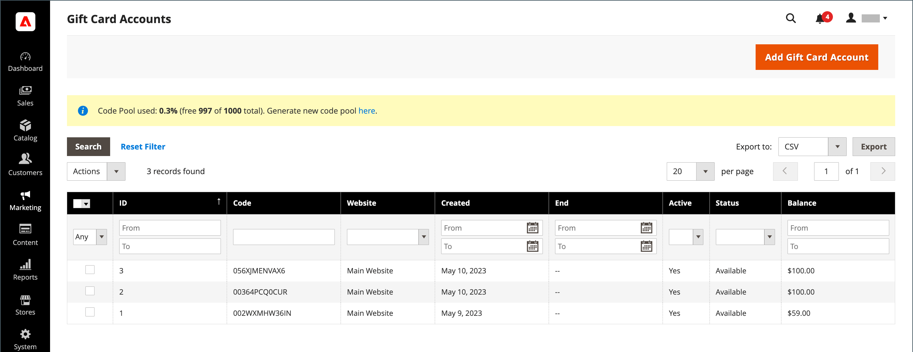
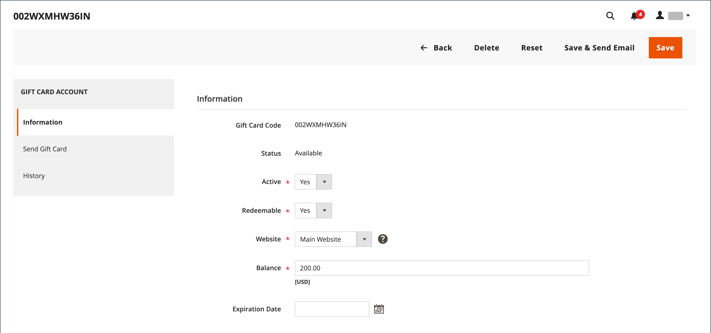
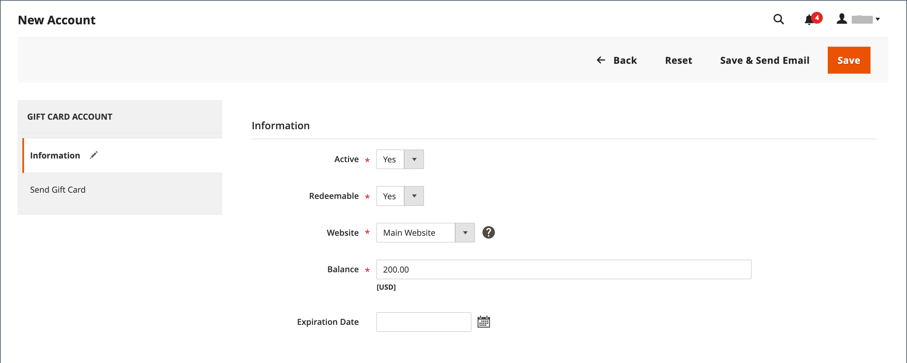
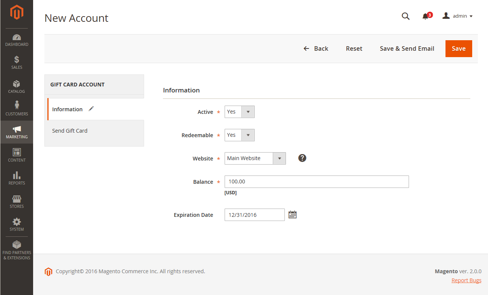
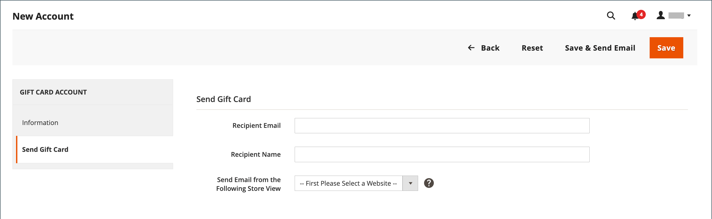
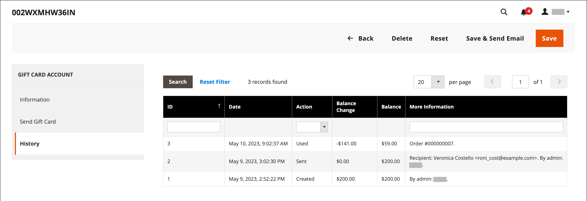

# Gift card accounts

A gift card account is automatically created for each Gift Card that is purchased. The value of the gift card can then be applied toward the purchase of a product in your store. You can also create gift card accounts from the Admin as a promotion or service for customers. The gift card account number corresponds to the gift card code.

<!-- zoom -->

## Configure gift card accounts

The Gift Card configuration establishes the default settings for all gift cards for the store view and manages the code pool. The code pool is a set of unique gift card codes in a specific format. Codes from the pool are used each time a gift card account is created. It is the responsibility of the store administrator to ensure that there are enough codes available for gift card sales. Make sure to generate a code pool before offering gift cards for sale. By default, Adobe Commerce generates 1,000 codes. A new code pool is not generated until there are no more codes available in the current pool.

### Step 1: Configure email notifications

1. On the _Admin_ sidebar, go to **[!UICONTROL Stores]** > _[!UICONTROL Settings]_ > **[!UICONTROL Configuration]**.

1. In the left panel, expand **[!UICONTROL Sales]** and choose **[!UICONTROL Gift Cards]**.

1. Expand  the _[!UICONTROL Gift Card Email Settings]_ section and do the following:

   - Set **[!UICONTROL Gift Card Notification Email Sender]** to the store identity that appears as the sender of gift card notifications.

   - Set **[!UICONTROL Gift Card Notification Email Template]** to the template that is used for the notification.

    <!-- zoom -->

1. Expand  the _[!UICONTROL Email Sent from Gift Card Account Management]_ section and do the following:

   - Set **[!UICONTROL Gift Card Email Sender]** to the store identity to appear as the sender of the gift cards.

   - Set **[!UICONTROL Gift Card Template]** to the template you want to use for the gift card.

See [Store Email Addresses](../configuration-reference/general/store-email-addresses.md) for specific configuration fields and options.

### Step 2: Complete the general settings

1. Expand  the _[!UICONTROL Gift Card General Settings]_ section.

1. To allow the customer to redeem the value on the card for cash, set **[!UICONTROL Redeemable]** to `Yes`.

1. For **[!UICONTROL Lifetime (days)]**, enter the number of days before the card expires.

   If there is no expiration date, leave the field blank.

   >[!NOTE]
   >
   >Depending on your location, it may be illegal for gift cards to expire. Check your local laws before setting a lifetime for your gift cards.

1. To give customers the option to enter a message to accompany the gift card, set **[!UICONTROL Allow Gift Message]** to `Yes` and enter the number of characters available for the message for **[!UICONTROL Gift Message Maximum Length]**.

1. Set **[!UICONTROL Generate Gift Card Account when Orders Item is]** to one of the following:

   - `Ordered` - The gift card account is created when the order is placed.
   - `Invoiced` - The gift card account is created after payment is captured and the order is invoiced.

   <!-- zoom -->

### Step 3: Establish the gift card code pool

1. Expand  the _[!UICONTROL Gift Card Account General Settings]_ section and do the following:

   <!-- zoom -->

   - To customize the code, complete the following according to your preference:

      - Code Length
      - Code Format
      - Code Prefix
      - Code Suffix
      - Dash Every X Characters

   - To determine the number of codes to generate, enter the **[!UICONTROL New Pool Size]**.

   - To specify when you receive notification to restock the code pool, enter the **[!UICONTROL Low Code Pool Threshold]**.

1. Before you generate the code pool, click **[!UICONTROL Save Config]**.

1. Click **[!UICONTROL Generate]**.

1. When complete, click **[!UICONTROL Save Config]**.

## Review an existing gift card account

1. If you need to find the number of the gift card account for a current order, do the following:

    - On the _Admin_ sidebar, go to **[!UICONTROL Sales]** > _[!UICONTROL Operations]_  > **[!UICONTROL Orders]**.

    - Find the order in the list and click **[!UICONTROL View]** in the _[!UICONTROL Action]_ column.

    - Scroll down to the _[!UICONTROL Items Ordered]_ section.

    The number is in the _[!UICONTROL Product]_ column, under **[!UICONTROL Gift Card Accounts]**.

1. On the _Admin_ sidebar, go to **[!UICONTROL Marketing]** > _[!UICONTROL Promotions]_ > **[!UICONTROL Gift Card Accounts]**.

1. Find the gift card account in the grid and open it in edit mode.

   The gift card code appears at the top of the _Information_ section.

   <!-- zoom -->

## Create a gift card account

1. On the _Admin_ sidebar, go to **[!UICONTROL Marketing]** > _[!UICONTROL Promotions]_ > **[!UICONTROL Gift Card Accounts]**.

1. At the upper-right corner, click **[!UICONTROL Add Gift Card Account]**.

   <!-- zoom -->

1. In the _[!UICONTROL Information]_ section, set **[!UICONTROL Active]** to `Yes` and do the following:

    - To make the card balance redeemable at checkout or transferred to the customer's store credit, set **[!UICONTROL Redeemable]** to `Yes`.

    - Choose the **[!UICONTROL Website]** where the gift card account can be used.

    - Enter the initial **[!UICONTROL Balance]** on the gift card.

    - To set an **[!UICONTROL Expiration Date]** for the gift card, select the date from the calendar .

      If left blank, the gift card account does not expire.

    <!-- zoom -->

1. In the left panel, choose **[!UICONTROL Send Gift Card]** and do the following:

    - Enter the **[!UICONTROL Recipient Email]** address.

    - Enter the **[!UICONTROL Recipient Name]**.

    - Set **[!UICONTROL Send Email from the Following Store View]** to the store view that appears as the sender of the gift card notification.

    <!-- zoom -->

1. Do one of the following to save the new account:

    - If you are not ready to send the gift card, click **[!UICONTROL Save]**.

    - To save the changes and send the gift card by email to the recipient, click **Save & Send Email**.

## View gift card account history

1. Go to **[!UICONTROL Marketing]** > _[!UICONTROL Promotions]_ > **[!UICONTROL Gift Card Accounts]**.

1. Open the gift card in edit mode.

1. The **[!UICONTROL History]** of the gift card is displayed.

   <!-- zoom -->

|Column|Description|
|--- |--- |
|[!UICONTROL ID]|A unique numeric of action with gift card.|
|[!UICONTROL Date]|Date of action.|
|[!UICONTROL Action]|Determines all possible actions with a gift card. Options: `Created` / `Updated` / `Sent` / `Used` / `Redeemed` / `Expired`|
|[!UICONTROL Balance Change]|Displays the amount by which the balance of the gift card has changed.|
|[!UICONTROL Balance]|Indicates the available balance.|
|[!UICONTROL More Information]|Displays information about who changed the balance of the gift card.|

{style="table-layout:auto"}

## Delete a gift card account

1. On the _Admin_ sidebar, go to **[!UICONTROL Marketing]** > _[!UICONTROL Promotions]_ > **[!UICONTROL Gift Card Accounts]**.

1. Select the gift card account to be deleted and open it in edit mode.

1. In the menu bar, click **[!UICONTROL Delete]**.

1. To confirm the action, click **[!UICONTROL OK]**.

## Column descriptions

|Column|Description|
|--- |--- |
|[!UICONTROL ID]|A unique numeric identifier that is assigned to gift card account.|
|[!UICONTROL Code]|The code that must be entered to apply a gift card.|
|[!UICONTROL Website]|Indicates the websites where the gift card account is available.|
|[!UICONTROL Created]|Creation date.|
|[!UICONTROL End]|Gift card expiration date, if scheduled.|
|[!UICONTROL Active]|Determines if the gift card is active.|
|[!UICONTROL Status]|Determines if the gift card is redeemed in customer's account or available. Options: `Used` / `Redeemed` / `Expired`|
|[!UICONTROL Balance]|Indicates the available balance.|

{style="table-layout:auto"}
