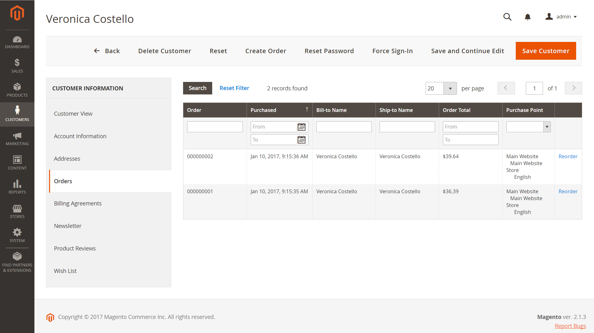
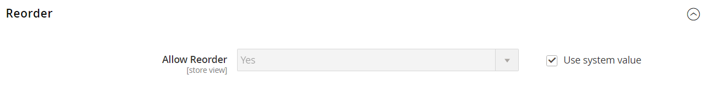
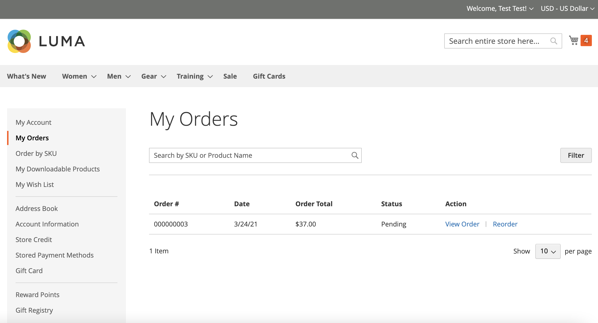
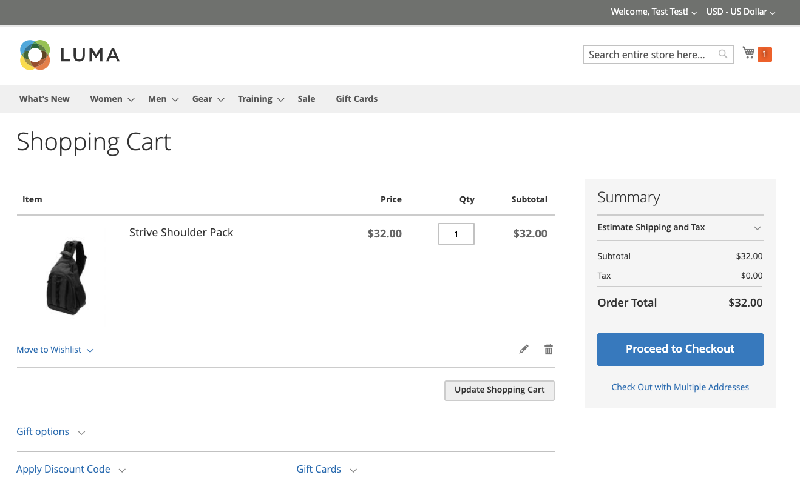
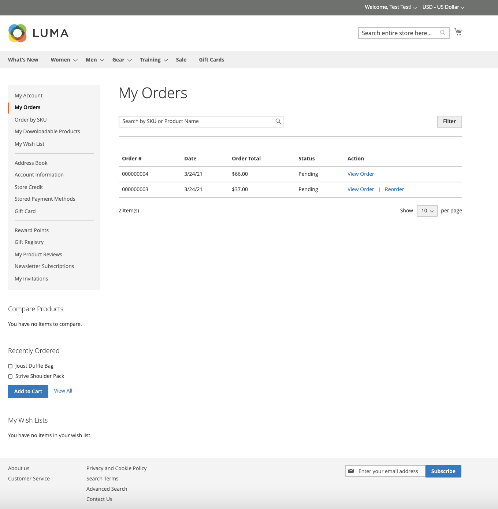
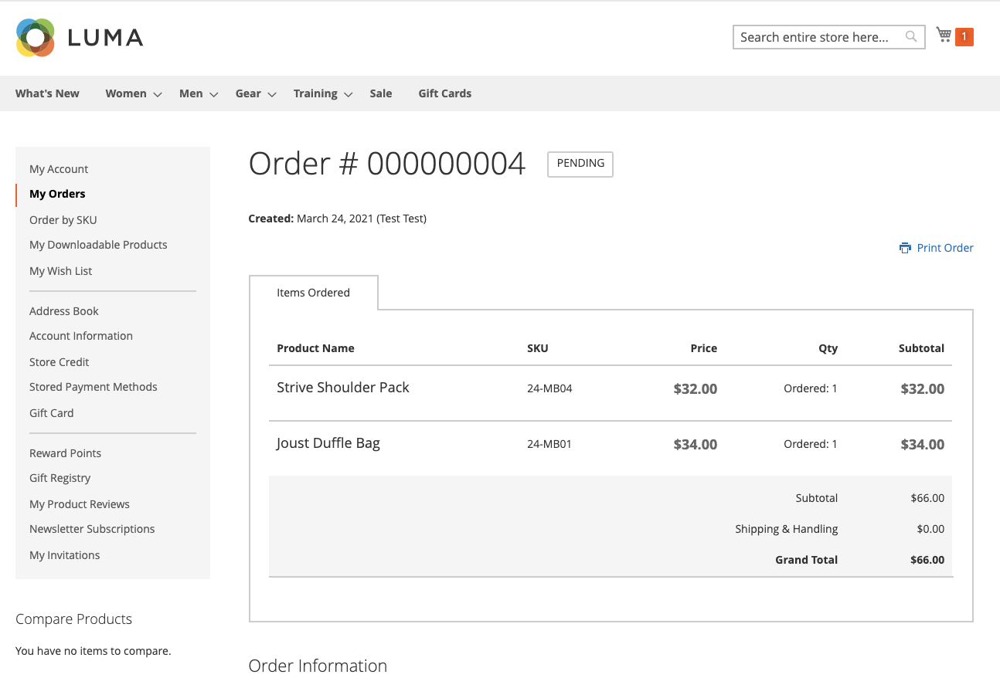
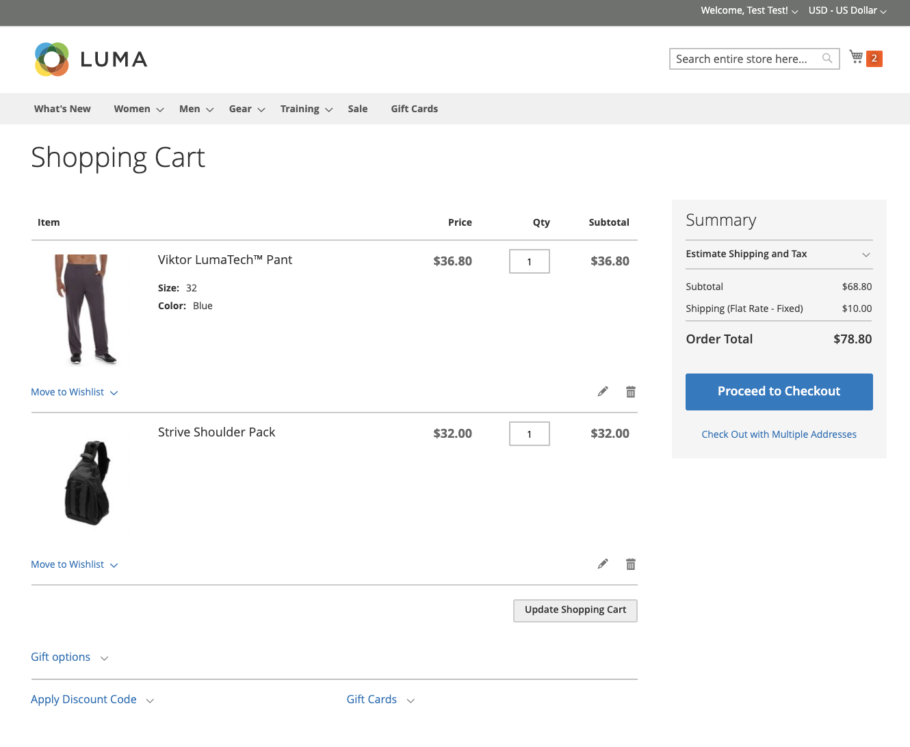
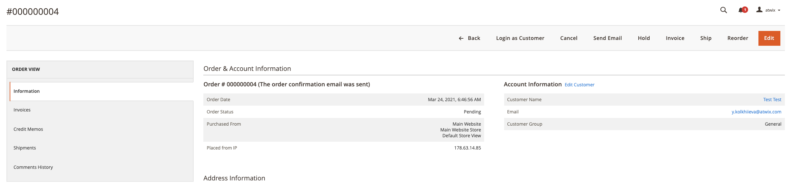
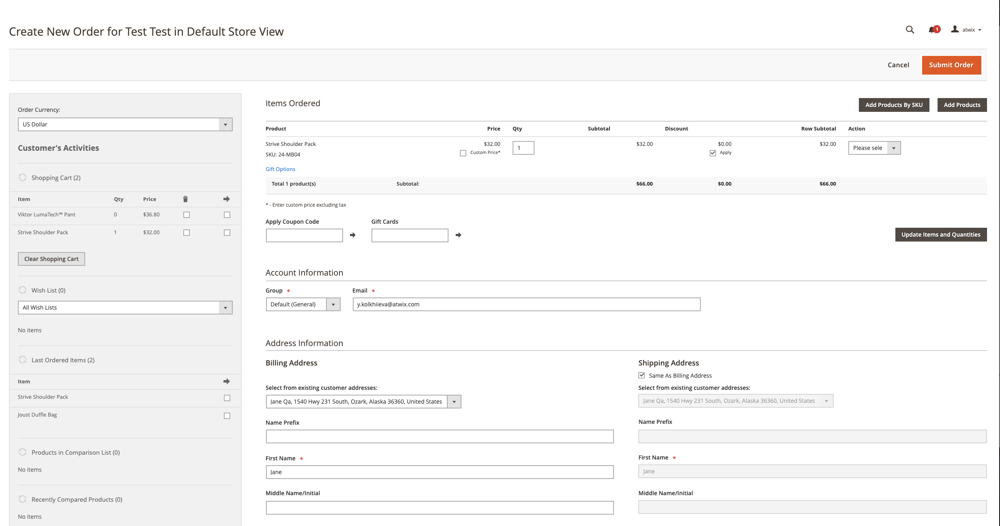

# Allow reorders

When enabled, reorders can be made directly from the customer account or from the original order in the _Admin_. Reorders are enabled by default.

{width="700" zoomable="yes"}

## Criteria for reorder to be enabled for an order

- The _Allow Reorder_ configuration option must be enabled.

- If order is in `Hold` or in `Payment Review` status, the reorder option is disabled.

- If any of the items in the order is unavailable, out of stock, or disabled, the reorder option is disabled on the storefront.

- An _Admin_ can reorder even if any of the items are out of stock or disabled.

## Configure to allow customer reorders

1. On the _Admin_ sidebar, go to **[!UICONTROL Stores]** > _[!UICONTROL Settings]_ > **[!UICONTROL Configuration]**.

1. In the left panel, expand **[!UICONTROL Sales]** and choose **[!UICONTROL Sales]** underneath.

1. Expand  the **[!UICONTROL Reorder]** section.

   {width="600" zoomable="yes"}

1. Set **[!UICONTROL Allow Reorder]** to `Yes`. 

   This setting enables reorder functionality from the customer account on the storefront or orders list in the Admin.

1. Click **[!UICONTROL Save Config]**.

## Reorder from the storefront

A customer can initiate the reorder functionality for a specific order from two pages:

- _My Orders_ page

- _Order View_ page

### My Orders

The _Reorder_ button is always displayed in the list with Orders (even if all products from the order are not available for reorder).

{width="700" zoomable="yes"}

**Case 1.** All products from the order are **available** for reorder

User is redirected to the cart, and all products are added to the cart

{width="700" zoomable="yes"}

**Case 2.** Some/all products from the order are **not available** for reorder

>[!NOTE]
>
>It is possible to reorder `Not Visible Individually` products.

The _Reorder_ button does not appear on the _My Orders_ and _View Order_ pages.

{width="700" zoomable="yes"}

### Order view page

**Case 1.** All products from the order are available for reorder

User is redirected to the cart, and all products are added to the cart

**Case 2.** Some/all products from the order are **not available** for reorder

>[!NOTE]
>
>It is possible to reorder `Not Visible Individually` products.

The _Reorder_ button does not appear on the _My Orders_ and _View Order_ pages.

{width="700" zoomable="yes"}

### Cart is not empty

If the cart is not empty and the user clicks **[!UICONTROL Reorder]** (from the _My Orders_  or _Order View_ page), the existing products remain in the cart with the added reorder products.

{width="700" zoomable="yes"}

## Reorder from the Admin

1. On the _Admin_ sidebar, go to **[!UICONTROL Sales]** > **[!UICONTROL Orders]**.

1. Locate the order and open in **[!UICONTROL View]** mode.

1. Click **[!UICONTROL Reorder]** which is displayed in the top button bar.

   {width="600" zoomable="yes"}

   After you click **[!UICONTROL Reorder]**, the _Create New Order_ page opens with reorder products.

   {width="600" zoomable="yes"}

1. Complete all required fields as needed.

1. To submit the order, click **[!UICONTROL Submit Order]**.
