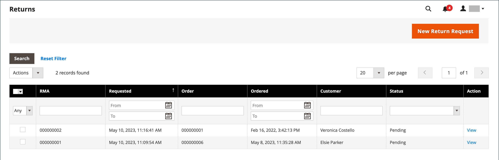
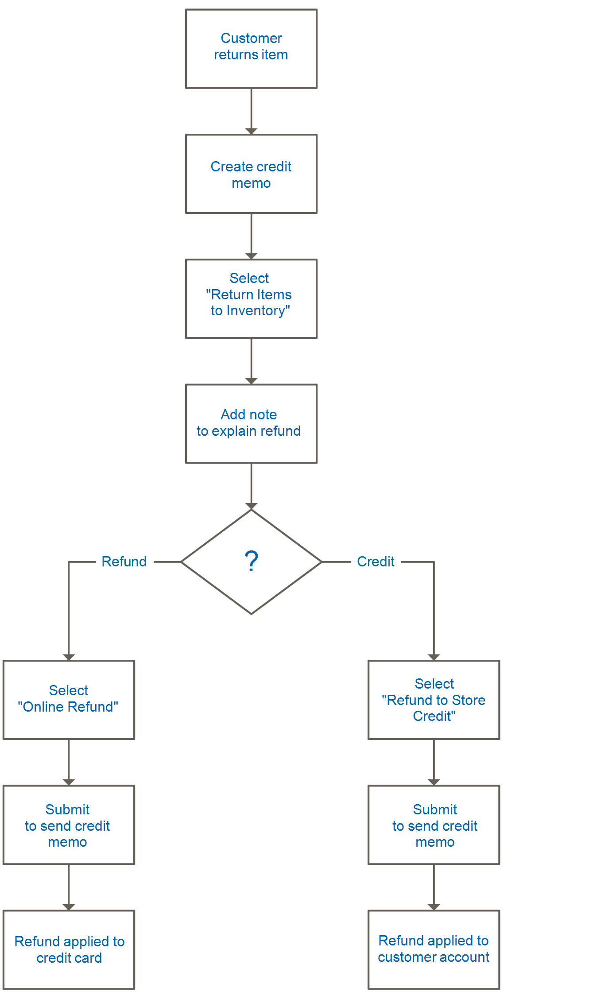
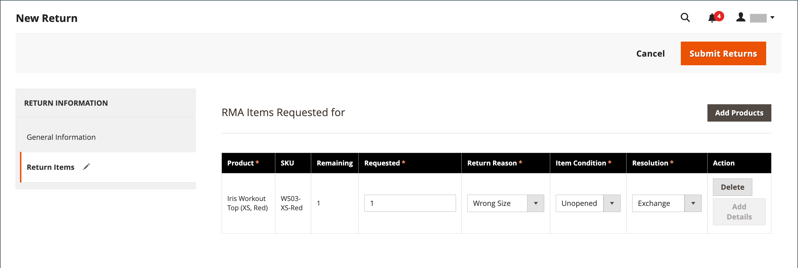

# Returns

A _returned merchandise authorization_ (RMA) can be granted to customers who request to return an item for replacement or refund. Typically, the customer contacts the merchant to request a refund. If approved, a unique RMA number is assigned to identify the returned product. In the configuration, you can either enable RMA for all products or allow RMA for only certain products. The _[!UICONTROL Returns]_ grid lists the current returned merchandise requests (RMAs) and is used to enter new return requests.

{width="600" zoomable="yes"}

RMAs can be issued for simple, grouped, configurable, and bundle product types. However, RMAs are not available for virtual products, downloadable products, and gift cards.

## Column descriptions

|Column|Description|
|--- |--- |
|[!UICONTROL Select]|Select the checkboxes for the returns to be subject to an action, or use the selection control in the column header. Options: `Select All` / `Deselect All` / `Select Visible` / `Unselect Visible`|
|[!UICONTROL RMA]|A unique numeric identifier that is assigned to each return|
|[!UICONTROL Requested]|Date and time the return was placed|
|[!UICONTROL Order]|A unique number of the original order|
|[!UICONTROL Ordered]|The date and time the order was placed|
|[!UICONTROL Customer]|The name of the customer or buyer who placed the order|
|[!UICONTROL Status]|Return status. Options: `Pending` / `Authorized` / `Partially Authorized` / `Approved` / `Rejected` / `Processed and Closed` / `Closed`|
|[!UICONTROL Action]|**[!UICONTROL View]** opens the return in edit mode.|

{style="table-layout:auto"}

## RMA and return workflow

1. **Receive request** - If [enabled](rma-configure.md#enable-rmas-for-your-store) for the storefront, both registered customers and guests can request an RMA. You can also [submit an RMA request in the Admin](#create-a-return-request-in-the-admin).

2. **RMA issued** - After considering the request, you can authorize it partially, completely, or cancel the request. If you authorize the return and agree to pay for the return shipment, you can create a shipment order from the Admin with a supported carrier.

3. **Merchandise received and product return processed** -  The following flow chart describes the operational order to complete the return process:

   {width="500"}

## RMA status

During its lifecycle, a returned merchandise authorization (RMA) can have many assigned statuses (such as Pending or Authorized). The RMA status indicates the progress of an RMA request raised by the user or the merchant.

|Status|Description|
|--- |--- |
|[!UICONTROL Pending]|The initial status assigned to an RMA request when it is raised by a user on the storefront or by the merchant in the Admin.|
|[!UICONTROL Authorized]|This status is assigned to the RMA when all requested items are authorized by the merchant in the Admin for the returns.|
|[!UICONTROL Partially Authorized]|This status is assigned to the RMA if any of the requested items have been denied and other products are authorized.|
|[!UICONTROL Denied]|This status is assigned to the RMA if all the requested items are rejected by the merchant in the Admin for the returns.|
|[!UICONTROL Return Received]|This status is assigned by the merchant to the RMA when the requested items are received from the user.|
|[!UICONTROL Return Partially Received]|This status is assigned by the merchant to the RMA when the requested items are partially returned and some of the items are denied to process.|
|[!UICONTROL Approved]|This status is assigned by the merchant to the RMA when the requested items are approved to process further.|
|[!UICONTROL Rejected]|This status is assigned by the merchant to the RMA when the requested items are rejected to process further.|
|[!UICONTROL Processed and Closed]|This status is assigned by the merchant to the RMA when all the requested items are approved to process further.|
|[!UICONTROL Closed]|This status is assigned by the merchant to the RMA when the requested items are denied to process for return.|

{style="table-layout:auto"}

## Create a return request in the Admin

A merchant can create a return request on behalf of the customer from the Admin. Customers can [create a return request](rma-customer-experience.md) on the storefront for an Adobe Commerce store.

1. On the _Admin_ sidebar, go to **[!UICONTROL Sales]** > **[!UICONTROL Returns]**.

1. Click **[!UICONTROL New Return Request]**.

1. To create a return request, click an order with a `Complete` status.

1. Under the _[!UICONTROL Return Information]_ section, select the **[!UICONTROL Return Items]** tab.

1. To add items to return, click **[!UICONTROL Add Items]**.

1. Select the checkbox for the required product and click **[!UICONTROL Add Selected Product to returns]**.

1. For **[!UICONTROL Requested]**, enter the number of items to be returned.

1. Set **[!UICONTROL Return Reason]** to one of the following:

    - `Wrong Color`
    - `Wrong Size`
    - `Out of Service`
    - `Other`

    If the reason for the return is different from the listed choices, you can enter your own if you select the `Other` option.

1. Set **[!UICONTROL Item Condition]** to one of the following:

    - `Unopened`
    - `Opened`
    - `Damaged`

1. Set **[!UICONTROL Resolution]** to one of the following:

    - `Exchange`
    - `Refund`
    - `Store Credit`

1. To create a return, click **[!UICONTROL Submit Returns]**.

   {width="600" zoomable="yes"}

   The newly submitted RMA request appears on the **[!UICONTROL Returns]** page with a `Pending` status.
