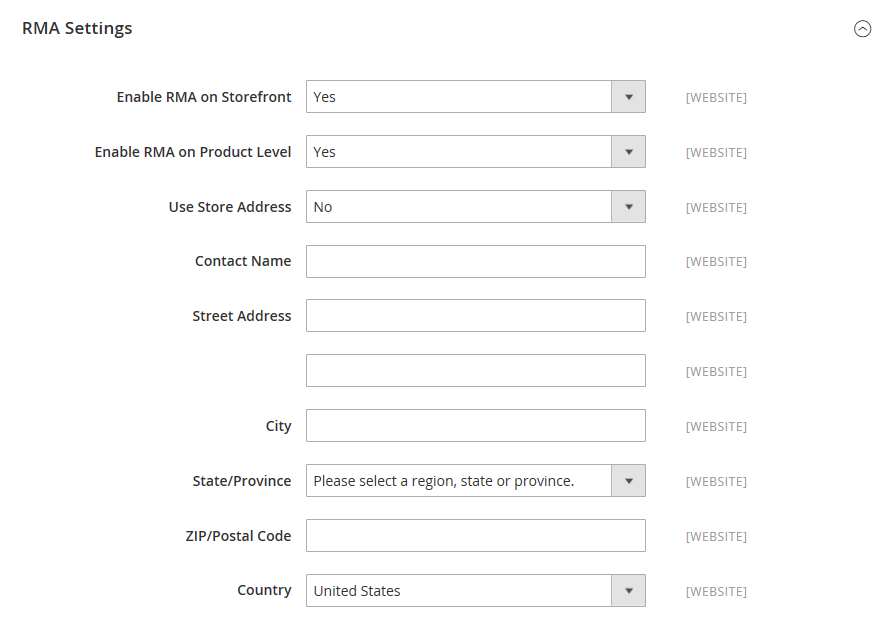

# Configure returns

{{ee-feature}}

When enabled, RMA requests can be submitted by customers from the storefront. An RMA can be generated only if there is an item in the order that is available for return. Requests to return individual items are managed by the _Enable RMA_ attribute in each product record. By default, the configuration settings are applied to the product (_Use Config Settings_ is selected). If _Enable RMA_ is set to `No`, the product does not appear in the list of items that are available for return. If you change the _Enable RMA_ setting, it applies to both new and existing orders.

<!-- zoom -->

## Enable RMAs for your store

1. On the _Admin_ sidebar, go to **Stores** > _Settings_ >  **Configuration**.

1. In the left panel, expand **Sales** and choose **Invoices** underneath.

1. Expand  the **RMA Settings** section.

   <!-- zoom -->

1. Set **Enable RMA on Storefront** to `Yes`.

   This determines if customers can create and view RMA requests from the storefront. RMAs can be applied to both new and existing orders.

1. Set **Enable RMA on Product Level** to `Yes`.

   This determines the default value for the _Enable RMA_ attribute for individual products.

1. Set **Use Store Address** to one of the following values:

   - `Yes` – Send returned products to the store address.
   - `No` – Enter an alternate address for product returns.

   <!-- zoom -->

1. Click **Save Config**.

## Configure shipping methods for returns

1. On the _Admin_ sidebar, go to **Stores** > _Settings_ > **Configuration**.

1. In the left panel, expand **Sales** and choose **Delivery Methods**.

1. Expand the section for the carrier that you want to use for return service, such as **UPS**.

   <!-- zoom -->

1. Set **Enabled for RMA** to `Yes`.

1. Click **Save Config**.
