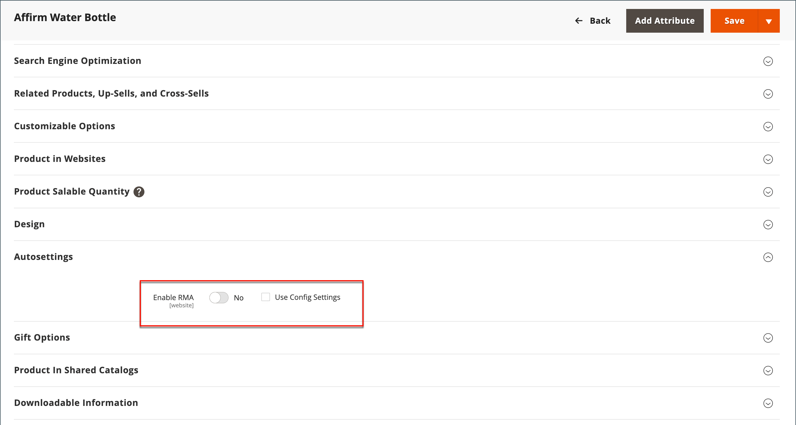

# Configure returns

{{ee-feature}}

When enabled, RMA requests can be submitted by customers from the storefront. An RMA can be generated only if there is an item in the order that is available for return. Requests to return individual items are managed by the _Enable RMA_ attribute in each product record. By default, the configuration settings are applied to the product (_[!UICONTROL Use Config Settings]_ is selected). If _[!UICONTROL Enable RMA]_ is set to `No`, the product does not appear in the list of items that are available for return. If you change the _Enable RMA_ setting, it applies to both new and existing orders.

## Enable RMAs for your store

1. On the _Admin_ sidebar, go to **[!UICONTROL Stores]** > _[!UICONTROL Settings]_ > **[!UICONTROL Configuration]**.

1. In the left panel, expand **[!UICONTROL Sales]** and choose **[!UICONTROL Sales]** underneath.

1. Expand  the **[!UICONTROL RMA Settings]** section.

   {width="600" zoomable="yes"}

1. Set **[!UICONTROL Enable RMA on Storefront]** to `Yes`.

   This setting determines if customers can create and view RMA requests from the storefront. RMAs can be applied to both new and existing orders.

1. Set **[!UICONTROL Enable RMA on Product Level]** to `Yes`.

   This setting determines the behavior for the _Enable RMA_ attribute for individual products on the storefront:

   - When [!UICONTROL Enable RMA on Product Level] is set to `Yes`, customers on the storefront can return all individual products. It includes both _[!UICONTROL Enable RMA]_ = `Yes` and _[!UICONTROL Enable RMA]_ = `No` product attribute values.
   - When [!UICONTROL Enable RMA on Product Level] is set to `No`, customers on the storefront can return only the products with an _[!UICONTROL Enable RMA]_ = `Yes` product attribute value.

1. Set **[!UICONTROL Use Store Address]** to one of the following values:

   - `Yes` – Send returned products to the store address.
   - `No` – Enter an alternate address for product returns.

   {width="600" zoomable="yes"}

1. Click **[!UICONTROL Save Config]**.

## Configure shipping methods for returns

1. On the _Admin_ sidebar, go to **[!UICONTROL Stores]** > _[!UICONTROL Settings]_ > **[!UICONTROL Configuration]**.

1. In the left panel, expand **[!UICONTROL Sales]** and choose **[!UICONTROL Delivery Methods]**.

1. Expand the section for the carrier that you want to use for return service, such as **[!UICONTROL UPS]**.

   {width="600" zoomable="yes"}

1. Set **[!UICONTROL Enabled for RMA]** to `Yes`.

1. Click **[!UICONTROL Save Config]**.

## Change allowed RMAs at a product level

If you enable RMAs for your store and your catalog contains some products that should not be allowed for return, you can modify the setting at the product level,

1. Open the product in edit mode.

1. Scroll down and expand  the **[!UICONTROL Autosettings]** section.

1. Clear the **[!UICONTROL Use Config Setting]** checkbox, if needed.

1. Toggle the **[!UICONTROL Enable RMA]** setting to `No`.

   {width="600" zoomable="yes"}

1. Click **[!UICONTROL Save]**.
