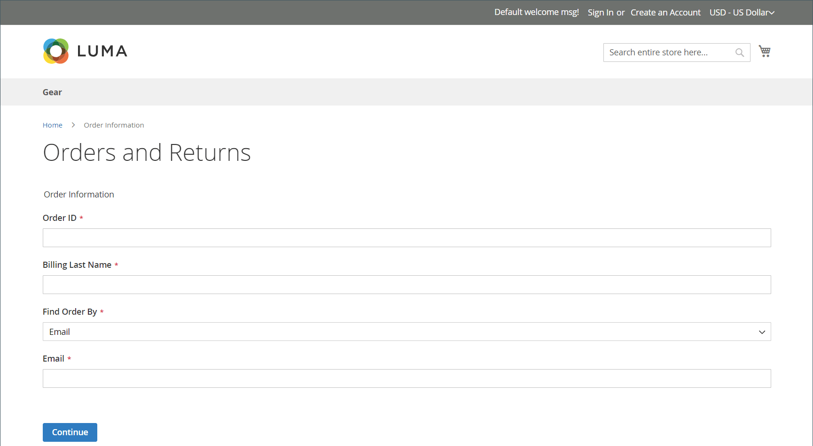
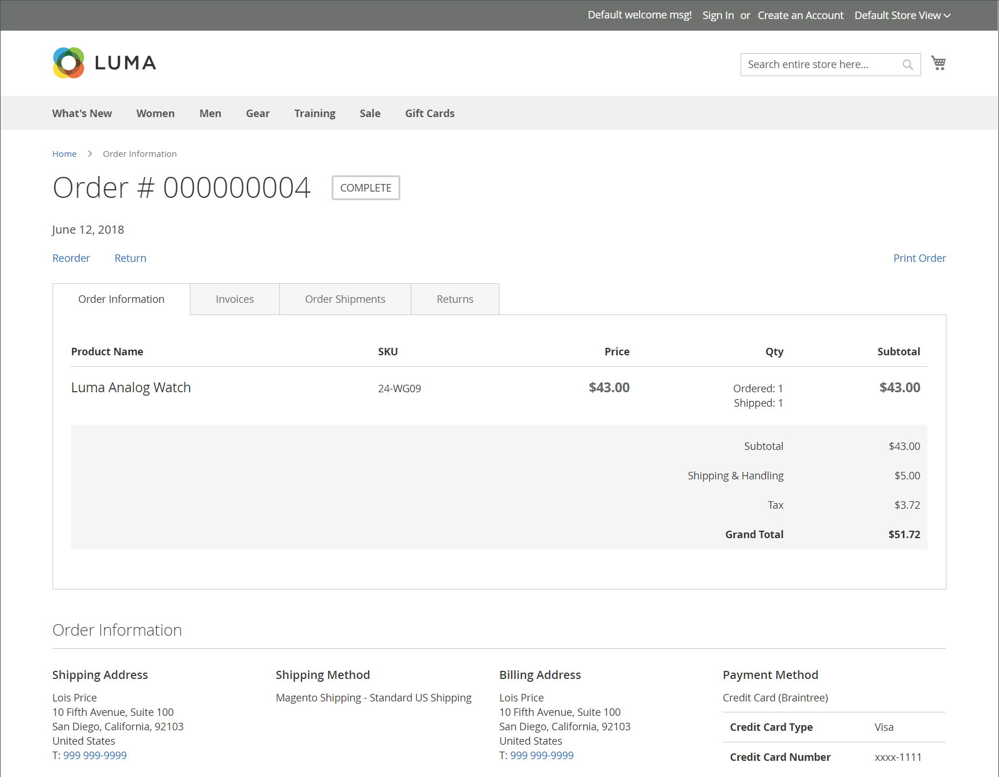
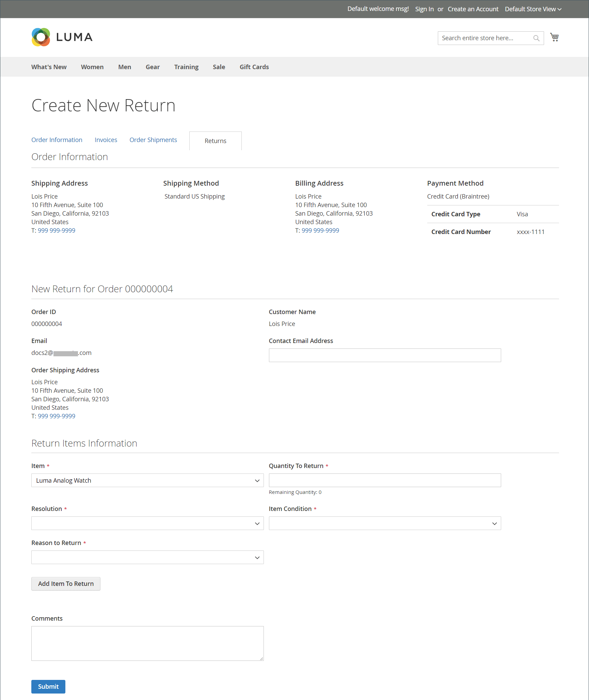

# Returns storefront experience

{{ee-feature}}

Customers can use either of the following to request an RMA from the storefront:

- [Orders and Returns Widget](../content-design/widget-orders-returns.md) in the sidebar
- _Orders and Returns_ link in footer

As a best practice, make sure to include a description of your RMA requirements and process in the Customer Service policy.

>[!NOTE]
>
>If you want to collect additional information related to returns, you can add your own custom [returns attributes](attributes-returns.md).

## Request an RMA

The customer completes the following steps on the storefront to submit an RMA:

1. In the footer, clicks **Orders and Returns**.

1. Enters the order information:

   - **Order ID**
   - **Billing Last Name**
   - **Email**

1. Clicks **Continue**.

   <!-- zoom -->

1. Below the order date, clicks **Return**.

   <!-- zoom -->

1. Chooses the **Item** to return and enters the **Quantity to Return**.

1. Sets **Resolution** to one of the following:

   - Exchange
   - [Refund](https://docs.magento.com/user-guide/customers/refunds-customer-account.html)
   - [Store Credit](https://docs.magento.com/user-guide/customers/store-credit.html)

1. Sets **Item Condition** to one of the following:

   - Unopened
   - Opened
   - Damaged

1. Sets **Reason to Return** to one of the following:

   - Wrong Color
   - Wrong Size
   - Out of Service
   - Other

   <!-- zoom -->

1. If needed, sets **Contact Email Address** and **Comments**.

   >[!NOTE]
   >
   >If the order contains several items and the customer wants to return another item, they can click **Add Item To Return**, select the item, and then set all mentioned options.

1. Clicks **Submit**.
