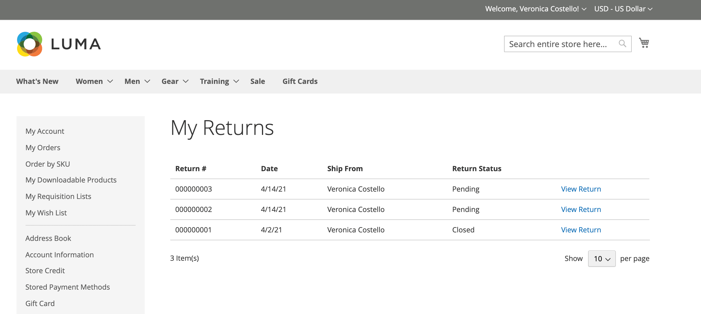
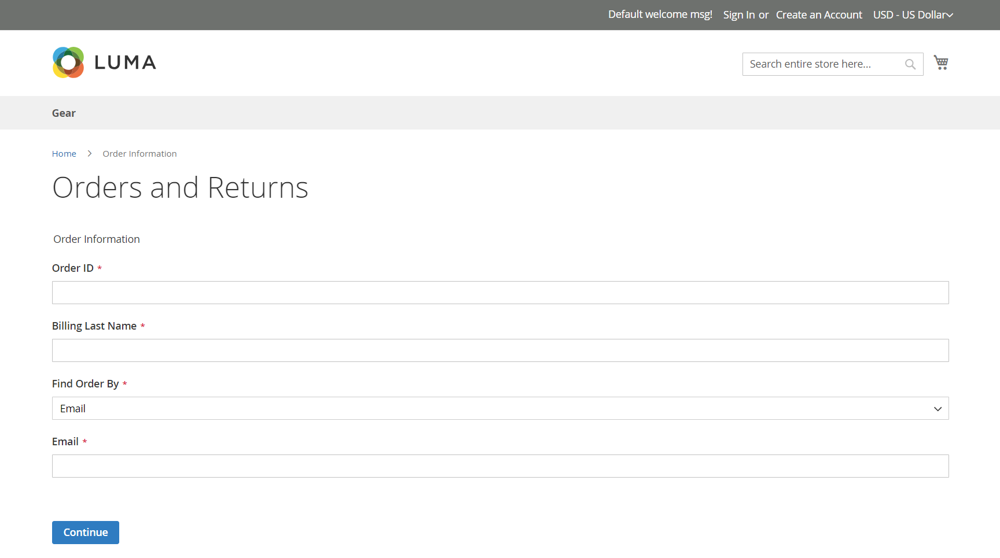
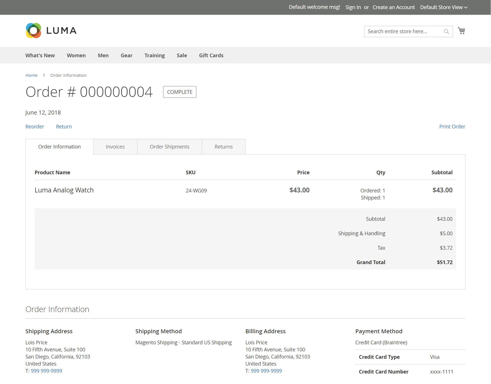
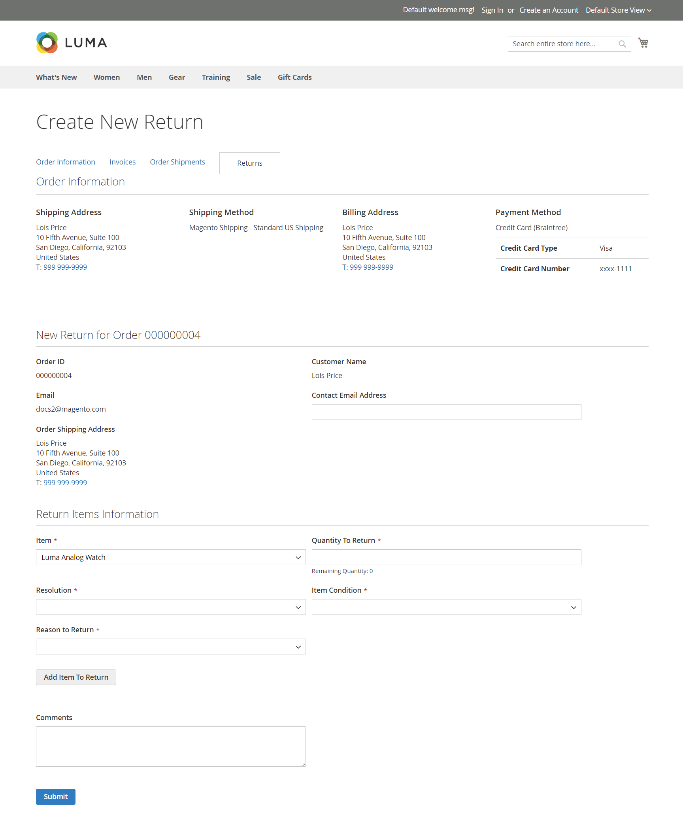

# Returns storefront experience

{{ee-feature}}

Customers can use either of the following to request an RMA from the storefront:

- [Orders and Returns Widget](../content-design/widget-orders-returns.md) in the sidebar
- _Orders and Returns_ link in footer

As a best practice, make sure to include a description of your RMA requirements and process in the Customer Service policy.

>[!NOTE]
>
>If you want to collect additional information related to returns, you can add your own custom [returns attributes](attributes-returns.md).

All customer RMA information is displayed on the **[!UICONTROL My Returns]** page in the customer account dashboard.

{width="700" zoomable="yes"}

## Request an RMA

The customer completes the following steps on the storefront to submit an RMA:

1. In the footer, clicks **[!UICONTROL Orders and Returns]**.

1. Enters the order information:

   - Order ID
   - Billing Last Name
   - Email

1. Clicks **[!UICONTROL Continue]**.

   {width="700" zoomable="yes"}

1. Below the order date, clicks **[!UICONTROL Return]**.

   {width="700" zoomable="yes"}

1. Chooses the item to return and enters the **[!UICONTROL Quantity to Return]**.

1. Sets **[!UICONTROL Resolution]** to one of the following:

   - Exchange
   - [Refund](../customers/refunds-customer-account.md)
   - [Store Credit](../customers/store-credit-using.md)

1. Sets **[!UICONTROL Item Condition]** to one of the following:

   - `Unopened`
   - `Opened`
   - `Damaged`

1. Sets **[!UICONTROL Reason to Return]** to one of the following:

   - `Wrong Color`
   - `Wrong Size`
   - `Out of Service`
   - `Other`

   {width="700" zoomable="yes"}

1. If needed, sets **[!UICONTROL Contact Email Address]** and **[!UICONTROL Comments]**.

   >[!NOTE]
   >
   >If the order contains several items and the customer wants to return another item, they can click **[!UICONTROL Add Item To Return]**, select the item, and then set all mentioned options.

1. Clicks **[!UICONTROL Submit]**.
