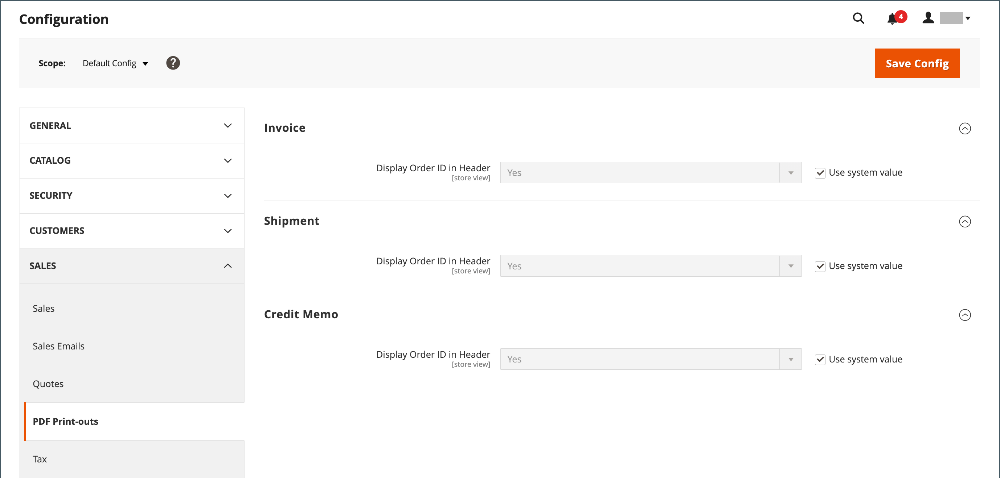

# Sales documents

To support the order workflow and provide documentation to your customers about the orders they submit, configure the related sales documents to reflect your store brand and include reference information.

## Configure invoices and packing slips

Unlike the logo images used in storefront pages, the logo for PDF invoices and other sales documents can be a high-resolution, 300-dpi image. Be careful to preserve the aspect ratio when you resize the logo. Resize the logo to fit the height, and don't worry about any unused space to the right.

One way to resize your logo to fit the required size is to create a new, blank image with the correct dimensions. Then, paste your logo image and resize it to fit the height. With most image-editing programs, you can either scale it by a percentage to preserve the aspect ratio, or hold down the Shift key and manually resize the image.

**_To update the logo:_**

1. On the _Admin_ sidebar, go to **[!UICONTROL Stores]** > _[!UICONTROL Settings]_ > **[!UICONTROL Configuration]**.

1. In the left panel, expand **[!UICONTROL Sales]** and choose **[!UICONTROL Sales]** underneath.

1. Expand  the **[!UICONTROL Invoice and Packing Slip Design]** section and do the following:

   <!-- zoom -->

   - To upload the **[!UICONTROL Logo for PDF Print-outs]**, click **[!UICONTROL Choose File]**, find the logo that you have prepared, and click **[!UICONTROL Open]**.

   - To upload the **[!UICONTROL Logo for HTML Print View]**, click **[!UICONTROL Choose File]**, find the logo that you have prepared, and click **[!UICONTROL Open]**.

   - Enter your address as you want it to appear on invoices and packing slips.

1. When complete, click **[!UICONTROL Save Config]**.

   For reference, a thumbnail of the uploaded image appears before each field. Don't worry if the thumbnail appears distorted. The proportion of the logo is correct on the invoice.

### Replace an image

1. Click **[!UICONTROL Choose File]** and choose a different logo file.

1. Select the **[!UICONTROL Delete Image]** checkbox for the image you want to replace.

1. Click **[!UICONTROL Save Config]**.

### Image formats

|Format| Requirements                             |
|--- |------------------------------------------|
|**_PDF_**||
|File format| JPG (JPEG), PNG, TIF (TIFF)              |
|Image size| Up to 1080 pixels wide x 270 pixels high |
|Resolution| 300 DPI recommended                      |
|**_HTML_**||
|File format| JPG (JPEG), PNG, GIF                     |
|Image size| Determined by theme.                     |
|Resolution| 72 or 96 DPI                             |

{style="table-layout:auto"}

## Add reference IDs

The Order ID and customer IP address can be included in the header of sales documents that accompany an order. By default, both the order ID and customer IP address appear in the header of invoices, shipment packing slips, and credit memos.

<!-- zoom -->

**_To change the order ID setting:_**

1. On the _Admin_ sidebar, go to **[!UICONTROL Stores]** > _[!UICONTROL Settings]_ > **[!UICONTROL Configuration]**.

1. In the left panel, expand **[!UICONTROL Sales]** and choose **[!UICONTROL PDF Print-outs]**.

1. Expand  the **Invoice** section.

   <!-- zoom -->

1. Set **[!UICONTROL Display Order ID in Header]** according to your preference.

1. Repeat for the **[!UICONTROL Shipment]** and **[!UICONTROL Credit Memo]** sections.

1. When complete, click **[!UICONTROL Save Config]**.

**_To change the customer IP address setting:_**

1. On the _Admin_ sidebar, go to **[!UICONTROL Stores]** > _[!UICONTROL Settings]_ > **[!UICONTROL Configuration]**.

1. In the left panel, expand **[!UICONTROL Sales]** and choose **[!UICONTROL Sales]** underneath.

1. Expand  the **[!UICONTROL General]** section.

   <!-- zoom -->

1. Set **[!UICONTROL Hide Customer IP]** to your preference.

1. When complete, click **[!UICONTROL Save Config]**.
