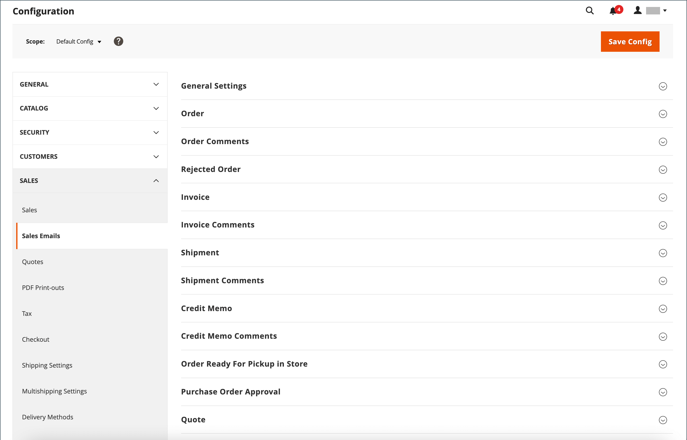

# Sales emails

Several email messages are triggered by the events related to an order, and the configuration is similar. Make sure that you identify the store contact that appears as the sender of the message, the email template to be used, and anyone else who is to receive a copy of the message. Sales emails can be sent when triggered by an event, or by predetermined interval.

{width="600" zoomable="yes"}

## Step 1. Update the email templates

Make sure to update the [email header](../systems/email-template-custom.md#header-template) template so that it reflects your brand, and the other email templates as needed. For a complete list of templates, see [Email templates](../systems/email-templates.md).

## Step 2. Choose the type of transmission

1. On the _Admin_ sidebar, go to **[!UICONTROL Stores]** > _[!UICONTROL Settings]_ > **[!UICONTROL Configuration]**.

1. In the left panel, expand **[!UICONTROL Sales]** and choose **[!UICONTROL Sales Emails]**.

1. If necessary, expand  the  **[!UICONTROL General Settings]** section.

   {width="600" zoomable="yes"}

   By default, Asynchronous sending is set to `Disable`. To change the system setting, clear the **[!UICONTROL Use system value]** checkbox and set **[!UICONTROL Asynchronous sending]** to one of the following:

   - `Disable` - Sends sales email when triggered by an event.
   - `Enable` - Sends sales email at predetermined, regular intervals.

   Adobe Commerce Support recommends enabling asynchronous sending to improve the order placement performance. See [Configuration best practices for order processing](https://experienceleague.adobe.com/docs/commerce-operations/implementation-playbook/best-practices/maintenance/order-processing-configuration.html) in Adobe Commerce Support Knowledge Base.

## Step 3. Complete the details for each sales email message

1. If necessary, expand  the **[!UICONTROL Order]** section.

   {width="600" zoomable="yes"}

1. Verify that **[!UICONTROL Enabled]** is set to `Yes` (default).

1. Set **[!UICONTROL New Order Confirmation Email]** to the store contact that appears as the sender of the message.

1. Set **[!UICONTROL New Order Confirmation Template]** to the template that is used for the email that is sent to registered customers.

1. Set **[!UICONTROL New Order Confirmation Template for Guest]** to the template that is used for the email that is sent to guests who do not have an account with your store.

1. For **[!UICONTROL Send Order Email Copy To]**, enter the email address of anyone who is to receive a copy of the new order email.

   If sending a copy to multiple recipients, separate each address with a comma.

1. Set **[!UICONTROL Send Order Email Copy Method]** to one of the following:

   - `Bcc` -  Sends a _blind courtesy copy_ by including the recipient in the header of the same email that is sent to the customer. The BCC recipient is not visible to the customer.
   - `Separate Email` - Sends the copy as a separate email.

1. Expand  the **[!UICONTROL Order Comments]** section and repeat these steps.

   {width="600" zoomable="yes"}

1. Complete the configuration for the remaining sales email types:

    - **[!UICONTROL Invoice]** / **[!UICONTROL Invoice Comments]**
    - **[!UICONTROL Shipment]** / **[!UICONTROL Shipment Comments]**
    - **[!UICONTROL Credit Memo]** / **[!UICONTROL Credit Memo Comments]**

1. When complete, click **[!UICONTROL Save Config]**.

   When prompted, click the [Cache Management](../systems/cache-management.md) link in the message at the top of the workspace and clear all invalid caches.
