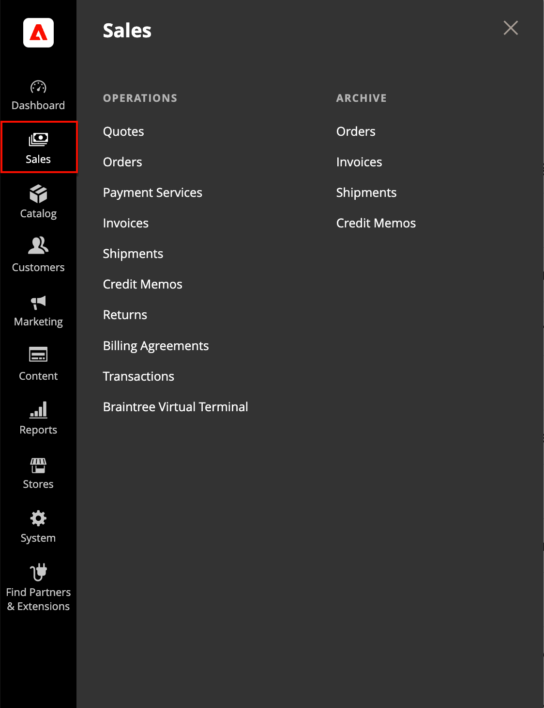

# [!UICONTROL Sales] menu

The Sales menu lists transactions according to where they are in the order workflow. You might think of each of option as a different stage in the lifetime of an order.

{width="450" zoomable="yes"}

## Display the [!UICONTROL Sales] menu

On the _Admin_ sidebar, click **[!UICONTROL Sales]**.

## Menu options

### [!UICONTROL Quotes]

 (Available with B2B for Adobe Commerce)

Authorized buyers can [negotiate the price](../b2b/quotes.md) with the seller by sending a [request](../b2b/quote-request.md) from the shopping cart.

### [!UICONTROL Orders]

When an [order](orders.md) is placed, a sales order is created as a temporary record of the transaction. Payment has not been processed, and the order can still be canceled.

### [!UICONTROL Invoices]

An [invoice](invoices.md) is a record of the receipt of payment for an order. Multiple invoices can be created for a single order, each with as many, or as few of the purchased products that you specify. Depending on the payment action, payment can be automatically captured when the invoice is generated.

### [!UICONTROL Shipments]

A [shipment](shipments.md) is a record of the products in an order that have been shipped. As with invoices, multiple shipments can be associated with a single order, until all products in the order are shipped.

### [!UICONTROL Credit Memos]

A [credit memo](credit-memos.md) is a document that shows the amount that is due the customer for a full or partial refund. The amount can be applied toward a purchase or refunded to the customer.

### [!UICONTROL Returns]

 (Adobe Commerce only)

A [returned merchandise authorization](returns.md) (RMA) can be granted to customers who request to return an item for replacement or refund. RMAs can be issued for Simple, Grouped, Configurable, and Bundle product types. However, RMAs are not available for virtual and downloadable products, or gift cards.

### [!UICONTROL Billing Agreements]

A [billing agreement](paypal-billing-agreements.md) is similar to a purchase order, except that it isn't limited to a single purchase. During checkout, the customer chooses Billing Agreement as the payment method. A billing agreement streamlines the checkout process because the customer doesn't have to enter payment information for each purchase.

### [!UICONTROL Transactions]

The [Transactions](transactions.md) page lists all payment activity that has taken place between your store and all payment systems, and provides access to more detailed information.

### [!UICONTROL Braintree Virtual Terminal]

On the Braintree Virtual Terminal page, an Admin user can accept the payment for the selected amount. To make the terminal feature available, a merchant should configure basic [Braintree settings](braintree.md). Braintree offers a fully customizable checkout experience with fraud detection and PayPal integration.

### [!UICONTROL Archive]

 (Adobe Commerce only)

(Archive option must be enabled) [Archiving orders](order-archive.md) and other sales documents regularly improves performance and keeps your workspace free of unnecessary information.
