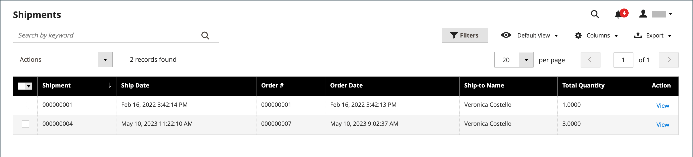
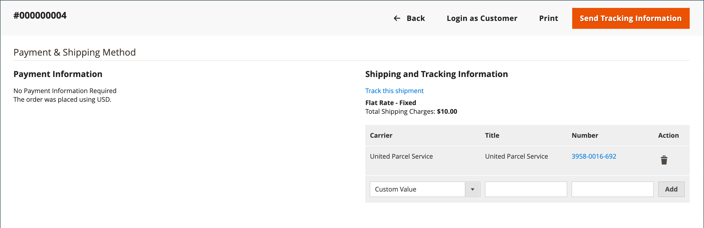
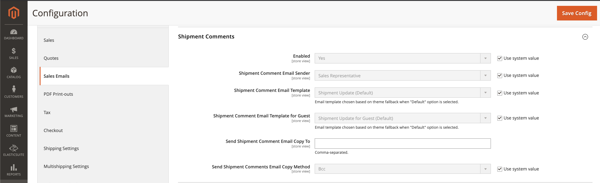

# Shipments

The _Shipments_ grid lists the shipment record of all invoices that have been prepared for shipping. A shipment record can be generated when an order is [invoiced](invoices.md) or later.

Adobe Commerce and Magento Open Source support partial and complete order shipment, with additional options available from [Inventory Management](../inventory-management/introduction.md) and third-party extensions.

<!-- zoom -->

## Column descriptions

|Column or control|Description|
|--- |--- |
|Select|Select the checkbox for each quote to be subject to an action, or use the selection control in the column header. Options: `Select All` / `Deselect All`|
|Shipment|A unique, sequential number that is assigned when a new shipment is saved for the first time|
|Ship Date|Shipping date|
|Order|Unique number of the order|
|Order Date|The date and time the order was placed|
|Ship-to Name|The name of the person to whom the order is shipped|
|Total Quantity|Total quantity of items to ship|
|Action|View opens the shipment in edit mode|

{style="table-layout:auto"}

Additional columns:

|Column|Description|
|--- |--- |
|Order Status|Indicates the order status|
|Purchased From|Indicates the website, store, and store view where the order was placed|
|Customer Name|The name of the customer or buyer who placed the order|
|Email|The email address of a registered customer|
|Customer Group|The name of the customer group or shared catalog to which the customer is assigned|
|Billing Address|The name of the customer or buyer who placed the order|
|Shipping Address|The name of the person to whom the order is shipped|
|Payment Method|The method of payment to be used for the order|
|Shipping Information|The method that is to be used to ship the order|

{style="table-layout:auto"}

## Create a shipment

The following instructions walk you through the process to create a shipment in Adobe Commerce or Magento Open Source. If you have Inventory Management enabled, you may want to review [Create Multi-Source Shipments](../inventory-management/shipments-create.md).

If you have Inventory Management enabled, select a source (or location) and an amount of quantity to send per line item. 

1. On the _Admin_ sidebar, go to **Sales** > **Orders**.

1. Find the order in the grid and open it.

1. If the order is paid, invoiced, and ready to ship, click **Ship**.

   The sections at the top of the shipment contain name, address, and payment information from the sales order.

1. Complete each section of the shipment form using the instructions in the following sections.

### Items to Ship

For each line item in the order, modify the **Qty to Ship** as needed.

### Shipping Information

**Method 1:** Using the order page

1. On the _Admin_ sidebar, go to **Sales** > **Orders**.

1. In the **Action** column for the selected order, click **View**.

1. Click **Ship**.

1. Scroll down to the _Payment & Shipping Method_ block and click **Add Tracking Number**.

1. Set **Carrier**:

   - Custom Value
   - DHL
   - Federal Express
   - United Parcel Service
   - United States Postal Service

1. Enter **Title** and **Number** to track the shipment.

**Method 2:** Using the shipment page

This method is only allowed if the order shipment has already been created from the order page.
You can modify shipping and tracking information as needed using the direct shipment page:

1. On the _Admin_ sidebar, go to **Sales** > **Shipments**.

1. Find and open the shipment in edit mode.

1. Scroll down to the _Payment & Shipping Method_ block.

1. Select the **Carrier**.

1. Enter a **Title** for the package.

1. Enter the tracking **Number**.

1. Click **Add**.

1. To send an email with tracking information to customer, click **Send Tracking Information**, and confirm the action.

   To track the location of any shipment, open the required shipment in edit mode and click **Track this shipment**.

   <!-- zoom -->

### Buttons

|Button|Description|
|--- |--- |
|**Back**|Closes the New Shipment form, and returns to the order|
|**Submit Shipment**|Adds the shipment for the order.|
|**Reset**|Restores all fields to original values.|

{style="table-layout:auto"}

### Shipping Comments

1. Enter **Comments** for the shipment, if needed.

1. When the shipment is ready, click **Submit Shipment**.

## Set up comments for shipments

1. On the _Admin_ sidebar, go to **Stores** > _Settings_ > **Configuration**.

1. Under _Sales_, select **Sales Email**.

1. Expand the **Shipment Comments** section and modify the settings as needed:

   <!-- zoom -->

   - The **Enabled** option is set to `Yes` by default, which means that the email is sent to a customer when a shipping comment is entered.

   - For **Shipment Comment Email Sender**, select the person from whom the shipment comment email is sent. The default offers five email addresses.

   - For **Shipment Comment Email Template**, select the template based on your requirement or select the default option.

   - For **Shipment Comment Email Template for Guests**, choose the template used for customers who do not have an account in your store.

   - For **Shipment Comment Email Copy To**, enter the email addresses to send a shipment comment email copy. Separate multiple email addresses with a comma.

   - For **Shipment Comment Email Copy Method**, select `bcc` (blind carbon copy) or `separate email copy` method based on your preference.

1. Click **Save Config**.

## Cancel a shipment

Before a shipment is dispatched to a carrier, it can be canceled by opening the order and navigating to the shipment, provided the carrier supports cancellations. Some carriers restrict or limit cancellations after a booking. For example, UPS allows cancellations, but requires that you wait 24 hours after the shipment is booked. If a shipment is canceled, the cancellation cannot be reversed. The only recourse is to recreate the order.

1. On the _Admin_ sidebar, go to **Sales** > **Orders**.

1. Find the order in the grid.

1. In the _Action_ column, choose **View**.

1. In the left panel, choose **Shipments**.

   If the shipment can be canceled, _Cancel Shipment_ appears as an option in the top button bar.

1. Click **Cancel Shipment**.

1. When prompted to confirm, click **OK**.

The status of the shipment changes to `Canceled`. If the carrier does not support cancellations, an error message appears and explains why the shipment could not be canceled.

## Shipment field descriptions

### Shipping Information

|Field|Description|
|-----|-----------|
|Carrier|The name of the selected carrier|
|Title|A descriptive name assigned to the package by the carrier.|
|Number|The linked tracking number that is assigned to the package.|
|Action| - Deletes the package information from the shipment record.|
|Add|Add another package to the shipment.|

{style="table-layout:auto"}

### Route Information

|Field|Description|
|-----|-----------|
|Origin Location|Displays a list of available locations.|
|International|If checked, identifies the shipment as an international shipment.|

{style="table-layout:auto"}

### Items ordered

|Field|Description|
|-----|-----------|
|Description|The description of the item.|
|SKU|The Stock Keeping Unit of the item.|
|Weight|The weight of the item.|
|Qty Ordered|The quantity of the item that was ordered.|
|Qty Shipped|The quantity of items that have been shipped.|
|Qty Packed|The number of items included in this package.|

{style="table-layout:auto"}

### Shipment Comments

|Field|Description|
|-----|-----------|
|Comments|Comments about the shipment are for internal use.|

{style="table-layout:auto"}

### Documentation

|Field|Description|
|-----|-----------|
|Package Label|**PNG** - Download the shipment package label. Size: A6 (105 x 148 mm; 4.1 x 5.6 in.)|

{style="table-layout:auto"}
