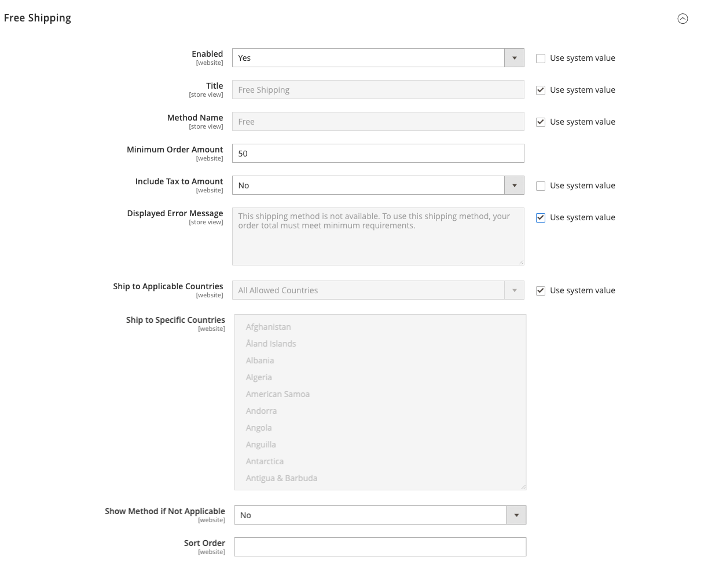

# Free shipping

_Free shipping_ is one of the most effective promotions that you can offer. It can be based on a minimum purchase, or set up as a [cart price rule](../merchandising-promotions/price-rules-cart.md) that is applied when a set of conditions is met. If both apply to the same order, the configuration setting takes precedence over the cart rule.

>[!NOTE]
>
>Check your shipping carrier configuration for any additional settings that may be required for free shipping.

## Step 1: Configure free shipping

1. On the _Admin_ sidebar, go to **[!UICONTROL Stores]** > _[!UICONTROL Settings]_ > **[!UICONTROL Configuration]**.

1. In the left panel, expand **[!UICONTROL Sales]** and choose **[!UICONTROL Delivery Methods]**.

1. Expand  the **[!UICONTROL Free Shipping]** section.

   >[!NOTE]
   >
   >If necessary, first deselect the **[!UICONTROL Use system value]** checkbox to change the following settings as described.

1. Set **[!UICONTROL Enabled]** to `Yes`.

1. For **[!UICONTROL Title]**, enter a title that identifies the Free Shipping method during checkout and a **[!UICONTROL Method Name]** to describe it.

1. For **[!UICONTROL Minimum Order Amount]**, enter the minimum total value that qualifies for free shipping.

   >[!TIP]
   >
   >To use free shipping with [table rates](shipping-table-rate.md), make the _[!UICONTROL Minimum Order Amount]_ so high that it is never met. Using this high value prevents free shipping from going into effect, unless it is triggered by a price rule.

1. Set **[!UICONTROL Include Tax to Amount]**:

   - `Yes` – Includes tax when calculating the Minimum Order amount (Subtotal + Tax - Discount).
   - `No` – Does not include tax when calculating the Minimum Order amount (Subtotal - Discount).

   {width="600" zoomable="yes"}

1. For **[!UICONTROL Displayed Error Message]**, enter the message to appear if free shipping becomes unavailable.

1. Set **[!UICONTROL Ship to Applicable Countries]**:

   - `All Allowed Countries` – Customers from all [countries](../getting-started/store-details.md#country-options) specified in your store configuration can use free shipping.

   - `Specific Countries` – After choosing this value, the _[!UICONTROL Ship to Specific Countries]_ list appears. Select each country in the list where free shipping can be used.

1. Set **[!UICONTROL Show Method if Not Applicable]**:

   - `Yes` – Always shows the Free Shipping method, even when not applicable.
   - `No` – Shows the Free Shipping method only when applicable.

1. For **[!UICONTROL Sort Order]**, enter the number that determines the position of free shipping in the list of delivery methods during checkout.

   `0` = first, `1` = second, `2` = third, and so on.

1. Click **[!UICONTROL Save Config]**.

## Step 2: Enable free shipping in the carrier configuration

Make sure to complete any configuration that is required for each carrier that you plan to use for free shipping. For example, if your [UPS configuration](ups.md) is otherwise complete, update the following settings to enable and configure free shipping.

1. In the _[!UICONTROL Delivery Methods]_ configuration, expand  the **[!UICONTROL UPS]** section.

1. Set **[!UICONTROL Free Method]** to `UPS Ground` or another type you want to designate for free shipping.

1. To require a minimum order for free shipping, set **[!UICONTROL Enable Free Shipping Threshold]** to `Enable`.

   If you choose to use a minimum order, enter the required amount for **[!UICONTROL Free Shipping Amount Threshold]**.

1. Click **[!UICONTROL Save Config]**.
