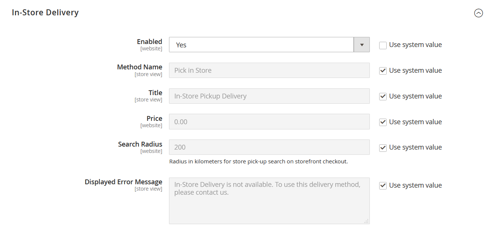

# In-store delivery

With the in-store delivery method, the customer can select a source to be used as a pickup location during the checkout.

<!-- zoom -->

## Before setup

- Make sure you have a non-default stock and source. For more information about how to configure a source as a pickup location, see [Adding a New Source](../inventory-management/sources-add.md).
- Make sure you have configured a Distance Priority Algorithm. For more information, see [Configuring Distance Priority Algorithm](../inventory-management/distance-priority-algorithm.md).
- Make sure you have [downloaded and imported](../inventory-management/cli.md#import-geocodes) all necessary geocodes for Offline Calculation.
- Make sure you have configured a [Default Tax Destination Calculation](https://docs.magento.com/user-guide/configuration/sales/tax.html#default-tax-destination-calculation) settings.

>[!IMPORTANT]
>
>**In the storefront, search results are filtered by country to show relevant results:**  
>- If the customer has a shipping address, the country is taken from the shipping address.
> - If the customer does not have a shipping address, the country is taken from the [Default Tax Destination Calculation](https://docs.magento.com/user-guide/configuration/sales/tax.html#default-tax-destination-calculation) settings. These settings are set per store view, so you need to configure the Store View country to make it work properly.

## Set up in-store delivery

First, check that In-store Delivery is enabled.

1. On the _Admin_ sidebar, go to **Stores** > _Settings_ > **Configuration**.

1. In the left panel, expand **Sales** and choose **Delivery Methods**.

1. Expand  the **In-Store Delivery** section.

   <!-- zoom -->

1. Set **Enabled** to `Yes`.

   >[!NOTE]
   >
   >If needed, clear the **Use system value** checkbox to change the default for any field.

1. Enter the **Method Name** that describes the method of calculation that is used to produce a shipping estimate.

   The method name appears next to the calculated estimated rate in the shopping cart.

1. Enter the **Title** that you want to appear for In-Store Delivery section during checkout.

   The default title is `In-Store Pickup Delivery`.

1. Enter the **Price** to charge customers for the in-store pickup service.

1. Enter the **Search Radius** in kilometers for store pickup location search on storefront checkout.

1. For **Displayed Error Message**, enter the message that appears if In-Store Delivery becomes unavailable.

   The default message is `In-Store Delivery is not available. To use this delivery method, please contact us.`

1. Click **Save Config**.
