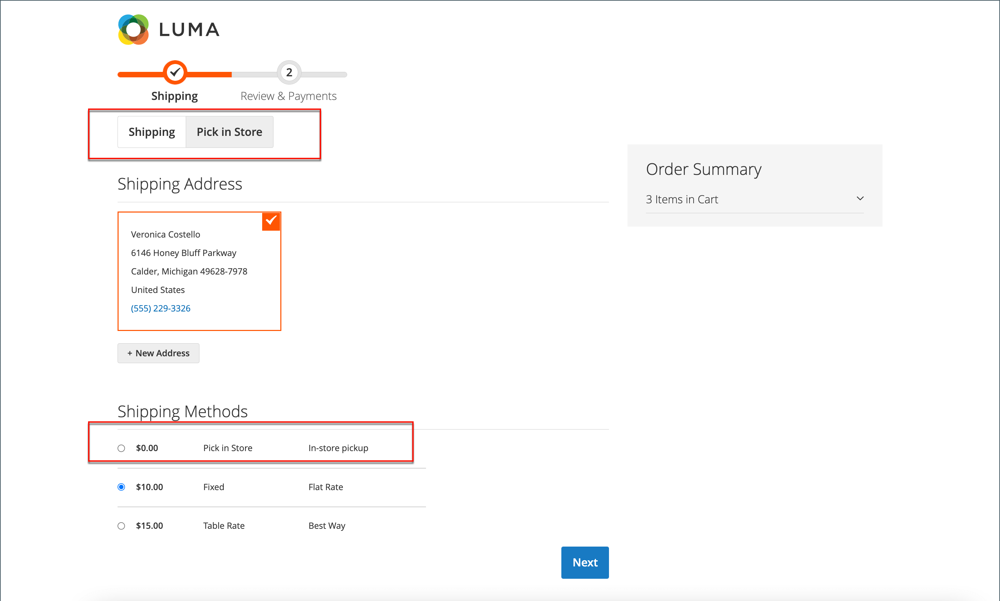

# In-store delivery

With the in-store delivery method, the customer can select a source to be used as a pickup location during the checkout.

{width="700" zoomable="yes"}

During checkout on the storefront:

1. The customer clicks **[!UICONTROL Pick In Store]** or selects the _[!UICONTROL In-Store Pickup Delivery]_ shipping method.
1. The _[!UICONTROL Pick In Store]_ checkout tab opens.

When the customer has an address, or previously filled the shipping address form before switching to the _[!UICONTROL Pick In Store]_ tab:

- The closest source to the customer address within the configured radius is automatically preselected as a pick-up store.
- When the customer clicks **[!UICONTROL Select Other]**, the _[!UICONTROL Select Store]_ search form opens. Only stores within the configured distance (radius) to the preselected store are displayed in the list. All stores in the list are sorted by the distance to the preselected store.
- When the customer enters a postal code or city name in the search field, only stores within the configured distance (radius) to the searched location are displayed in the list. All stores in the list are sorted by the distance to the searched location.
- When the customer clears the postal code or city name from the search field, all pick-up stores that are assigned to the products in shopping cart are shown to the customer. All stores in the list are sorted in ascending order of the source codes without any distance (radius) limitation.

In the case when the customer has no address or did not previously fill the shipping address form before switching to the [!UICONTROL Pick In Store] tab:
- The page displays the _We could not preselect pickup location based on available information_ message.
- When the customer clicks [!UICONTROL Select Store] button, [!UICONTROL Select Store] search form is opened.
- All pick-up stores assigned to the products in shopping cart are shown to the customer in ascending order of the source codes without any distance (radius) limitation.
- When the customer enters postcode or city name in the search field, only stores within the configured distance (radius) to the searched location are displayed in the list. All stores in the list are sorted by the distance to the searched location.

## Before setup

- Make sure you have a non-default stock and source. For more information about how to configure a source as a pickup location, see [Add a source](../inventory-management/sources-add.md).
- Make sure you have configured a Distance Priority Algorithm. For more information, see [Configure the Distance Priority Algorithm](../inventory-management/distance-priority-algorithm.md).
- Make sure you have [downloaded and imported](../inventory-management/cli.md#import-geocodes) all necessary geocodes for offline calculation.
- Make sure you have configured [Default Tax Destination Calculation](../configuration-reference/sales/tax.md#default-tax-destination-calculation) settings.

>[!IMPORTANT]
>
>**In the storefront, search results are filtered by distance (radius) to show relevant results:**  
>If the customer has a shipping address, the base location to calculate the distance (radius) is taken from the shipping address.  
>If the customer does not have a shipping address, the base location to calculate the distance is taken from the [Default Tax Destination Calculation](../configuration-reference/sales/tax.md#default-tax-destination-calculation) settings. These settings are set per store view. So, you must configure the Default Tax Destination Calculation settings to make pick-up store search work properly.

## Set up in-store delivery

First, check that in-store delivery is enabled.

1. On the _Admin_ sidebar, go to **[!UICONTROL Stores]** > _[!UICONTROL Settings]_ > **[!UICONTROL Configuration]**.

1. In the left panel, expand **[!UICONTROL Sales]** and choose **[!UICONTROL Delivery Methods]**.

1. Expand  the **[!UICONTROL In-Store Delivery]** section.

   {width="600" zoomable="yes"}

1. Set **[!UICONTROL Enabled]** to `Yes`.

   >[!NOTE]
   >
   >If needed, clear the **[!UICONTROL Use system value]** checkbox to change the default for any field.

1. Enter the **[!UICONTROL Method Name]** that describes the method of calculation that is used to produce a shipping estimate.

   The method name appears next to the calculated estimated rate in the shopping cart.

1. Enter the **[!UICONTROL Title]** that you want to appear for _In-Store Delivery_ section during checkout.

   The default title is `In-Store Pickup Delivery`.

1. To charge customers for the in-store pickup service, enter the fee in the **[!UICONTROL Price]** field.

1. Enter the **[!UICONTROL Search Radius]** in kilometers for store pickup location search on storefront checkout.

1. For **[!UICONTROL Displayed Error Message]**, enter the message that appears if in-store delivery becomes unavailable.

   The default message is `In-Store Delivery is not available. To use this delivery method, please contact us.`

1. Click **[!UICONTROL Save Config]**.
