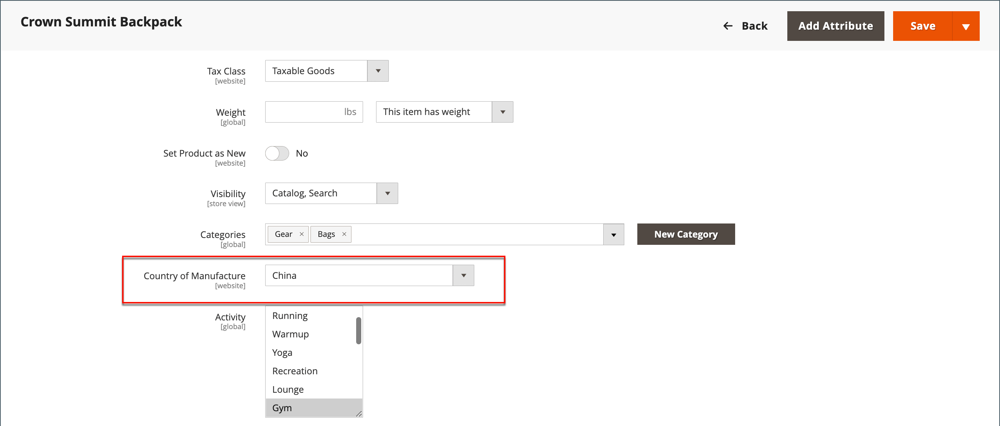

# Configure shipping labels

The following settings must be made at the product level, and in the configuration of each carrier that is used to print labels. To print labels, all carriers require that you open an account. Then, complete the configuration in your store for each carrier that you plan to use.s

## Carrier requirements

|[!UICONTROL Carrier]|Requirements|
|-------|--------|
|[USPS](usps.md)|Requires a USPS account. As of February 23, 2018, USPS requires all shipping labels to include postage.|
[UPS](ups.md)|Requires a UPS account. Shipping labels are available only for shipments that originate in the U.S. Specific credentials are required for stores outside the US.|
|[FedEx](fedex.md)|Requires a FedEx account. For stores outside of the U.S., shipping labels are supported for international shipments only. FedEx does not allow domestic shipments that originate outside of the U.S|
[DHL](dhl.md)|Requires a DHL account. Shipping labels are supported only for shipments that originate in the U.S.|

{style="table-layout:auto"}

## Step 1: Verify the country of manufacture

The country of manufacture is required for all products that are shipped internationally by USPS and FedEx. If you have many products that need to be updated, you can either [import](../systems/data-import.md) the updates, or use the Inventory grid to update multiple records.

1. On the _Admin_ sidebar, go to **[!UICONTROL Catalog]** > **[!UICONTROL Products]**.

1. Update the shipping label record using one of the following methods.

### Method 1: Update a single record

1. In the grid, find the product to be updated, and open in edit mode.

1. In the _Advanced Settings_ section in the left panel, choose **Autosettings**.

1. Update the **Country of Manufacture** as needed.

   <!-- zoom -->

1. Click **[!UICONTROL Save]**.

### Method 2: Update multiple records

1. In the grid, select the checkbox of each product to be updated.

   For example, all products that are manufactured in China.

1. Set the **[!UICONTROL Actions]** control to `Update Attributes` and click **[!UICONTROL Submit]**.

1. In the _Update Attributes_ form, find the **Country of Manufacture** field and select the **Change** checkbox. Then, choose the country.

1. Click **[!UICONTROL Save]**.

## Step 2 Verify the store information

1. On the _Admin_ sidebar, go to **[!UICONTROL Stores]** > _[!UICONTROL Settings]_ > **[!UICONTROL Configuration]**.

1. In the left panel, expand **[!UICONTROL Sales]** and choose **Shipping Settings**.

1. Expand  the **Origin** section, and verify that the following fields are complete:

   - **Street Address** – The street address of the place from which shipments are sent. For example, the location of your company or warehouse. This field is required for shipping labels.
   - **Street Address Line 2** – Any additional address information, such as the floor or entrance. Using this field is recommended.

   <!-- zoom -->

1. In the _Sales_ section in the left panel, choose **[!UICONTROL Delivery Methods]**.

1. Expand  the **[!UICONTROL USPS]** section, and verify that the following fields are complete:

   - **Secure Gateway URL** – The system automatically enters the gateway URL.
   - **[!UICONTROL Password]** – The password is provided by USPS and gives you access to their system through Web Services.
   - **Length, Width, Height, Girth** – The default dimensions of the package. To make these fields appear, set **[!UICONTROL Size]** to `Large`.

1. Expand  the **FedEx** section and verify that the following fields are complete:

   - Meter Number
   - Key
   - Password

   This information is provided by the carrier, and is required to gain access to their system through Web Services.

1. In the left panel, expand **General** and choose **General** underneath.

1. Expand  the **Store Information** section and verify that the following fields are complete:

   - **Store Name** – The name of the store or store view.
   - **Store Contact Telephone** – The telephone number of the primary contact for the store or store view.
   - **Country** – The country where your store is based.
   - **VAT Number** – If applicable the Value Added Tax number of your store. (Not required for stores based in the U.S.)
   - **Store Contact Address** – The street address of the primary contact for the store or store view.

1. If you have multiple stores and the contact information differs from the default, set **[!UICONTROL Store View]** for each and verify that the information is complete.

   If the information is missing, an error appears when you try to print the labels.

   <!-- zoom -->

1. Click **[!UICONTROL Save Config]**.
