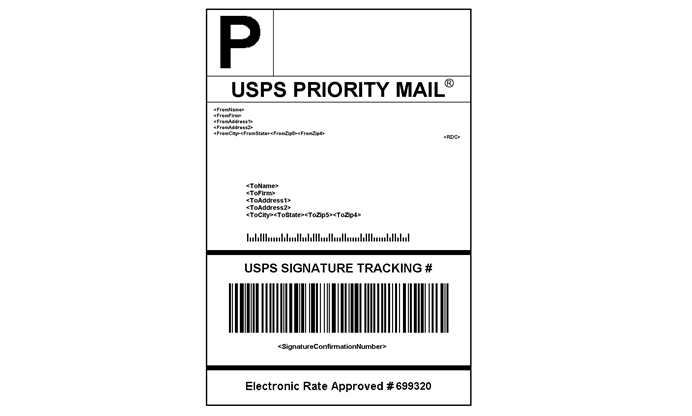

# Shipping labels

Commerce includes a high level of integration with major shipping carriers, which gives you access to carrier shipping systems to track orders, create shipping labels, and more. Shipping labels can be created for regular shipments and products with return merchandise authorization. In addition to the information provided by the shipping carrier, the label also includes the Commerce order number, number of the package, and the total quantity of packages for the shipment.

{width="300"}

- [Configure shipping labels](shipping-label-configure.md)
- [Create shipping labels and packages](shipping-label-create.md)

## Shipping label workflow

Shipping labels can be produced at the time a shipment is created, or later. Shipping labels are stored in PDF format and are downloaded to your computer.

### Step 1: Merchant submits shipping label request

The merchant/store manager completes the information necessary to generate labels, and submits the request.

### Step 2: Request sent to carrier

Commerce contacts the shipping carrier, and creates an order in the carrier's system. A separate order is created for each package that is shipped.

### Step 3: Carrier sends label and tracking number

The carrier sends the shipping label and tracking number for the shipment.

- A single shipment with multiple packages receives multiple shipping labels.

- If you generate the same shipping labels multiple times, the original tracking numbers are preserved.

- For returned products with RMA numbers, the old tracking numbers are replaced with new ones.

### Step 4: Merchant downloads and prints the label

After the shipping label is generated, the new shipment is saved and the label can be printed. If the shipping label cannot be created due to problems with the connection or any other reason, the shipment is not created. Depending on your browser settings, the PDF file can be opened and printed. Each label appears on a separate page in the PDF.
