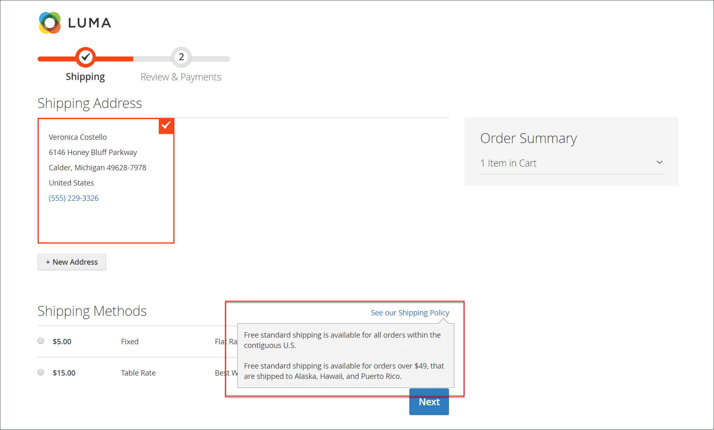
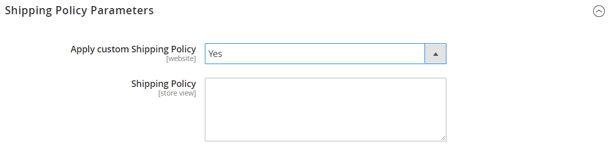

# Shipping settings

The shipping configuration establishes the point of origin for all shipments, your shipping policy, and the handling of shipments to multiple addresses.

## Point of origin

The point of origin is used to calculate the charge for shipments made from your store or warehouse, and also determines the tax rate for products sold. When calculating [EU taxes](international-tax-guidelines.md#eu-tax-configuration), make sure that the [Default Tax Destination Calculation](../configuration-reference/sales/tax.md) for each store view corresponds to the Shipping Settings point of origin.

{width="600" zoomable="yes"}

1. On the _Admin_ sidebar, go to **[!UICONTROL Stores]** > _[!UICONTROL Settings]_ > **[!UICONTROL Configuration]**.

1. In the left panel, expand **[!UICONTROL Sales]** and choose **[!UICONTROL Shipping Settings]**.

1. Expand  the **[!UICONTROL Origin]** section and complete the following:

   - [!UICONTROL Country]
   - [!UICONTROL Region / State]
   - [!UICONTROL ZIP / Postal Code]
   - [!UICONTROL City]
   - [!UICONTROL Street Address] (and line 2, if needed)

1. Click **[!UICONTROL Save Config]**.

## Shipping policy

A shipping policy should explain your company's business rules and guidelines for shipments. For example, if you have price rules that trigger free shipping, you can explain the terms in your shipping policy.

{width="700" zoomable="yes"}

To display your shipping policy during checkout, complete the Shipping Policy Parameters in the configuration. The text appears when customers click _See our shipping policy_ during checkout.

1. On the _Admin_ sidebar, go to **[!UICONTROL Stores]** > _[!UICONTROL Settings]_ > **[!UICONTROL Configuration]**.

1. In the left panel, expand **[!UICONTROL Sales]** and choose **[!UICONTROL Shipping Settings]**.

1. Expand  the **[!UICONTROL Shipping Policy Parameters]** section.

1. Set **[!UICONTROL Apply Custom Shipping Policy]** to `Yes`.

1. Either paste or enter your **[!UICONTROL Shipping Policy]** into the text box.

   >[!NOTE]
   >
   >If you use a word processor to compose the text, make sure to save the document as a .txt file to remove any control characters from the text. Then, copy and paste the text into the Shipping Policy text box.

   {width="600" zoomable="yes"}

1. Click **[!UICONTROL Save Config]**.

## Multiple addresses

The multiple address shipping options enable customers to ship an order to multiple addresses during checkout, and determine the maximum number of addresses to which an order can be shipped.

1. On the _Admin_ sidebar, go to **[!UICONTROL Stores]** > _[!UICONTROL Settings]_ > **[!UICONTROL Configuration]**.

1. In the left panel, expand **[!UICONTROL Sales]** and choose **[!UICONTROL Multishipping Settings]**.

1. Expand  the **[!UICONTROL Options]** section.

   {width="600" zoomable="yes"}

1. Set **[!UICONTROL Allow Shipping to Multiple Addresses]** to `Yes`.

1. Enter the **[!UICONTROL Maximum Qty Allowed for Shipping to Multiple Addresses]**.

1. Click **[!UICONTROL Save Config]**.

>[!NOTE]
>
> (B2B for Adobe Commerce) For orders with multiple shipping addresses, the [Payment on Account](../b2b/enable-basic-features.md#configure-payment-on-account) payment method, even if enabled, are not available during the checkout.
