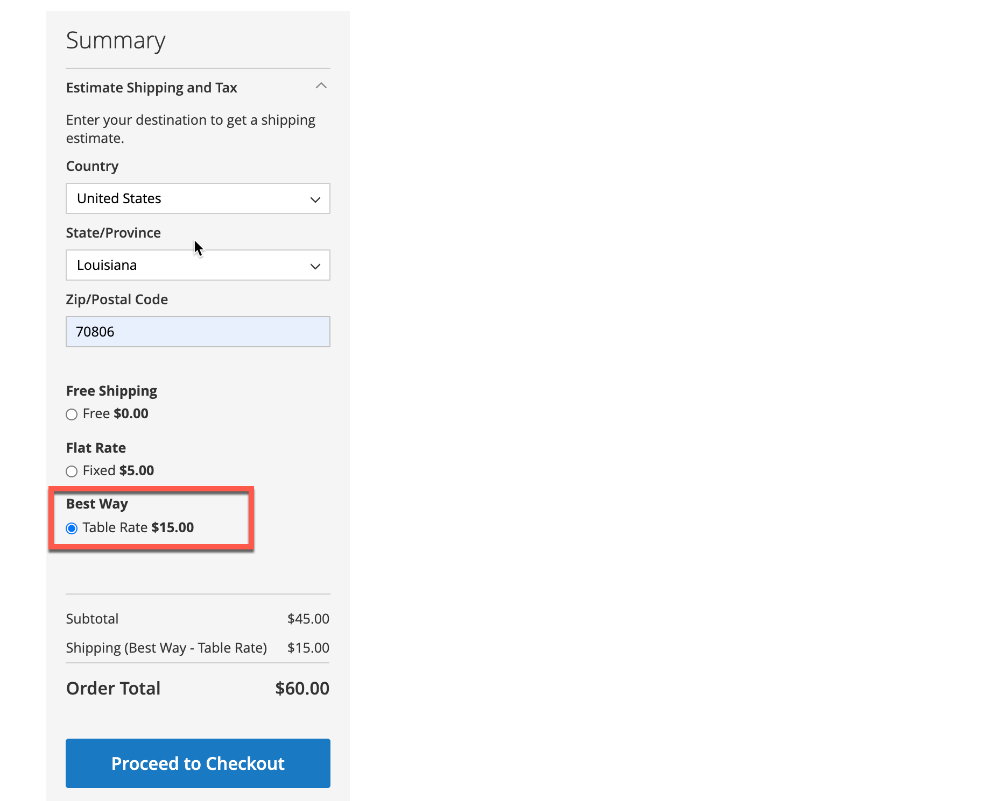
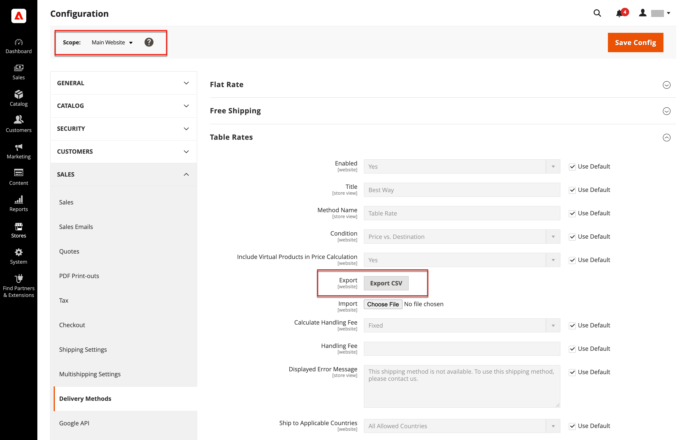
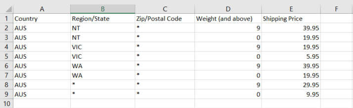
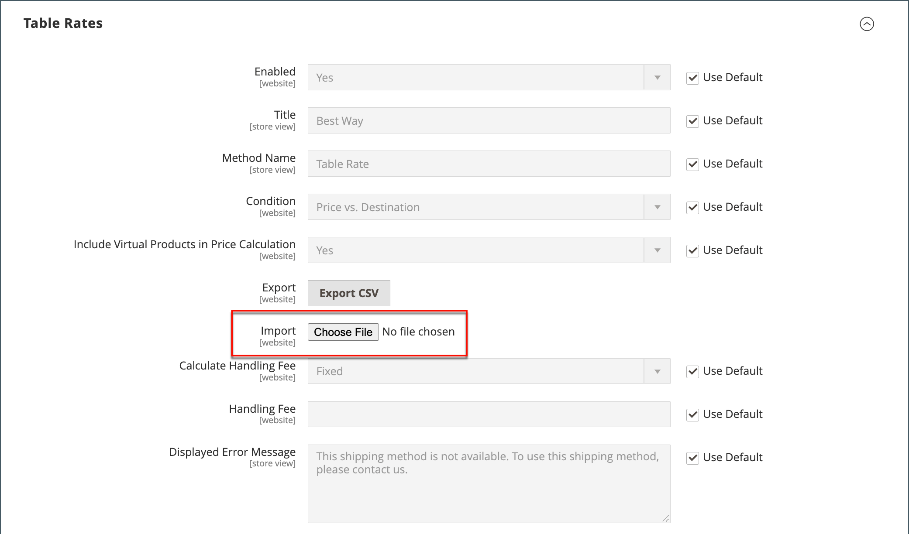

# Table rate shipping

The _table rate_ shipping method references a table of data to calculate shipping rates based on a combination of conditions, including:

- Weight v. Destination
- Price v. Destination
- Number of Items v. Destination

For example, if your warehouse is in Los Angeles, it costs less to ship to San Diego than to Vermont. You can use table rate shipping to pass the savings on to your customers.

The data that is used to calculate tables rates is prepared in a spreadsheet and imported into your store. When the customer requests a quote, the results appear in the shipping estimate section of the shopping cart.

>[!NOTE]
>
>Only one set of table rate data can be active at a time.

<!-- zoom -->

## Step 1: Complete the default settings

The first step is to complete the default settings for table rates. You can complete this step without changing the scope of the configuration.

1. On the _Admin_ sidebar, go to **[!UICONTROL Stores]** > _[!UICONTROL Settings]_ > **[!UICONTROL Configuration]**.

1. In the _[!UICONTROL Sales]_ section of the left panel, choose **[!UICONTROL Delivery Methods]**.

1. Expand  the **[!UICONTROL Table Rates]** section.

   >[!NOTE]
   >
   >If necessary, first clear the **[!UICONTROL Use system value]** checkbox to change the following settings as described.

   <!-- zoom -->

1. Set **[!UICONTROL Enabled]** to `Yes`.

1. Enter the **[!UICONTROL Title]** that you want to appear for table rates section during checkout.

   The default title is `Best Way`.

1. Enter the **[!UICONTROL Method Name]** that you want to appear as a label next to the calculated rate in the shopping cart.

1. Set **[!UICONTROL Condition]** to one of the following calculation methods:

   - `Weight v. Destination`
   - `Price v. Destination`
   - `Number of Items v. Destination`

1. For orders that include virtual products, set **[!UICONTROL Include Virtual Products in Price Calculation]** to `Yes` if you want to be able to include the virtual products in the calculation.

   >[!NOTE]
   >
   >Because virtual products—such as services—have no weight, they cannot change the result of a calculation that is based on the Weight v. Destination condition. However, virtual products can change the result of a calculation that is based on either the Price v. Destination or # of Items vs Destination condition.

1. Configure the handling fee options according to your requirements.

   The handling fee is optional and appears as an extra charge that is added to the shipping cost. If you want to include a handling fee, do the following:

   - Set **[!UICONTROL Calculate Handling Fee]**:

      - `Fixed`
      - `Percent`

   - Enter the **[!UICONTROL Handling Fee]** rate according to the method used to calculate the fee.

      For example, if the charge is based on a fixed fee, enter the amount as a decimal, such as `4.90`. However, if the handling fee is based on a percentage of the order, enter the amount as a percentage. For example, if you are charging six percent of the order, enter the value as `.06`.

1. If needed, change the **[!UICONTROL Displayed Error Message]**.

   This text box is preset with a default message, but you can enter a different message that you want to appear if this delivery method becomes unavailable.

1. Set **[!UICONTROL Ship to Applicable Countries]**:

   - `All Allowed Countries` - Customers from all [countries](../getting-started/store-details.md#country-options) specified in your store configuration can use this delivery method.
   - `Specific Countries` - When you choose this option, the _[!UICONTROL Ship to Specific Countries]_ list appears. Select each country in the list where this delivery method can be used.

1. Set **[!UICONTROL Show Method if Not Applicable]** to `Yes` if you want to show Table Rates all the time

1. For **[!UICONTROL Sort Order]**, enter a number to determine the sequence in which Table Rate Shipping appears when listed with other delivery methods during checkout.

   `0` = first, `1` = second, `2` = third, and so on.

1. Click **[!UICONTROL Save Config]**.

## Step 2: Prepare the table rate data

1. In the upper-left corner, set **[!UICONTROL Store View]** to `Main Website`, or to any other website where the configuration applies.

   >[!NOTE]
   >
   >If necessary, first deselect the **[!UICONTROL Use system value]** checkbox to change the following settings as described.

1. Change the **[!UICONTROL Condition]** as needed.

1. Click **[!UICONTROL Export CSV]**.

1. Save the `tablerates.csv` file to your computer.

   <!-- zoom -->

1. Open the file in a spreadsheet application.

1. Complete the table with appropriate values for the shipping calculation condition.

   - Use an asterisk (*) as a wildcard to represent all possible values in any category.
   - The _[!UICONTROL Country]_ column must contain a [valid three-character code][1] for each row.
   - Sort the data by _[!UICONTROL Region/State]_ so the specific locations are at the top of the list, and the wildcard locations at the bottom. This processes the rules with the absolute values first, and the wildcard values later.
   - Values in the _[!UICONTROL Weight (and above)]_ column can have a maximum of four decimal places (such as `2.5075`). Using more decimal places in the data causes the import to fail. 

   <!-- zoom -->

1. Save the `tablerates.csv` file.

## Step 3: Import the table rate data

1. Return to the **[!UICONTROL Table Rates]** section of your store configuration.

1. In the upper-left corner, set **[!UICONTROL Store View]** to the website where this method is used.

1. For **[!UICONTROL Import]**, click **[!UICONTROL Choose File]** and select your completed `tablerates.csv` file to import the rates.

   <!-- zoom -->

1. Click **[!UICONTROL Save Config]**.

## Step 4: Verify the rates

To make sure that the table rate data is correct, go through the payment process with several different addresses to make sure that the shipping and handling rates are calculated correctly.

### Example 1: Price and destination

This example uses the Price v. Destination condition to create a set of three different shipping rates based on the amount of the order subtotal for the continental United States, Alaska, and Hawaii. The asterisk (*) is a wildcard that represents all values.

|COUNTRY|REGION / STATE|ZIP / POSTAL CODE|ORDER SUBTOTAL (and above)|SHIPPING PRICE|
|--- |--- |--- |--- |--- |
|USA|HI|*|100|10|
|USA|HI|*|50|15|
|USA|HI|*|0|20|
|USA|AK|*|100|10|
|USA|AK|*|50|15|
|USA|AK|*|0|20|
|USA|*|*|100|5|
|USA|*|*|50|10|
|USA|*|*|0|15|

{style="table-layout:auto"}

### Example 2: Weight and destination

This example uses the Weight v. Destination condition to create different shipping rates based on the weight of the order.

|COUNTRY|REGION / STATE|ZIP / POSTAL CODE|WEIGHT (and above)|SHIPPING PRICE|
|--- |--- |--- |--- |--- |
|AUS|NT|*|9|39.95|
|AUS|NT|*|0|19.95|
|AUS|VIC|*|9|19.95|
|AUS|VIC|*|0|5.95|
|AUS|WA|*|9|39.95|
|AUS|WA|*|0|19.95|
|AUS|*|*|9|29.95|
|AUS|*|*|0|9.95|

{style="table-layout:auto"}

### Example 3: Restrict free shipping to the continental United States

1. Create a `tablerates.csv` file that includes all the state destinations to which you are willing to provide free shipping.

1. Complete the table rate configuration with the following settings:

   | Setting | Value |
   |----------|-------|
   | [!UICONTROL Condition] | `Price v. Destination` |
   | [!UICONTROL Method Name] | `Free Shipping` |
   | [!UICONTROL Ship to Applicable Countries] | `Specific Countries` |
   | [!UICONTROL Ship to Specific Countries] | `Select only United States` |
   | [!UICONTROL Show method if not applicable] | `No` |

   {style="table-layout:auto"}

1. In the upper-left corner, set **[!UICONTROL Store View]** to `Main Website`, or to any other website where the configuration applies.

1. For **[!UICONTROL Import]**, click **[!UICONTROL Choose File]** and select your completed `tablerates.csv` file to import the rates.

[1]: https://en.wikipedia.org/wiki/ISO_3166-1_alpha-3
