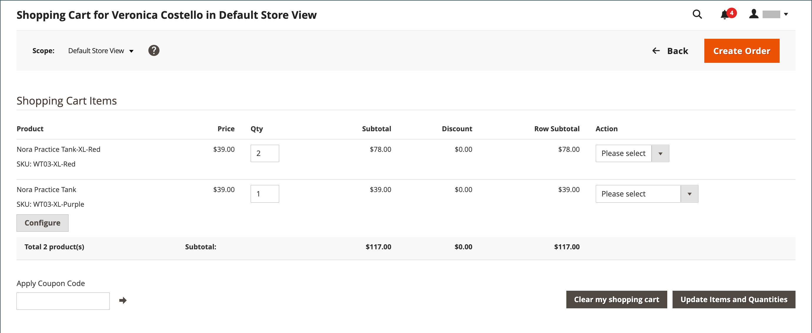
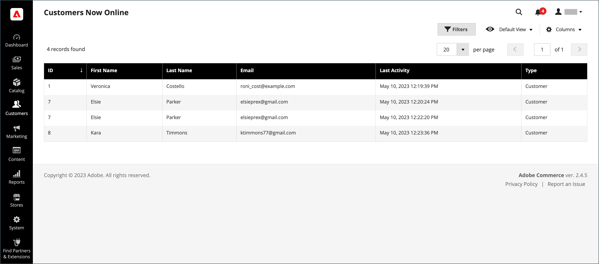
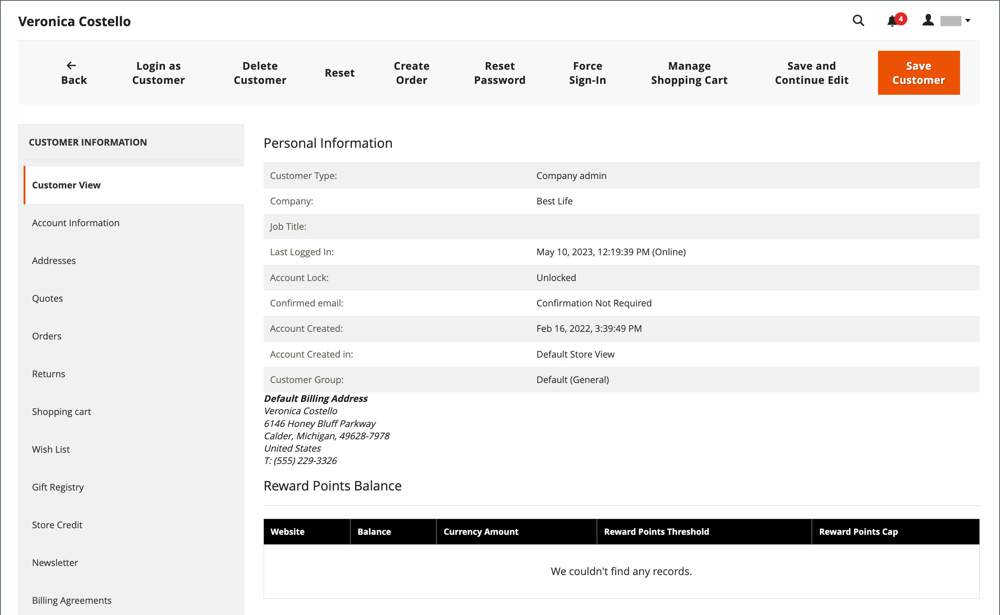
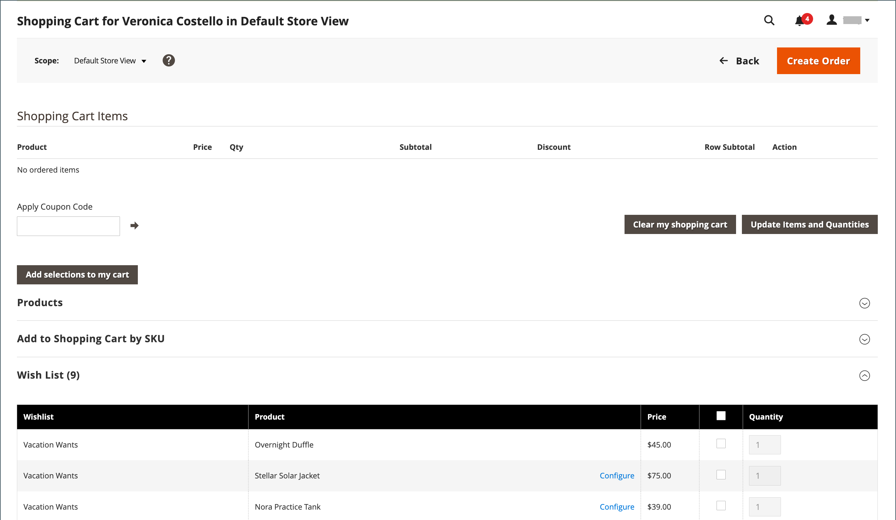
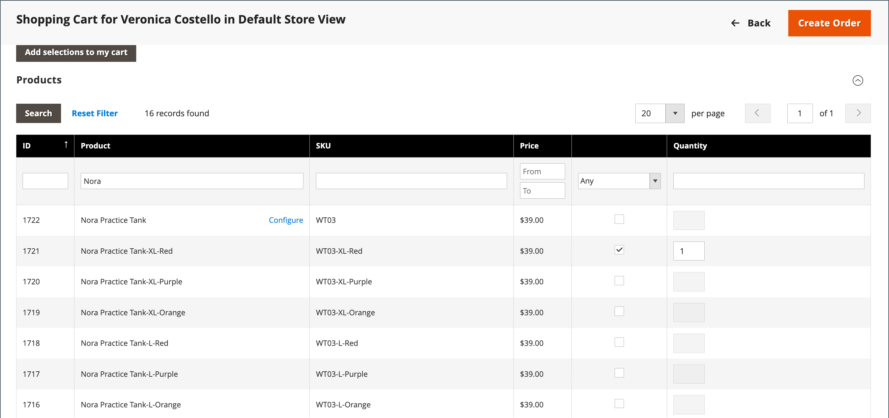
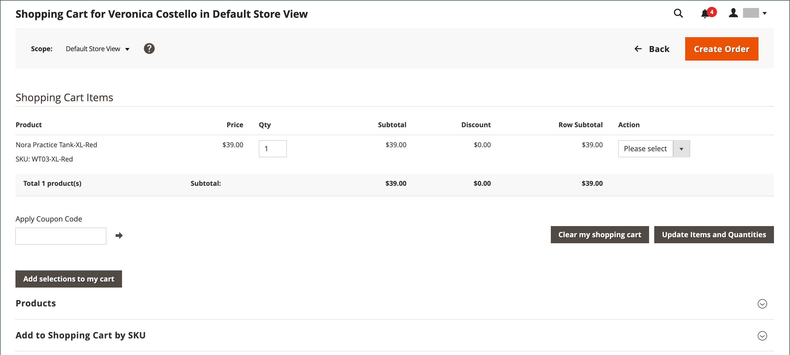
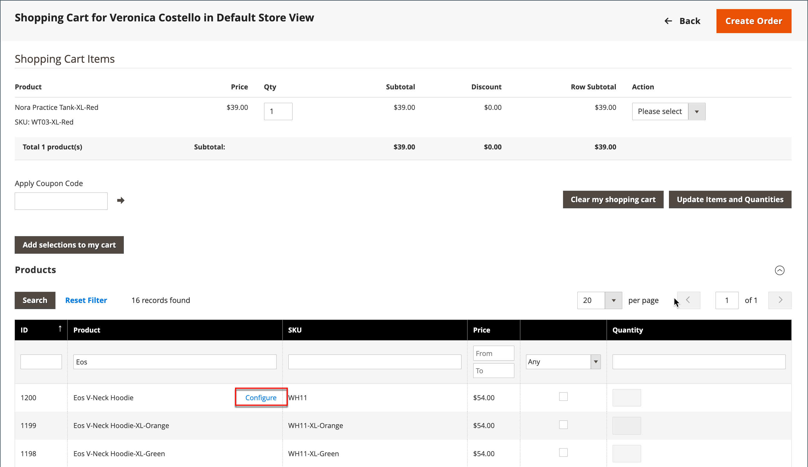
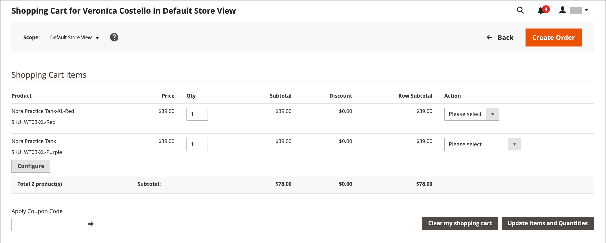
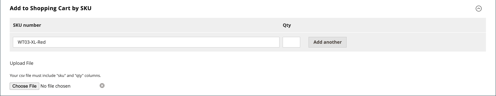

# Manage a shopping cart

{{ee-feature}}

To begin an assisted shopping session, the customer must be logged into their account from the storefront to make the information available. If the customer does not have an account, you can [create one](https://docs.magento.com/user-guide/customers/account-create.html).

<!-- zoom -->

## Actions control

|Option|Description|
|--- |--- |
|Remove|Removes items from the current shopping cart|
|Move to Wish List|Moves items to the selected customer wishlist|

{style="table-layout:auto"}

## Control buttons

|Option|Description|
|--- |--- |
|Clear my shopping cart|Clears the current shopping cart from all products|
|Update Items and Quantities|Enter the required quantity in the **Qty** field and update the number of items in the cart|
|Add selections to my cart|Adds products from all sections to the cart|

{style="table-layout:auto"}

## Verify that the customer is logged in

1. On the _Admin_ sidebar, go to **Customers** > **Now Online**.

   All visitors to the store and logged in customers appear in the list.

   <!-- zoom -->

## Offer assisted shopping

1. On the _Admin_ sidebar, go to **Customers** > **All Customers**.

1. In the list, open the customer record in edit mode.

   To find the customer record in a hurry, use the [Filters](../getting-started/admin-grid-controls.md) control.

   In the customer profile under _Personal Information_, the _Last Logged In_ date and time shows that the customer is online.

   <!-- zoom -->

1. To enter assisted shopping mode, click **Manage Shopping Cart** in the top button bar.

   <!-- zoom -->

## Add products to cart by attribute

1. Expand  the **Products** section.

1. Find a product to add using any of the filters at the top of each column.

1. Click **Search**.

1. Use one of the following series of steps according to the product type:

### Add a simple product

1. Click the product that you want to order.

   This action selects the record and sets **Quantity** to the default value of `1`.

1. If necessary, update the quantity ordered.

1. On the left above the grid, click **Add selections to my cart**.

   <!-- zoom -->

   The line item is added to the Shopping Cart at the top of the page.

   <!-- zoom -->

### Add a product with configuration

There are three types of products that need to be configured before adding to the cart: `Bundle Product`, `Configurable Product`, and `Grouped Product`.

1. In the grid, click **Configure** next to the product name.

   <!-- zoom -->

1. In the _Associated Products_ dialog, choose each product option to describe the item to be ordered, enter the **Quantity**, and click **OK**.

   The product is selected with a checkmark and the quantity ordered appears in the grid.

1. To add the product to the cart, click **Add selections to my cart**.

   <!-- zoom -->

1. Update product options in the cart if needed:

   - Click **Configure**.

   - Update the options and then click **OK**.

## Add product by SKU

1. Expand  the **Add to Shopping Cart by SKU** section.

1. Add products individually by **SKU** or add products by uploading a CSV file.

### Add items individually by SKU

1. Enter the **SKU** and **Qty** of the item to be ordered.

1. To order another product, click **Add another**.

   <!-- zoom -->

1. Click **Add selections to my cart**.

1. If the item is a configurable product, choose the product options when prompted, and then click **Add to Shopping Cart**.

### Add products by uploading a CSV file

1. Prepare a [csv file](https://docs.magento.com/user-guide/system/data-csv.html) with the items to be added to the cart.

   The file must contain only two columns, with `sku` and `qty` in the header.

1. Upload the prepared file:

   - Click **Choose File**.

   - Select the file to be uploaded from your directory.

## Transfer an item

You can transfer items to the cart from a customer's wish list, and recently viewed, compared, or ordered items. The number of items in each section appears in parentheses after the section header.

1. Expand  one of the following sections:

   - Wish List
   - Products in the Comparison List
   - Recently Compared Products
   - Recently Viewed Products
   - Last Ordered Items

1. In the grid, select each product to be ordered and enter the **Quantity**.

1. To enter the options for a configurable product, click **Configure** and set the product options as needed.

1. Click **Add selections to my cart**.

1. Apply a coupon code if available:

   - For **Apply Coupon Code**, enter a valid coupon code.

   - Click the _Apply_ (  ) arrow.

1. Adjust the quantity ordered as needed:

   - In the **Qty** column of the product to be adjusted, enter the correct amount.

   - Click **Update Items and Quantities**.

## Create the order

1. Click **Create Order**.

   The _Create New Order_ page shows the items in the cart, followed by the shipping and payment information.

1. Complete the shipping and payment information.

1. Click **Submit Order**.

To learn more, see [Create an order](customer-account-create-order.md).
