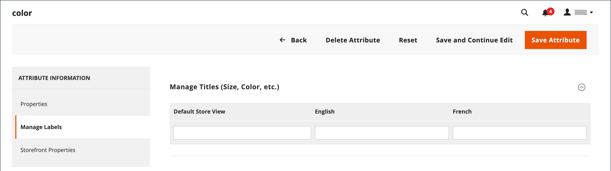
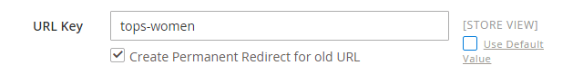
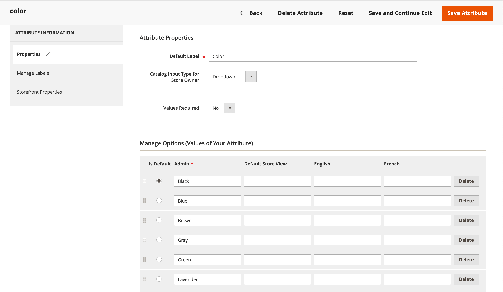

# Store localization

Most of the text that appears to be hard-coded on pages throughout your store can be instantly changed to a different language by changing the locale of the view. Changing the locale does not actually translate the text word-for-word, but simply references a different translation table that provides the interface text that is used throughout the store. The text that can be changed includes navigational titles, labels, buttons, and links such as _My Cart_ and _My Account_. You can also use the [Inline Translation](../configuration-reference/advanced/developer.md) tool to touch up text in the interface.

Language packs can be found under [Translations & Localization][1]{:target="_blank"} on Commerce Marketplace. New extensions are continually added to Marketplace, so check back often.

## Step 1: Install a language pack

Follow the standard instructions for installing the language pack extension. For detailed information about installing an extension, see [General CLI installation][2] in the _Extensions Guide_.

## Step 2: Create a store view for the language

1. On the _Admin_ sidebar, go to **[!UICONTROL Stores]** > _[!UICONTROL Settings]_ > **[!UICONTROL All Stores]**.

1. Click **[!UICONTROL Create Store View]**.

1. Set the options for the new store view:

   - **[!UICONTROL Store]** — Choose the store that is the parent of the view.

   - **[!UICONTROL Name]** — Enter a name for the store view. For example: Portuguese.

      In the header of the store, the name appears in the _language chooser_.

   - **[!UICONTROL Code]** — Enter a code in lowercase characters to identify the view. For example: `portuguese`.

   - **[!UICONTROL Status]** — To activate the view, set to `Enabled`.

   - **[!UICONTROL Sort Order]** — (Optional) Enter a number to determine the sequence in which this view is listed with other views.

1. When complete, click **[!UICONTROL Save Store View]**.

## Step 3: Change the locale of the store view

1. On the _Admin_ sidebar, go to **[!UICONTROL Stores]** > _[!UICONTROL Settings]_ > **[!UICONTROL Configuration]**.

1. In the upper-left corner, set **[!UICONTROL Store View]** to the specific view where the configuration is to apply.

1. When prompted to confirm scope switching, click **[!UICONTROL OK]**.

1. Expand  the **[!UICONTROL Locale Options]** section.

1. Clear the **[!UICONTROL Use Website]** checkbox and set **[!UICONTROL Locale]** to the language that you want to assign to the view.

   If there are several variations of the language available, make sure to choose the one for the specific region or dialect.

1. When complete, click **[!UICONTROL Save Config]**.

   After you change the language of the locale, the remaining content that you have created, including product names and descriptions, categories, [CMS](../content-design/page-translate.md) pages, and blocks must be translated separately for each store view.

## Localize products

If your store has multiple views in different languages, the same products are available in each store view. You can use the same basic product information, such as SKU, price, and inventory level, regardless of language. Then, translate only the product name, description fields, and meta data as needed for each language.

### Step 1: Translate product fields

1. On the _Admin_ sidebar, go to  **[!UICONTROL Catalog]** > **[!UICONTROL Products]**.

1. In the grid, find the product to be translated and open it in edit mode.

1. In the upper-left corner, set **[!UICONTROL Store View]** to the view for the translation and click **[!UICONTROL OK]** when prompted to confirm.

1. For each field to be edited, do the following:

   - Deselect the **[!UICONTROL Use Default Value]** checkbox to the right of the field.

   - Either paste or type the translated text into the field.

   Make sure to translate all text fields, including [image](../catalog/catalog-images-video.md) labels and Alt text, [Search Engine Optimization](../catalog/product-search-engine-optimization.md) fields and any [Custom Options](../catalog/settings-advanced-custom-options.md) information.

1. When complete, click **[!UICONTROL Save]**.

### Step 2: Translate field labels

1. On the _Admin_ sidebar, go to **[!UICONTROL Stores]** > _[!UICONTROL Attributes]_ > **[!UICONTROL Product]**.

1. In the list, find the attribute to be translated and open in edit mode.

1. In the left panel, choose **[!UICONTROL Manage Labels]**.

1. In the _[!UICONTROL Manage Titles]_ section, enter a translated label for each store view.

   {width="600" zoomable="yes"}

1. When complete, click **[!UICONTROL Save Attribute]**.

### Step 3: Translate all categories

1. On the _Admin_ sidebar, go to **[!UICONTROL Catalog]** > **Categories**.

1. At the upper-left corner, set **[!UICONTROL Store View]** to the view for the translation and click **[!UICONTROL OK]** when prompted to confirm.

1. In the tree, find the category to be translated and open it in edit mode.

1. For _Basic Information_, translate **[!UICONTROL Category Name]**.

1. Expand  the _[!UICONTROL Content]_ section and translate **[!UICONTROL Description]**.

1. Expand  the **[!UICONTROL Search Engine Optimization Settings]** section and translate the following fields:

   - **[!UICONTROL Meta Title]**
   - **[!UICONTROL Meta Keywords]**
   - **[!UICONTROL Meta Description]**

1. Under the _[!UICONTROL Search Engine Optimization Settings]_ section, do the following to translate the **[!UICONTROL URL Key]**:

   - Clear the **[!UICONTROL Use Default Value]** checkbox to the right of the field.

   - Enter the translated text.

   - Make sure that the **[!UICONTROL Create Permanent Redirect for old URL]** checkbox is selected.

   

1. When complete, click **[!UICONTROL Save Category]**.

1. Repeat the process for all categories used in the store.

### Step 4: Translate product attributes and attributes options

1. On the _Admin_ sidebar, go to **[!UICONTROL Stores]** > _[!UICONTROL Attributes]_ > **[!UICONTROL Product]**.

1. Select the attribute to be translated.

1. Choose **[!UICONTROL Manage Labels]** on the left and set the **[!UICONTROL Managed Titles]** options to define the attribute title translations.

1. Choose **[!UICONTROL Properties]** on the left and enter the translated attribute options in the **[!UICONTROL Manage Options]** section.

   {width="600" zoomable="yes"}

1. When complete, click **[!UICONTROL Save Attribute]**.

[1]: https://marketplace.magento.com/extensions/content-customizations/translations-localization.html
[2]: https://experienceleague.adobe.com/docs/commerce-operations/installation-guide/tutorials/extensions.html
