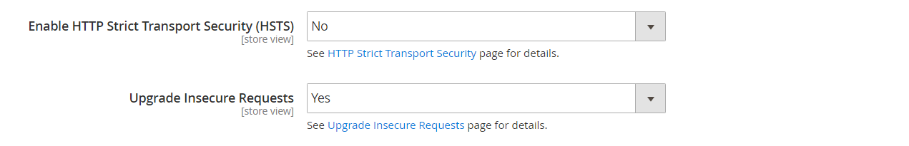

# Store URLs

Each website in a Adobe Commerce or Magento Open Source installation has a base URL that is assigned to the storefront, and another URL that is assigned to the Admin. Adobe uses variables to define internal links in relation to the base URL, which makes it possible to move an entire store from one location to another without updating the links. Standard base URLs begin with `http`, and secure base URLs begin with `https`.

- **Base URL** — `http://www.yourdomain.com/magento/`
- **Secure Base URL** — `https://www.yourdomain.com/magento/`
- **URL with IP address** — `http://###.###.###.###/magento/` or `https://###.###.###.###/magento/`

>[!IMPORTANT]
>
>Do not change the Admin URL from the default base URL configuration. To change the Admin URL or path, see [Use a custom Admin URL](#use-a-custom-admin-url).

## Use a secure protocol

The base URLs for your store were initially set up during your Adobe Commerce installation. If a security certificate was available at the time, you could specify for `HTTPS` URLs to be used for the store, Admin, or both. If your Adobe Commerce installation includes multiple stores or you plan to later add more stores, you can include the store code in the URL. All Adobe resources and operations can be used with secure protocol.

If a security certificate was not available for the domain at the time of the installation, make sure to update the configuration before launching your store. After a security certificate is established for your domain, you can configure either or both base URLs to operate with encrypted Secure Sockets Layer (SSL) and [Transport Layer Security][1] (TLS) protocol.

>[!IMPORTANT]
>
>Adobe strongly recommends transmitting all pages of a production site, including content and product pages, using a secure protocol.

Adobe Commerce and Magento Open Source can be configured to deliver all pages over `HTTPS` by default. If your store has been running up until now with standard protocol, you can improve security by enabling [HTTP Strict Transport Security][2] (HSTS) and upgrading any unsecure page requests that are received by the store. HSTS is an opt-in protocol that prevents browsers from rendering standard `HTTP` pages that are transmitted with unsecure protocol for the specified domain. Because search engines might have already indexed each page of your store with standard `HTTP` URLs, you can configure Commerce to upgrade any unsecure page requests to `HTTPS` automatically , so you don't lose any traffic. When Commerce is configured to use secure URLs for both the store and Admin, two additional fields appear that allow you to enable `HSTS`.

## Configure the base URL

1. On the _Admin_ sidebar, go to **Stores** > _Settings_ > **Configuration**.

1. Under _General_ in the left panel, choose **Web**.

1. Expand  the **Base URL** section.

   - **Base URL** — Enter the fully qualified base URL for your store. Make sure to end the URL with a forward slash, so it can be extended with additional URL Keys from your store. For example: `http://yourdomain.com/`

      >[!NOTE]
      >
      >Do not change the placeholder in the **Base Link URL** field. It is a placeholder that is used to create relative links to the base URL.

   - **Base URL for Static View Files** — (Optional) Specify an alternate location for the base URL for static view files by entering the path starting with the following placeholder:

      \{\{unsecure_base_url}}

   - **Base URL for User Media Files** — (Optional) Specify an alternate location for the base URL for user media files by entering the path starting with the following placeholder:

      \{\{unsecure_base_url}}

      For a typical installation, there is no need to update the paths for the static view files or media files because they are relative to the base URL.

   <!-- zoom -->

   >[!NOTE]
   >
   >Placeholders enclosed in double braces are markup tags for variables.

1. When complete, click **Save Config**.

## Configure the secure base URL

If your domain has a valid security certificate, you can configure the URLs of both the storefront and Admin to transmit data over a secure (https) channel. Without a valid security certificate, your store cannot operate with secure (SSL/TLS) protocol.

1. Expand  the _Base URLs (Secure)_ section. Then, do the following:

   <!-- zoom -->

   - **Secure Base URL** — Enter the full secure base URL, followed by a forward slash. For example: `https://yourdomain.com/`

   - **Secure Base Link URL** — Do not change the placeholder in the secure base link URL field. It is used to create relative links to the secure base URL.

   - **Secure Base URL for Static View Files** — (Optional) Specify an alternate location for the secure base URL for static view files by entering the path starting with the following placeholder:

        \{\{secure_base_url}}

   - **Secure Base URL for User Media Files** — (Optional) Specify an alternate location for the secure base URL for user media files by entering the path starting with the following placeholder:

        \{\{secure_base_url}}

1. To enhance security, set both of the following options to `Yes`.

   - **Use Secure URLs on Storefront**
   - **Use Secure URLs in Admin**

1. For _Enhanced Security Settings_, do the following:

   <!-- zoom -->

   - **Enable HTTP Strict Transport Security (HSTS)** — If you want your store to display only secure HTTPS page requests, set to `Yes`.

   - **Upgrade Insecure Requests** — To upgrade any requests for standard unsecured HTTP pages to secure HTTPS, set to `Yes`.

1. Most Commerce installations use the default `X-Forward-Proto` **Offloader Header** to identify the protocol as either `HTTP` or `HTTPS`. If your server configuration uses a different `offloader_header`, enter it here.

1. When complete, click **Save Config**.

## Include the store code in URLs

>[!NOTE]
>
>When _Add Store Code to URLs_ option is set to `Yes`, you must include store codes in your browser URLs to ensure that URL rewrites are mapped correctly and all pages are opened successfully, without _"404 Page Not Found"_ errors.

1. On the _Admin_ sidebar, go to **Stores** > _Settings_ > **Configuration**.

1. Under _General_ in the left panel, choose **Web**.

1. Expand  the **URL Options** section.

1. Set **Add Store Code** to your preference:

   - **URL with Store Code**: `http://www.yourdomain.com/magento/[store-code]/index.php/url-identifier`
   - **URL without Store Code**: `http://www.yourdomain.com/magento/index.php/url-identifier`

    <!-- zoom -->

1. When complete, click **Save Config**.

1. Click the **Cache Management** link in the message at the top of the workspace. Then, follow the instructions to refresh the cache.

   )

## URL troubleshooting

If after following the configuration instructions, some pages continue to be served with the unsecure URL (`http://`), do the following:

- Change the (unsecure) base URL to the secure HTTPS URL.
- On the server, edit the `.htaccess` file (or load balancer) so the unsecure URL is redirected to the secure URL.

## Use a custom Admin URL

As a [security best practice](https://www.adobe.com/content/dam/cc/en/security/pdfs/Adobe-Magento-Commerce-Best-Practices-Guide.pdf), Adobe recommends that you use a unique, custom Admin URL instead of the default _admin_ or a common term such as _backend_. Although it will not directly protect your site from a determined bad actor, it can reduce exposure to scripts that try to gain unauthorized access.

>[!NOTE]
>
>Check with your hosting provider before implementing a custom Admin URL. Some hosting providers require a standard URL to meet firewall protection rules.

In a typical installation, the Admin URL and path immediately follows the base URL. The Admin path is one directory below the root.

- **Default Base URL**: `http://yourdomain.com/magento/`
- **Default Admin Path**: `admin`
- **Default Admin URL and Path**: `http://yourdomain.com/magento/admin`

Although it is possible to change the Admin URL and path to another location, any mistake removes access to the Admin, and must be corrected from the server.

>[!NOTE]
>
>As a precaution, do not try to change the Admin URL yourself unless you know how to edit configuration files on the server.

### Method 1: Change from the Admin

1. On the _Admin_ sidebar, go to **Stores** > _Settings_ > **Configuration**.

1. In the left panel, expand **Advanced** and choose **Admin**.

1. Expand  the **Admin Base URL** section.

1. Set the configuration options for the custom URL:

   <!-- zoom -->

    If needed, clear the **Use system value** checkbox to change the setting.

   - Set **Use Custom Admin URL** to `Yes`.

   - Enter the **Custom Admin URL**: `http://yourdomain.com/magento/`

      >[!NOTE]
      >
      >The Admin URL must be in the same Commerce installation, and have the same document root as the storefront.

   - Set **Custom Admin Path** to `Yes`.

   - Enter the **Custom Admin Path**.

        This is the desired custom admin folder name only.

        `sample_custom_admin`

1. When complete, click **Save Config**.

1. After the changes are saved, **Sign Out** of the Admin. Then, log back in using the new Admin URL and path.

### Method 2: Change the Admin path from the server command line

1. Open the `app/etc/env.php` file in a text editor, and change the value of the `frontName` parameter of the `backend` section. Then, save the file.

   Make sure to use only lowercase characters.

   >[!NOTE]
   >
   >   This method allows you to change the Admin Path, but not the Admin URL.

      >[!TIP]
      >
      >For Adobe Commerce on cloud infrastructure, you can set up a custom admin path using the **ADMIN_URL** variable in the Cloud UI. See the [Admin variables topic](https://devdocs.magento.com/cloud/env/environment-vars_magento.html#admin-url) in the _Cloud Guide for Commerce_.

   - **Default Admin Path**
      ```php?start_inline=1
      'backend' => [
       'frontName' => 'admin'
      ],
      ```

   - **New Admin Path**
      ```php?start_inline=1
      'backend' => [
          'frontName' => 'backend'
      ],
      ```

1. Use one of the following methods to clear the cache:

   - On the _Admin_ sidebar, go to **System** > _Tools_ > **Cache Management**. Then, click **Flush Magento Cache**.
   - On the server, execute the following:
      ```terminal
      php bin/magento cache:flush
      ```

   >[!NOTE]
   >
   >Note that the changes made using the Method 1 will have the priority over the changes made in the `app/etc/env.php` file.

### Method 3: Change the Admin path using the Commerce CLI

You can use the CLI `setup:config:set` command to change the Admin Path. The following example uses the `--backend-frontname` option to change the path from the Commerce root to a new Admin path:

```terminal
bin/magento setup:config:set --backend-frontname="backend_front_name"
```

This command updates the `backend` > `frontName` configuration option in the `app/etc/env.php` file.

## Restore the default Admin URL and Admin path

In case you have set an invalid Admin URL or an Admin Path and lost access to the backend, there is a way to fix this from the command line.

1. Execute this command to revert to the default Admin URL

   ```terminal
   php bin/magento config:set admin/url/use_custom 0
   ```

1. Execute this command to revert to the default Admin Path (set in the `app/etc/env.php` as described in the Method 2)

   ```terminal
   php bin/magento config:set admin/url/use_custom_path 0
   ```

1. Use one of the following methods to clear the cache:

   - On the _Admin_ sidebar, go to **System** > _Tools_ > **Cache Management**. Then, click **Flush Magento Cache**.
   - On the server, execute the following:
      ```terminal
      php bin/magento cache:flush
      ```


[1]: https://en.wikipedia.org/wiki/Transport_Layer_Security
[2]: https://en.wikipedia.org/wiki/HTTP_Strict_Transport_Security
