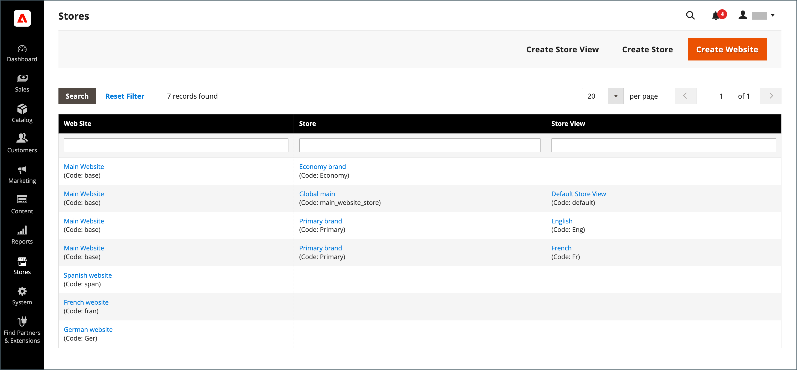
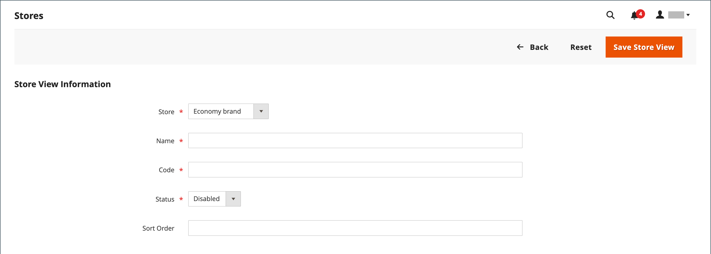
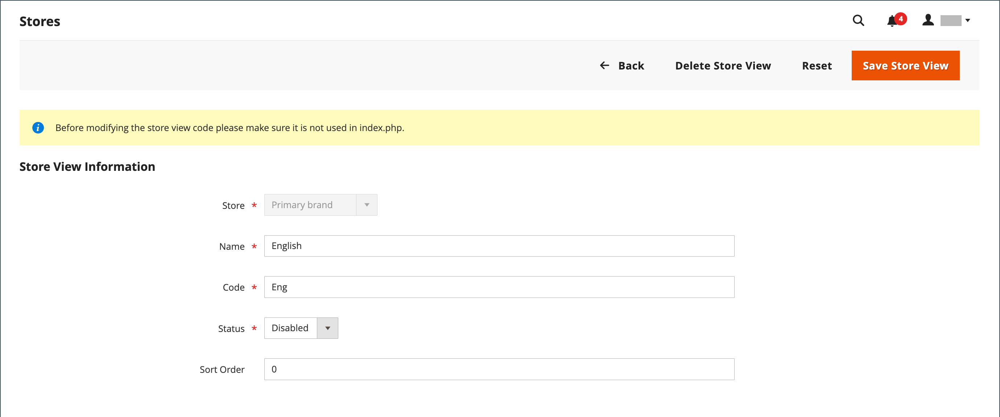
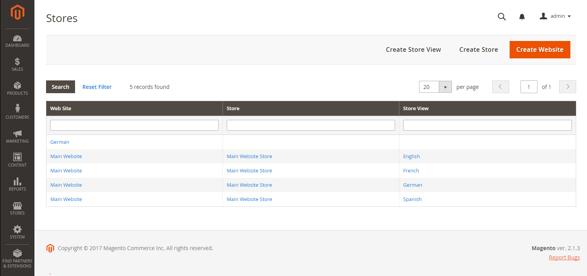

# Store views

Store views are typically used to make the store available in different locales. Shoppers can use the language chooser in the header of the store to change the store view.

<!-- {:width="550px"} -->

## Add a new store view

1. On the _Admin_ sidebar, go to **Stores** > _Settings_ > **All Stores**.

   <!-- zoom -->

1. Click **Create Store View**.

   <!-- zoom -->

1. Set **Store** to the parent store of this view.

1. Enter a **Name** for this store view.

   The name appears in the language chooser in the store header. For example: `Spanish`.

1. Enter a **Code** in lowercase characters to identify the view. For example: `spanish`.

1. To activate the view, set **Status** to `Enabled`.

1. (Optional) Enter a **Sort Order** number to determine the sequence in which this view is listed with other views.

1. Click **Save Store View**.

## Edit a store view

Because the view name appears in the language chooser, you might eventually want to change the name of the default view to something more descriptive. The _Name_ field is simply a label and can be easily changed.

If your Adobe Commerce or Magento Open Source installation has a multisite or multi-store setup, do not change the store Code field without verifying that the value is not referenced in the `index.php` file. If you do not have access to the server to examine the file, ask a developer for help.

| Field | Original value | Updated value |
| ----- | -------------- | ------------- |
| Name  | Default Store View | English |
| Code  | default | english |

{style="table-layout:auto"}

1. On the _Admin_ sidebar, go to **Stores** >  _Settings_ > **All Stores**.

1. In the _Store View_ column of the grid, click the name of the view that you want to edit.

   When editing the default view, the _Store_ and _Status_ fields are not available.

   <!-- zoom -->

1. Update the following fields as needed:

    - **Store** (non-default views only)
    - **Name**
    - **Code** (only if not used in `index.php`)
    - **Status** (non-default views only)
    - **Sort Order**

1. Click **Save Store View**.

   <!-- zoom -->
