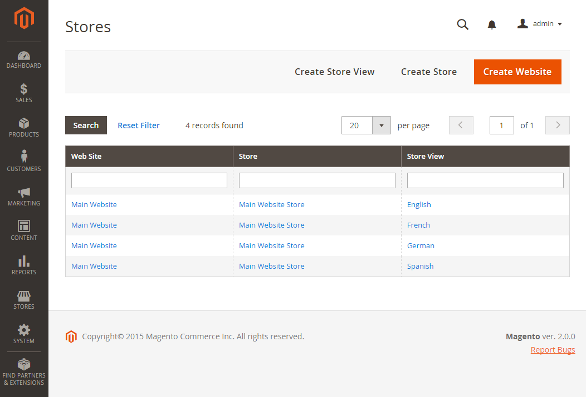
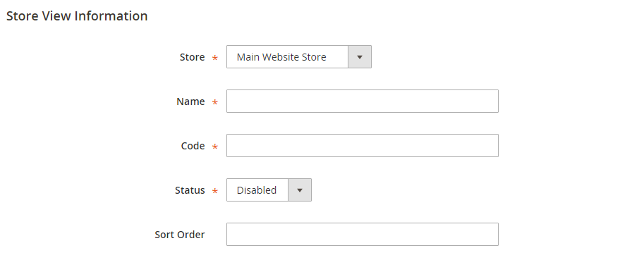
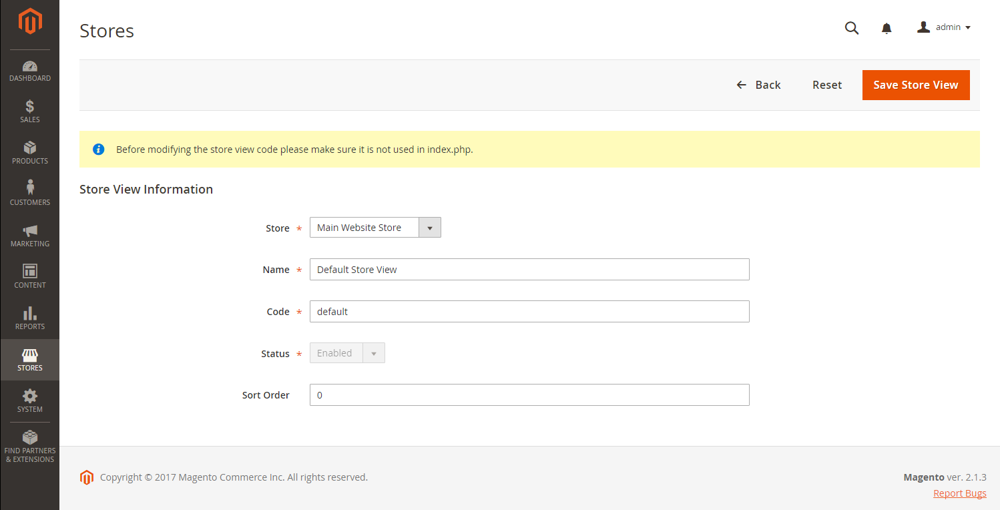

# Store views

Store views are typically used to make the store available in different locales. Shoppers can use the language chooser in the header of the store to change the store view.

{width="550"}

## [!DNL Adobe Commerce Optimizer] sync status {#optimizer-sync-status}

If the [!DNL Adobe Commerce Optimizer Connector] is installed and enabled for a website or store view, the [!UICONTROL All Stores] grid shows a sync status indicator. If the [!DNL Adobe Commerce Optimizer Connector for B2B] is installed, data is also synchronized for available B2B shared catalogs. See [Manage catalog views](../b2b/catalog-views-manage.md).

| Column | Indicator | Description |
| ----- | ----- | ----- |
| [!UICONTROL Web Site] | [!UICONTROL Price sync enabled for Commerce Optimizer] | This website's prices and price books are synchronized to [!DNL Adobe Commerce Optimizer]. |
| [!UICONTROL Store View] | [!UICONTROL Product sync enabled for Commerce Optimizer] | This store view's products and attributes are synchronized to [!DNL Adobe Commerce Optimizer]. |

{width="700" zoomable="yes"}

To enable or disable synchronization, edit the **[!UICONTROL Adobe Commerce Optimizer exporter settings]** when you [create a website](stores.md#step-1-create-a-website) or [add a store view](#add-a-store-view), or when you update an existing website or store view.

## Add a store view

1. On the _Admin_ sidebar, go to **[!UICONTROL Stores]** > _[!UICONTROL Settings]_ > **[!UICONTROL All Stores]**.

   {width="700" zoomable="yes"}

1. Click **[!UICONTROL Create Store View]**.

   {width="600" zoomable="yes"}

1. Set **[!UICONTROL Store]** to the parent store of this view.

1. Enter a **[!UICONTROL Name]** for this store view.

   The name appears in the language chooser in the store header. For example: `Spanish`.

1. For **[!UICONTROL Code]**, enter the code that identifies the view (in lowercase characters).

   For example: `spanish`.

1. To activate the view, set **[!UICONTROL Status]** to `Enabled`.

1. (Optional) Enter a **[!UICONTROL Sort Order]** number to determine the sequence in which this view is listed with other views.

1. (Optional) If the [!DNL Adobe Commerce Optimizer Connector] is installed, select **[!UICONTROL Sync products and attributes]** in the **[!UICONTROL Adobe Commerce Optimizer exporter settings]** section to synchronize this store view's products and attributes to [!DNL Adobe Commerce Optimizer]. If the [!DNL Adobe Commerce Optimizer Connector for B2B] is also installed, this setting also synchronizes B2B shared catalog data to [!DNL Adobe Commerce Optimizer]. See [Manage catalog views](../b2b/catalog-views-manage.md).

   {width="600" zoomable="yes"}

   Changing this setting after the initial sync triggers a full re-indexation. See [Customize the Commerce scopes export configuration](https://experienceleague.adobe.com/en/docs/commerce/aco-optimizer-connector/get-started#customize-the-commerce-scopes-export-configuration) in the *Adobe Commerce Optimizer Connector Guide*.

1. Click **[!UICONTROL Save Store View]**.

## Edit a store view

Because the view name appears in the language chooser, you might eventually want to change the name of the default view to something more descriptive. The _Name_ field is simply a label and can be easily changed.

If your Adobe Commerce or Magento Open Source installation has a multisite or multi-store setup, do not change the store Code field without verifying that the value is not referenced in the `index.php` file. If you do not have access to the server to examine the file, ask a developer for help.

| Field | Original value | Updated value |
| ----- | -------------- | ------------- |
| [!UICONTROL Name]  | `Default Store View` | `English` |
| [!UICONTROL Code]  | `default` | `english` |

{style="table-layout:auto"}

1. On the _Admin_ sidebar, go to **[!UICONTROL Stores]** >  _[!UICONTROL Settings]_ > **[!UICONTROL All Stores]**.

1. In the _[!UICONTROL Store View]_ column of the grid, click the name of the view that you want to edit.

   When editing the default view, the _[!UICONTROL Store]_ and _[!UICONTROL Status]_ fields are not available.

   {width="600" zoomable="yes"}

1. Update the following fields as needed:

    - **[!UICONTROL Store]** (non-default views only)
    - **[!UICONTROL Name]**
    - **[!UICONTROL Code]** (only if not used in `index.php`)
    - **[!UICONTROL Status]** (non-default views only)
    - **[!UICONTROL Sort Order]**
    - **[!UICONTROL Sync products and attributes]** (only if the [!DNL Adobe Commerce Optimizer Connector] is installed)

   {width="600" zoomable="yes"}

1. Click **[!UICONTROL Save Store View]**.
