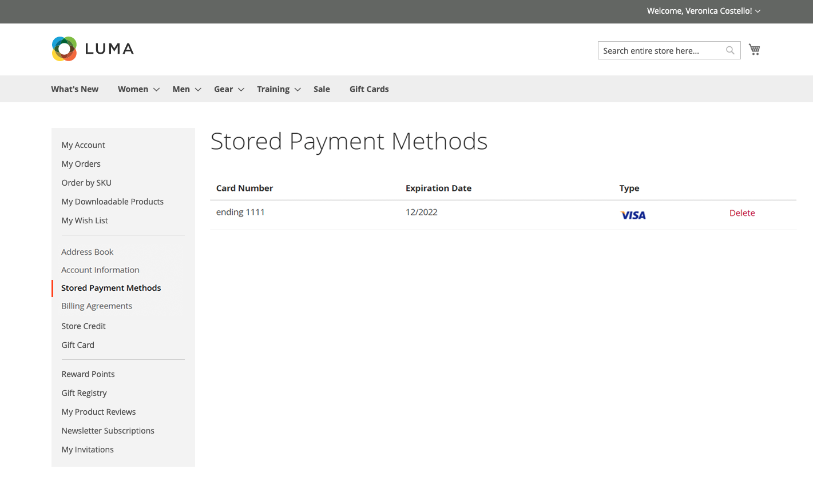

# Stored payment methods

Customers with access to a secure vault for storing payment information can speed through checkout without entering their credit card information each time. If [Instant Purchase](checkout-instant-purchase.md) is enabled, customers can bypass the two-step checkout process and place the order from the product page.

A payment method that supports a secure vault, such as [Braintree](braintree.md), is required. When a secure vault is enabled in the payment method configuration, customers have the option during checkout to save their credit card information as a stored payment method. Customers can manage stored payment methods from their account dashboard.

{width="700" zoomable="yes"}

## Add stored payment method at checkout

1. From the storefront, the customer goes to the detail page of the product.

1. Adds product to the cart.

1. Proceeds to the checkout page.

1. Completes the _Shipping_ step.

1. Selects the **[!UICONTROL Braintree Credit Card]** payment method.

1. Fills in credit card data.

1. Selects the **[!UICONTROL Save for later use]** checkbox.

1. Clicks **[!UICONTROL Place Order]**.

The saved payment method is then displayed in the _[!UICONTROL Stored Payment Methods]_ tab of the customer dashboard.

## Delete a stored payment method

Any previously added, stored payment methods cannot be edited by the customer, they can only be deleted. This action cannot be undone.

1. In the sidebar of their account, the customer selects **[!UICONTROL Stored Payment Methods]**.

1. Finds the payment method entry to be deleted.

1. Clicks **[!UICONTROL Delete]**.

1. To confirm the action, clicks **[!UICONTROL OK]**.
