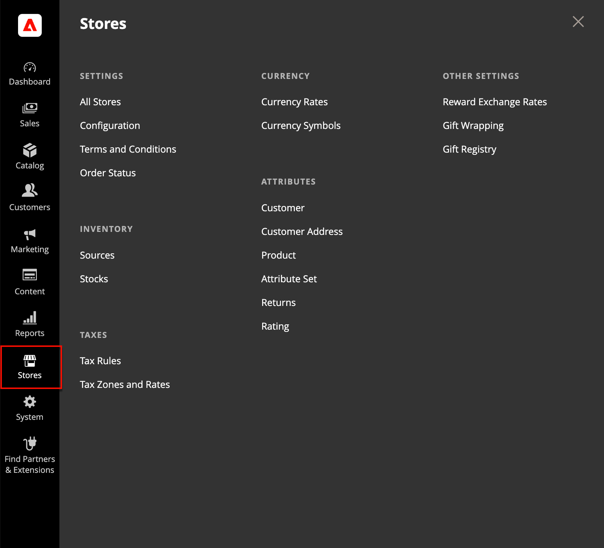

# [!UICONTROL Stores] menu

The _[!UICONTROL Stores]_ menu provides access to settings that are used less frequently, but referenced throughout your Adobe Commerce or Magento Open Source installation. This includes setting up the store hierarchy, configuration, sales and order settings, tax and currency, product attributes, product review ratings, and customer groups.

<!-- zoom -->

## Display the [!UICONTROL Stores] menu

On the _Admin_ sidebar, click **[!UICONTROL Stores]**.

## Main sections

### [!UICONTROL Settings]

Manage the hierarchy of [websites, stores, and store views](stores.md#store-and-site-structure) in your Adobe Commerce or Magento Open Source installation, and all [configuration settings](https://docs.magento.com/user-guide/stores/configuration-overview.html). In addition, you can set up the [Terms and Conditions](terms-and-conditions.md) of a sale, and manage [order status settings](order-status.md#custom-order-status).

### [!UICONTROL Inventory]

[Manage and create stocks](../inventory-management/introduction.md) to link your sales channels or websites to [sources](../inventory-management/sources-manage.md). Stocks provide an aggregated salable quantity of products. Single Source merchants use the Default Stock while Multi Source merchants use additional custom stocks.

### [!UICONTROL Taxes]

Manage all types of [tax functions](taxes.md) across your store, set up the tax rules for your store, define customer and product tax classes, and manage tax zones and rates. You can also import tax rate data into your store.

### [!UICONTROL Currency]

Manage the rates for the [currencies](currency.md) that are accepted as payment in your store and customize the currency symbols that appear in product prices and sales documents.

### [!UICONTROL Attributes]

Manage [attributes](https://docs.magento.com/user-guide/stores/attributes.html) that are used for customer or product information, returns, and product ratings. You can create attributes, edit existing attributes, and manage attribute sets.

### [!UICONTROL Other Settings]

Manage additional settings for [reward exchange rates](../merchandising-promotions/reward-exchange-rates.md), [gift wrapping](cart-configuration.md#gift-wrap), and [gift registries](../merchandising-promotions/gift-registries.md).
