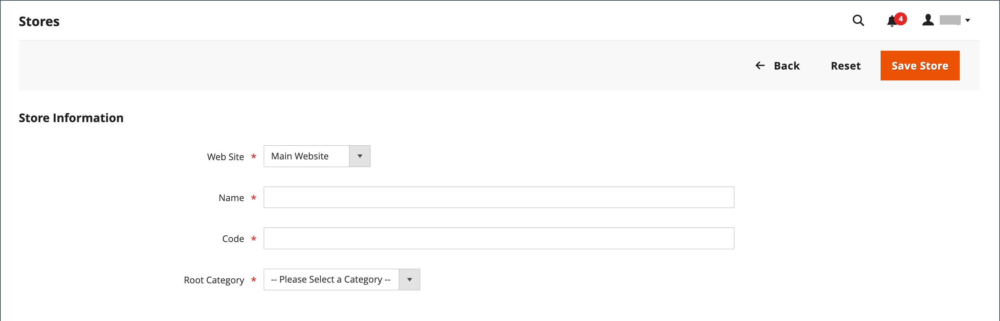
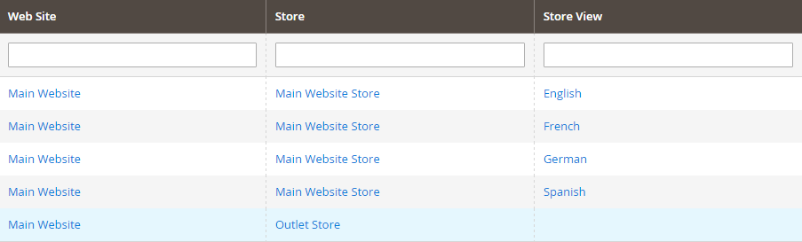
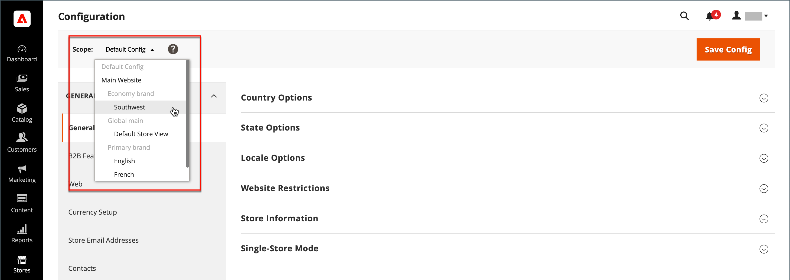
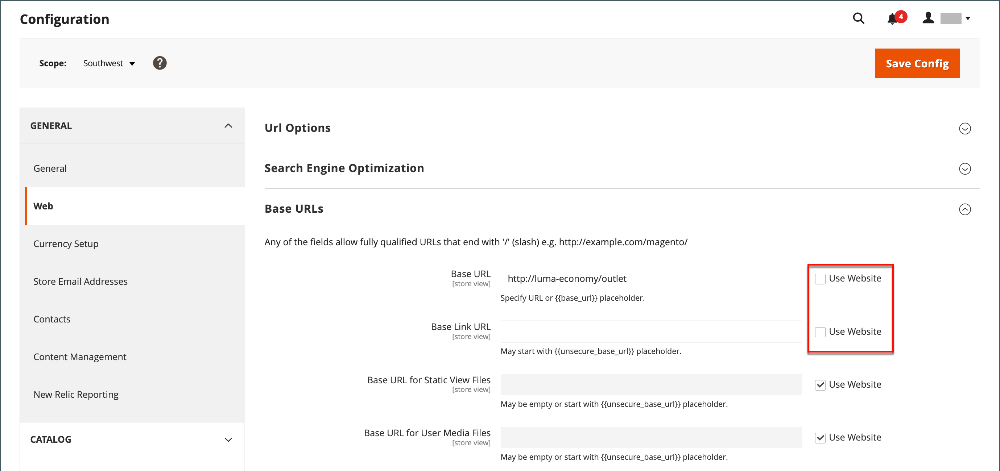
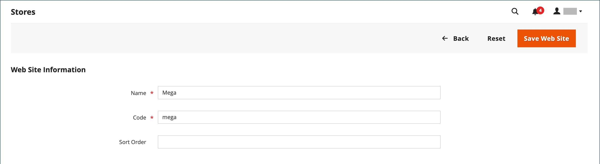

# Store and site structure

When Adobe Commerce or Magento Open Source is installed, a hierarchy that includes a main website, store, and store view is created. You can create additional websites, stores, and store views, as needed. For example, in addition to your main website, you might have additional websites with a different domain. Within each website, you can have multiple stores, and within each store, separate store views. Many installations have one website and one store, but with multiple store views to support different languages.

Before you begin, plan your store catalog hierarchy in advance because it is referred to throughout the configuration. Each store can have a separate [root category](../catalog/category-root.md), which makes it possible to have an entirely different set of main menu options for each store.

<!-- {:width="550px"} -->

## Add stores

A single installation of Adobe Commerce or Magento Open Source can have multiple stores that share an Admin. Stores that are under the same website have the same IP address and domain, use the same security certificate, and share a single checkout process.

The important thing to understand is that the stores use the same code and share an Admin. Each store can have a separate catalog, or the stores can share a catalog. Each store can have a separate [root category](../catalog/category-root.md), which makes it possible to have a different main menu for each store. Stores can also have different branding, presentation, and content. Take some time to plan your store hierarchy with future growth in mind before you begin, because it is used throughout the configuration.

<!-- {:width="550px"} -->

Here are some examples of how URLs can be configured for multiple stores:

| URL | Description |
| --- | ----------- |
| `yourdomain.com/store1` `yourdomain.com/store2` | Each store has a different path, but shares a domain. |
| `store1.yourdomain.com` `store2.yourdomain.com` | Each store has a different subdomain of the primary domain. |

Multi-store installations of Adobe Commerce must be configured from the Admin and also from the command line of the server. The Adobe Commerce [Configuration Guide](https://experienceleague.adobe.com/docs/commerce-operations/configuration-guide/multi-sites/ms-overview.html) provides detailed instructions for configuring the server environment.

### Step 1: Choose the store domain

The first step is to choose how you want to position the store. Should the stores share a domain, each have a subdomain, or have distinctly different domains? For each store, do one of the following:

- To place the store one level below the primary domain, you do not have to do anything.
- Set up a subdomain of your primary domain.
- Set up a different primary domain.

### Step 2: Create the store

1. On the _Admin_ sidebar, go to **Stores** > _Settings_ > **All Stores**.

1. Click **Create Store** and set the options for the new store:

   - **Web Site** — Choose a website that is to be the parent of the new store. If the installation has only one web site, accept the default (`Main Website`).

   - **Name** — Enter a name for the new store. The name is for internal reference only.

   - **Code** — Enter a code in lowercase characters to identify the store. For example: `mainstore`.

   - **Root Category** — Set to the [root category](../catalog/category-root.md) that defines the category structure for the main menu of the new store. If you have already created a specific root category for the store, select it. Otherwise, select `Default Category`. You can come back later and update the setting.

   <!-- zoom -->

1. Click **Save Store**.

   <!-- zoom -->

### Step 3: Create a default store view

1. Click **Create Store View** and set the store view options:

   - **Store** — Set to the new store you created.

   - **Name** — Enter a name for the view. For example, `English`.

   - **Code** — Enter a code for the view in lowercase characters.

   - **Status** — Set to `Enabled`.

   - **Sort Order** — Enter a number to determine the store's position when listed with other stores.

1. Click **Save Store View**.

   If you open your store in edit mode, you can see that it now has a default view.

   <!-- zoom -->

### Step 4: Configure the store URL

1. On the _Admin_ sidebar, click **Stores** > _Settings_ > **Configuration**.

1. Under _General_ in the left panel on the left, choose **Web**.

1. In the upper-left corner, set **Store View** to the view that you created for the new store.

1. When prompted to confirm [scope](../getting-started/websites-stores-views.md#scope-settings) switching, click **OK**.

   <!-- zoom -->

1. Expand  the **Base URLs** section and enter the base URL for the store.

   If needed, clear the **Use system value** checkbox to change the setting.

   

1. Expand  the **Secure Base URLs** section and repeat the previous step as needed to configure the store's [secure URL](store-urls.md).

1. Click **Save Config**.

### Step 5: Configure the server

To configure your server to support multiple websites, see [Multiple websites or stores](https://experienceleague.adobe.com/docs/commerce-operations/configuration-guide/multi-sites/ms-overview.html) in the _Configuration Guide_.

For help with configuring your web server, see the following resources:

- [Set up multiple websites with NGNX](https://experienceleague.adobe.com/docs/commerce-operations/configuration-guide/multi-sites/ms-nginx.html)
- [Set up multiple websites with Apache](https://experienceleague.adobe.com/docs/commerce-operations/configuration-guide/multi-sites/ms-apache.html)

For Adobe Commerce on cloud infrastructure, see [Set up multiple websites or stores](https://devdocs.magento.com/cloud/project/project-multi-sites.html).

## Add websites

Multiple websites can be set up from a single Adobe Commerce or Magento Open Source installation with the same domain or different domains. By default, stores that are under the same website have the same IP address and domain, use the same security certificate, and share a single checkout process. If you want each store to have a dedicated checkout process under its own domain, each store must have a distinct IP address and separate security certificate.

Multi-site installations of Adobe Commerce or Magento Open Source must be configured from the Admin and also from the command line of the server. The Commerce [Configuration Guide](https://experienceleague.adobe.com/docs/commerce-operations/configuration-guide/multi-sites/ms-overview.html) provides detailed instructions for configuring the server environment.

<!-- {:width="550px"} -->

### Step 1: Create a website

1. On the _Admin_ sidebar, go to **Stores** > _Settings_ > **All Stores**.

1. In the upper-right corner, click **Create Website**.

1. Set the **Web Site Information** options:

   <!-- zoom -->

   - **Name** — Enter the domain of the new website. For example, `domain.com`.

   - **Code** — Enter a code that is used on the server to point to the domain.

      The code must begin with a lowercase (a-z) letter, and can include any combination of letters (a-z), numbers (0-9), and the underscore (_) symbol.

   - **Sort Order** — (Optional) Enter a number to determine the sequence in which this site is listed with other sites. Enter a zero to make this site appear at the top of the list.

   - **Default Store** — If you have multiple stores, set to the store to use as the default for this website.

1. Click **Save Web Site**.

1. Set up each [store](#add-stores) and [store view](store-views.md) that is needed for the new website.

### Step 2: Configure the store URL

Follow the instructions to configure the [store URLs](store-urls.md).

### Step 3: Configure the server

To configure your server to support multiple websites, see [Multiple websites or stores](https://experienceleague.adobe.com/docs/commerce-operations/configuration-guide/multi-sites/ms-overview.html) in the _Configuration Guide_.

For help with configuring your web server, see the following tutorials:

- [Set up multiple websites with NGNX](https://experienceleague.adobe.com/docs/commerce-operations/configuration-guide/multi-sites/ms-nginx.html)
- [Set up multiple websites with Apache](https://experienceleague.adobe.com/docs/commerce-operations/configuration-guide/multi-sites/ms-apache.html)

For Adobe Commerce on cloud infrastructure, see [Set up multiple websites or stores](https://devdocs.magento.com/cloud/project/project-multi-sites.html).
