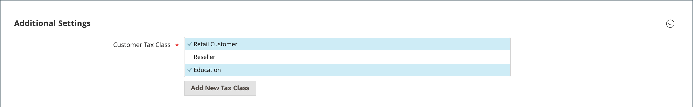
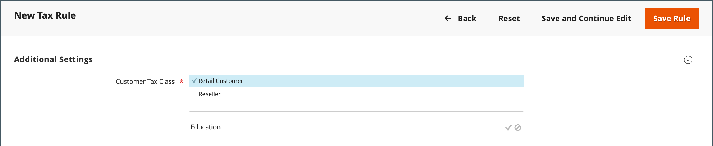
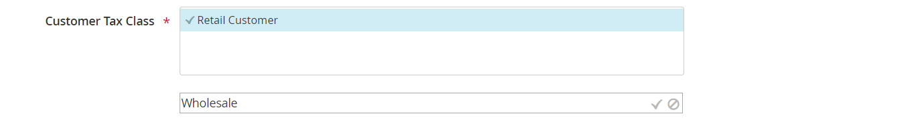
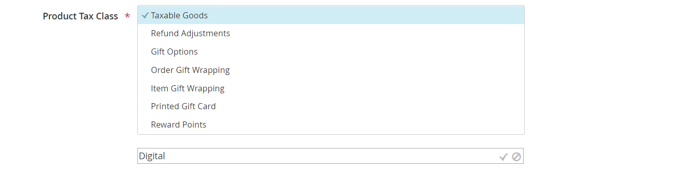

# Tax classes

Tax classes can be assigned to customers, products, and shipping. Commerce analyzes the shopping cart of each customer and calculates the appropriate tax according to the class of the customer, the class of the products in the cart, and the region. The region is determined by the customer's shipping address, billing address, or shipping origin. New tax classes can be created when a [tax rule](tax-rules.md) is defined.

- Customer — You can create as many customer tax classes as you need, and assign them to [customer groups](https://docs.magento.com/user-guide/customers/customer-groups.html). For example, in some jurisdictions, wholesale transactions are not taxed, but retail transactions are. You can associate members of the Wholesale Customer group with the Wholesale tax class.

- Product— Product classes are used in calculations to determine the correct tax rate is applied in the shopping cart. When you create product, it is assigned to a specific tax class. For example, food might not be taxed, or be taxed at a different rate.

- Shipping— If your store charges an extra tax on shipping, you should designate a specific product tax class for shipping. Then in the configuration, specify it as the tax class that is used for shipping.

## Configure tax classes

The tax class that is used for shipping, and the default tax classes for [products and customers](#add-a-product-tax-class) are set in the Sales configuration.

<!-- zoom -->

1. On the _Admin_ sidebar, go to **Stores** > _Settings_ > **Configuration**.

1. In the left panel, expand **Sales** and choose **Tax**.

1. Expand  the **Tax Classes** section.

1. Choose the tax class for each of the following:

   - **Set Tax Class for Shipping**
   - **Tax Class for Gift Options**
   - **Default Tax Class for Product**
   - **Default Tax Class for Customer**

1. When complete, click **Save Config**.

## Add tax classes

Tax classes for customers and products can be easily added, and then assigned to individual customers and products, and used in tax rules.

<!-- zoom -->

1. On the _Admin_ sidebar, go to **Stores** > _Taxes_ > **Tax Rules**.

1. Click **Add New Tax Rule**.

1. Expand  the **Additional Settings** section.

1. Under _Customer Tax Class_, click **Add New Tax Class**.

   <!-- zoom -->

1. Enter the **Name** of the new tax class in the text box and click the checkmark to add the new class to the list of available customer tax classes.

   <!-- zoom -->

## Add a product tax class

1. Under _Product Tax Class_, click **Add New Tax Class**.

1. Enter the **Name** of the new tax class in the text box and click the checkmark to add the new class to the list of available product tax classes.

   <!-- zoom -->

1. When complete, click **Back** in the button bar to return to the _Tax Rules_ grid.

## Default tax destination

The default tax destination settings determine the country, state, and ZIP or postal code that are used as the basis of tax calculations.

**_To configure the default tax destination for calculations:_**

1. On the _Admin_ sidebar, go to **Stores** > _Settings_ > **Configuration**.

1. In the left panel, expand **Sales** and choose **Tax**.

1. Expand  the **Default Tax Destination Calculation** section.

   <!-- zoom -->

1. Set **Default Country** to the country upon which tax calculations are based.

1. Set **Default State** to the state or province that is used as the basis of tax calculations.

1. Set **Default Post Code** to the ZIP or postal code that is used as the basis of local tax calculations.

1. When complete, click **Save Config**.
