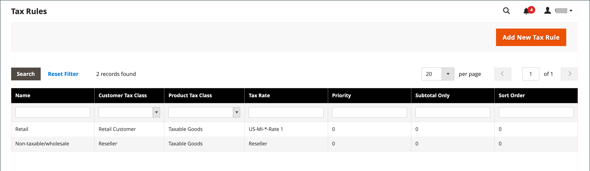
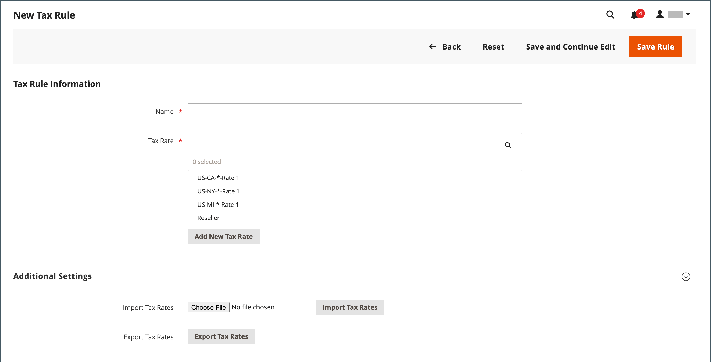
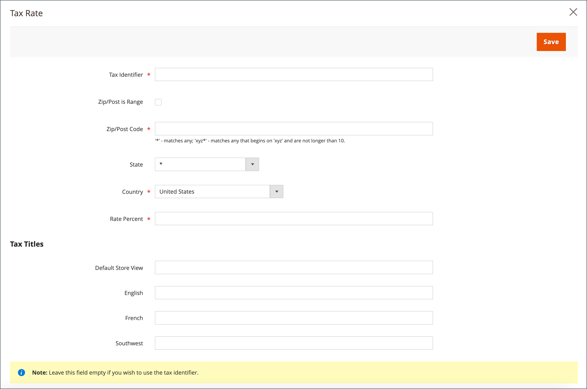
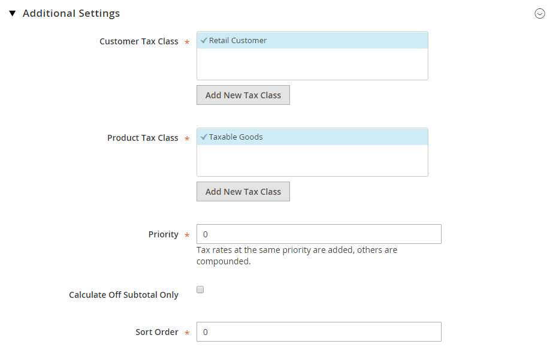

# Tax rules

Tax rules incorporate a combination of product class, customer class, and tax rate. Each customer is assigned to a customer class, and each product is assigned a product class. Commerce analyzes the shopping cart of each customer and calculates the appropriate tax according to the customer and product classes, and the region. The region is based on the customer's shipping address, billing address, or shipping origin.

>[!NOTE]
>
>When numerous tax rates must be defined, you can simplify the process by importing them.

<!-- zoom -->

## Step 1: Complete the tax rule information

1. On the _Admin_ sidebar, go to **[!UICONTROL Stores]** > _[!UICONTROL Taxes]_ > **[!UICONTROL Tax Rules]**.

1. In the upper-right corner, click **[!UICONTROL Add New Tax Rule]**.

1. Under _Tax Rule Information_, enter a **[!UICONTROL Name]** for the new rule.

1. Choose the **[!UICONTROL Tax Rate]** that applies to the rule.

   If you need to edit an existing tax rate, do the following:

   - Hover over the tax rate and click the _Edit_  icon.

   - Update the form as needed and click **[!UICONTROL Save]**.

   <!-- zoom -->

1. To enter tax rates, use either of the following methods:

### Method 1: Enter tax rates manually

1. Click **[!UICONTROL Add New Tax Rate]**.

1. Complete the form as needed (see [Tax zones and rates](tax-zones-rates.md)).

1. When complete, click **[!UICONTROL Save]**.

   <!-- zoom -->

### Method 2: Import tax rates

1. Scroll down to the section at the bottom of the page.

1. To import tax rates, do the following:

   - Click **[!UICONTROL Choose File]** and navigate to the CSV file with the tax rates to be imported.

   - Click **[!UICONTROL Import Tax Rates]**.

1. To export tax rates, click **[!UICONTROL Export Tax Rates]** (see [Import/Export Tax Rates](https://docs.magento.com/user-guide/system/data-transfer-tax-rates.html)).

<!-- zoom -->

## Step 2: Complete the additional settings

1. Click **[!UICONTROL Additional Settings]** to open the section.

1. Choose the **[!UICONTROL Customer Tax Class]** to which the rule applies.

   - To edit a customer tax class, click the _Edit_  icon, update the form as needed, and click **[!UICONTROL Save]**.

   - To create a tax class, click **[!UICONTROL Add New Tax Class]**, complete the form as needed, and click **[!UICONTROL Save]**.

1. Choose the **[!UICONTROL Product Tax Class]** to which the rule applies.

   - To edit a product tax class, click the _Edit_  icon, update the form as needed, and click **[!UICONTROL Save]**.

   - To create a tax class, click **[!UICONTROL Add New Tax Class]**, complete the form as needed, and click **[!UICONTROL Save]**.

1. When more than one tax applies, enter a number to indicate the priority of this tax for **[!UICONTROL Priority]**.

   If two tax rules with the same priority apply, the taxes are added. If two taxes with different priority settings apply, the taxes are compounded.

1. If you want taxes to be based on the order subtotal, select the **[!UICONTROL Calculate off Subtotal Only]** checkbox.

1. For **[!UICONTROL Sort Order]**, enter a number to indicate the order of this tax rule when listed with others.

   <!-- zoom -->

1. When complete, click **[!UICONTROL Save Rule]**.

## Currency and tax rules demo

Watch this video to learn about managing currency and tax rules:

>[!VIDEO](https://video.tv.adobe.com/v/343657/?quality=12)