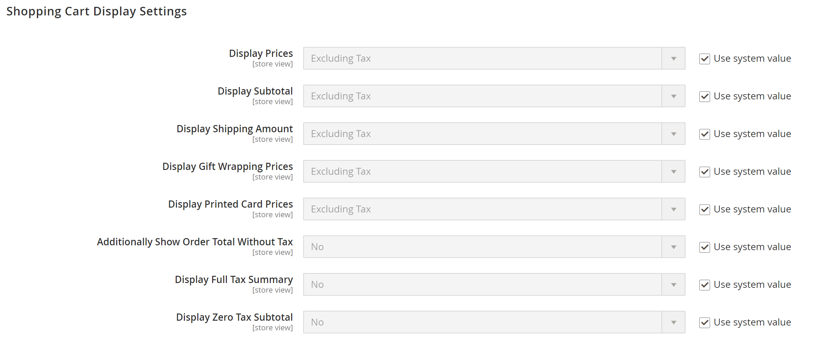
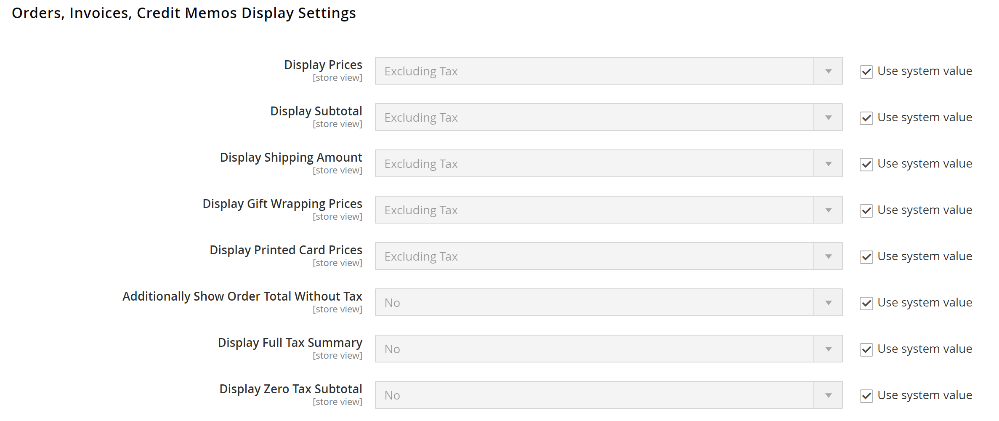
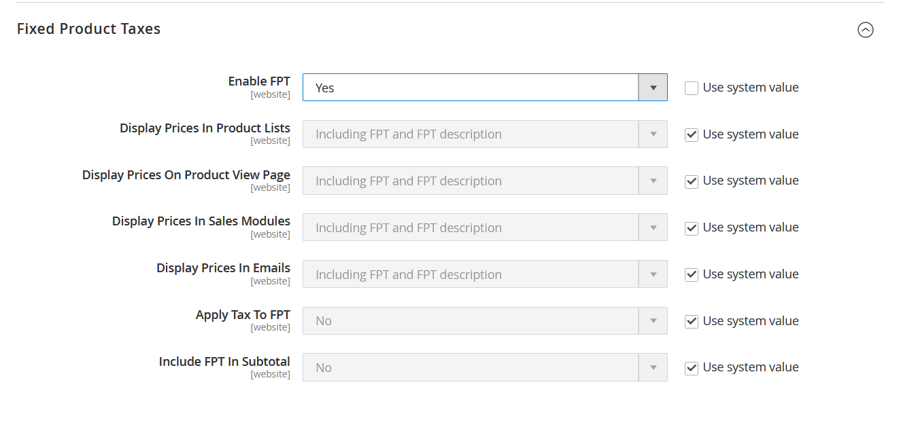
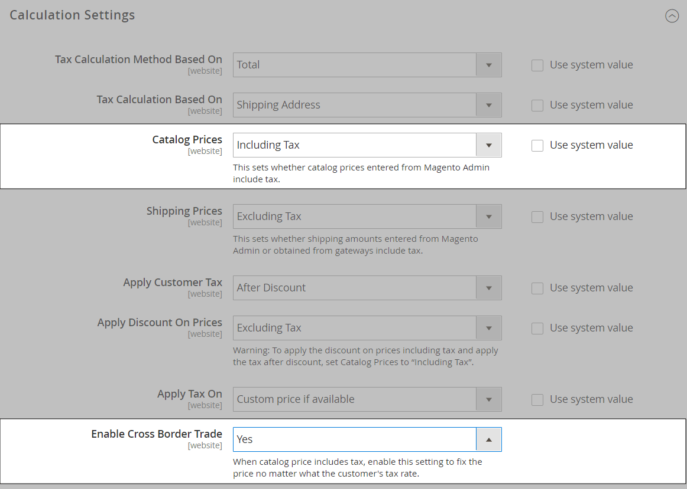

# Tax configuration settings

The following instructions take you through the basic tax configuration for your Commerce instance. Before setting up your taxes, make sure that you are familiar with the tax requirements of your [locale](store-localize.md#step-3-change-the-locale-of-the-store-view). Then, complete the tax configuration according to your requirements.

Admin [permissions](https://docs.magento.com/user-guide/system/permissions.html) can be set to restrict access to [tax resources](https://docs.magento.com/user-guide/system/permissions-role-resources.html), based on the business _need to know_. To create an Admin role with access to tax settings, choose both the Sales/Tax and System/Tax resources. If setting up a website for a region that differs from your default shipping point of origin, you must also allow access to the System/Shipping resources for the role. The shipping settings determine the store tax rate that is used for catalog prices.

## Configure the general tax settings

1. On the _Admin_ sidebar, go to **Stores** > _Settings_ > **Configuration**.

1. For a multisite configuration, set **Store View** to the website and store that is the target of the configuration.

1. In the left panel, expand **Sales** and choose **Tax**.

1. Complete the following configuration settings.

   If necessary, clear the **Use System value** checkbox of any settings that are dimmed.

### Tax Classes

1. Expand  the **Tax Classes** section.

   <!-- zoom -->

   - **Tax Class for Shipping** — Set to the appropriate class. The default classes are: `None` and `Taxable Goods`
   - **Tax Class for Gift Options** —  (Adobe Commerce only) Set to the appropriate class. The default classes are: `None` and `Taxable Goods`
   - **Default Tax Class for Product** — Set to the appropriate class. The default classes are: `None` and `Taxable Goods`
   - **Default Tax Class for Customer** — Set to the appropriate class. The default class is: `Retail Customer` and `Wholesale Customer`

1. When complete, click **Save Config**.

### Calculation Settings

1. Expand the **Calculation Settings** section.

   <!-- zoom -->

1. Set **Tax Calculation Method Based On** to one of the following:

   - `Unit Price` - The price of each product
   - `Row Total` - The total of the line item in the order, less discounts
   - `Total` - The order total

1. Set **Tax Calculation Based On** to one of the following:

   - `Shipping Address` - The address where the order is to be shipped
   - `Billing Address` - The billing address of the customer or company
   - `Shipping Origin` - The address that is specified as the [point of origin](shipping-settings.md#point-of-origin) for your store

1. Set **Catalog Prices** to `Excluding Tax` or `Including Tax`.

1. Set **Shipping Prices** to `Excluding Tax` or `Including Tax`.

1. Set **Apply Customer Tax** to one of the following to determine whether tax is applied to the original or discounted price: `After Discount` or `Before Discount`

1. Set **Apply Discount on Prices** to one of the following to determine if discounts include or exclude tax: `Excluding Tax` or `Including Tax`

1. Set **Apply Tax On** to `Custom price if available` or `Original price only`.

1. Set **Enable Cross-Border Trade** to one of the following:

   - `Yes` - Use consistent pricing across different tax rates. If the catalog price includes tax, choose this setting to fix the price regardless of the customer's tax rate.
   - `No` - Vary the price by tax rate.

   >[!IMPORTANT]
   >
   >If [cross-border trade](#cross-border-price-consistency) is enabled, the profit margin changes by tax rate. Profit is determined by the formula (`Revenue - CustomerVAT - CostOfGoodsSold`). To enable cross-border trade, prices must be set to include tax.

### Default Tax Destination Calculation

1. Expand  the **Default Tax Destination Calculation** section.

   <!-- zoom -->

1. Specify the **Default Country** for tax calculations.

1. If applicable, specify the **Default State** for tax calculations.

1. If applicable, specify the **Default Post Code** for tax calculations.

1. When complete, click **Save Config**.

### Price Display Settings

>[!IMPORTANT]
>
>Some combinations of settings related to a price display that both include and exclude tax can be confusing to the customer. To avoid triggering a warning message, see the [recommended settings](taxes.md#warning-messages).

1. Expand  the **Price Display Settings** section.

   <!-- zoom -->

1. Set **Display Product Prices in Catalog** to one of the following:

   - `Excluding Tax` - Catalog prices that appear in the storefront do not include tax.
   - `Including Tax` - Catalog prices in the storefront include tax only if a tax rule matches the tax origin, or if the customer's address matches the tax rule. This might happen after a customer creates an account, logs in, or uses the Estimate Tax and Shipping tool in the cart.
   - `Including and Excluding Tax` - Catalog prices that appear in the storefront are displayed both with, and without tax.

1. Set **Display Shipping Prices** to `Excluding Tax`, `Including Tax`, or `Including and Excluding Tax`.

1. When complete, click **Save Config**.

### Shopping Cart Display Settings

1. Expand  the **Shopping Cart Display Settings** section.

   <!-- zoom -->

1. For each of the following settings, choose how you want taxes and prices to appear in the cart, according to the requirements of your store and locale:

   - Set **Display Prices** to `Excluding Tax`, `Including Tax`, or `Including and Excluding Tax`.

   - Set **Display Subtotal** to `Excluding Tax`, `Including Tax`, or `Including and Excluding Tax`.

   - Set **Display Shipping Amount** to `Excluding Tax`, `Including Tax`, or `Including and Excluding Tax`.

   -  (Adobe Commerce only) Set **Display Gift Wrapping Prices** to `Excluding Tax`, `Including Tax`, or `Including and Excluding Tax`.

   -  (Adobe Commerce only) Set **Display Printed Card Prices** to `Excluding Tax`, `Including Tax`, or `Including and Excluding Tax`.

1. Set the following display options to either `Yes` or `No`, according to your needs:

   - **Include Tax in Order Total**
   - **Display Full Tax Summary**
   - **Display Zero Tax Subtotal**

1. When complete, click **Save Config**.

### Orders, Invoices, Credit Memos Display Settings

1. Expand  the **Orders, Invoices, Credit Memos Display Settings** section.

   <!-- zoom -->

1. Specify how prices and taxes appear in orders, invoices, and credit memos:

   - Set **Display Prices** to `Excluding Tax`, `Including Tax`, or `Including and Excluding Tax`.

   - Set **Display Subtotal** to `Excluding Tax`, `Including Tax`, or `Including and Excluding Tax`.

   - Set **Display Shipping Amount** to `Excluding Tax`, `Including Tax`, or `Including and Excluding Tax`.

   -  (Adobe Commerce only) Set **Display Gift Wrapping Prices** to `Excluding Tax`, `Including Tax`, or `Including and Excluding Tax`.

   -  (Adobe Commerce only) Set **Display Printed Card Prices** to `Excluding Tax`, `Including Tax`, or `Including and Excluding Tax`.

1. Set the following display options to either to `Yes` or `No`, according to your requirements:

   - **Include Tax in Order Total**
   - **Display Full Tax Summary**
   - **Display Zero Tax Subtotal**

1. When complete, click **Save Config**.

### Fixed Product Taxes

1. Expand  the **Fixed Product Taxes** section.

   <!-- zoom -->

1. Set **Enable FPT** to either to `Yes` or `No`, according to your requirements.

1. If FPT is enabled, specify FPT display options:

   - **Display Prices in Product Lists**
   - **Display Price On Product view Page**
   - **Display Prices in Sales Modules**
   - **Display Prices in Emails**

   - `Including FPT Only` -  Displayed prices include fixed product taxes. The FPT amount is not displayed separately.
   - `Including FPT and FPT description` - Displayed prices include fixed product taxes. The FPT amount is displayed separately.
   - `Excluding FPT. Including FPT description and final price` - Displayed prices do not include fixed product taxes. The FPT amount is displayed separately.
   - `Excluding FPT` - Displayed prices do not include fixed product taxes. The FPT amount is not displayed separately.

1. Set **Apply Discounts to FPT** to `Yes` or `No`, according to your requirements.

1. Set **FPT Tax Configuration** to determine how FPT is calculated.

   - `Not Taxed` - Select this option if your taxing jurisdiction does not tax FPT. (For example, California.)
   - `Taxed` - Select this option if your taxing jurisdiction does tax FPT. (For example, Canada.)
   - `Loaded and Displayed with Tax` - Click this option if FPT is added to the order total before applying tax. (For example, EU countries.)

1. Set **Include FPT in Subtotal** to `Yes` or `No`, according to your requirements.

1. When complete, click **Save Config**.

## Cross-border price consistency

Cross-border trade (also referred to as price consistency) supports European Union (EU) and other merchants who want to maintain consistent prices for customers whose tax rates are different than the store tax rate.

Merchants operating across regions and geographies can show their customers a single price by including the tax in the price of the product. Pricing is clean and uncluttered regardless of tax structures and rates that vary from country to country.

>[!NOTE]
>
>When cross-border trade is enabled, your profit margin changes by tax rate. Profit is determined by the formula:
`Revenue - CustomerVAT - CostOfGoodsSold`

**_To enable cross-border price consistency:_**

1. On the _Admin_ sidebar, go to **Stores** > _Settings_ > **Configuration**.

1. For a multisite configuration, set **Store View** to the website and store that is the target of the configuration.

1. In the left panel, expand **Sales** and choose **Tax**.

1. Expand  the **Calculation Settings** section.

   <!-- zoom -->

1. Set **Catalog Prices** to `Including Tax`.

1. To enable cross-border price consistency, set **Enable Cross Border Trade** to `Yes`.

1. When complete, click **Save Config**.
