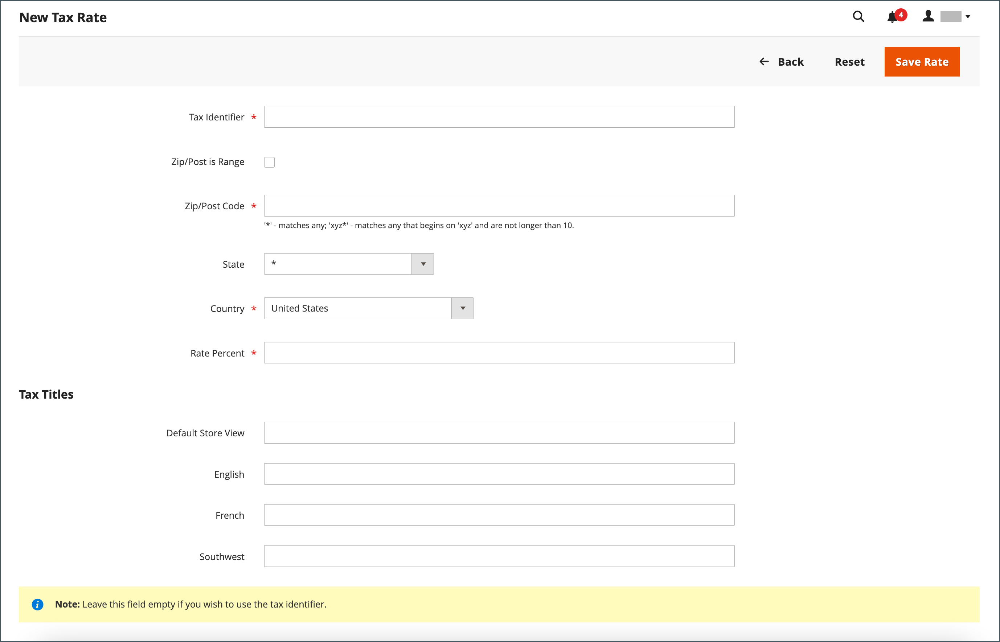

# Tax zones and rates

Tax rates generally apply to transactions that take place within a specific geographical area. Use the _Tax Zones and Rates_ tool to specify the tax rate for each geographical area from which you collect and remit taxes. Because each tax zone and rate has a unique identifier, you can have multiple tax rates for a given geographic area (such as places that do not tax food or medicine, but do tax other items).

Store tax is calculated based on the store's address. The actual customer tax for an order is calculated after the customer completes the order information. Commerce then calculates the tax according to the tax configuration of the store.

{width="600" zoomable="yes"}

## Define a new tax rate

1. On the _Admin_ sidebar, go to **[!UICONTROL Stores]** > _[!UICONTROL Taxes]_ > **[!UICONTROL Tax Zones and Rates]**.

1. In the upper-right corner, click **[!UICONTROL Add New Tax Rate]**.

   {width="600" zoomable="yes"}

1. Enter a **[!UICONTROL Tax Identifier]**.

1. To apply the tax rate to a single ZIP or postal code, enter the code for **[!UICONTROL Zip/Post Code]**.

   The asterisk wildcard (`*`) can be used to match up to ten characters in the code. For example, `90*` represents all ZIP codes from 90000 through 90999.

1. To apply the tax rate to a range of ZIP or postal codes, do the following:

   - Select the **[!UICONTROL Zip/Post is Range]** checkbox and define the range by entering the first and last ZIP or postal code for **[!UICONTROL Range From]** and **[!UICONTROL Range To]**.

      {width="600" zoomable="yes"}

   - Choose the **[!UICONTROL State]** where the tax rate applies.

   - Choose the **[!UICONTROL Country]** where the tax rate applies.

   - Enter the **[!UICONTROL Rate Percent]** that is used for the tax rate calculation.

1. If you have multiple stores, you can set **[!UICONTROL Tax Titles]** for each store view.

   >[!NOTE]
   >
   >Leave this field empty if you want to use the tax identifier.

1. When complete, click **[!UICONTROL Save Rate]**.

## Edit an existing tax rate

1. On the _Admin_ sidebar, go to **[!UICONTROL Stores]** > _[!UICONTROL Taxes]_ > **[!UICONTROL Tax Zones and Rates]**.

1. Find the tax rate in the _[!UICONTROL Tax Zones and Rates]_ grid, and open the record in edit mode.

   If there are many rates in the list, use the [filter controls](../getting-started/admin-grid-controls.md) to find the rate you need.

1. Make the necessary changes to the **[!UICONTROL Tax Rate Information]**.

1. Update the **[!UICONTROL Tax Titles]** as needed.

1. When complete, click **[!UICONTROL Save Rate]**.

## Delete tax rate

1. On the _Admin_ sidebar, go to **[!UICONTROL Stores]** > _[!UICONTROL Taxes]_ > **[!UICONTROL Tax Zones and Rates]**.

1. Find the tax rate to be deleted and open it in edit mode.

1. In the menu bar, click **[!UICONTROL Delete Rate]**.

1. To confirm the action, click **[!UICONTROL OK]**.
