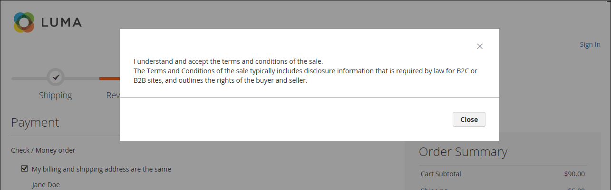
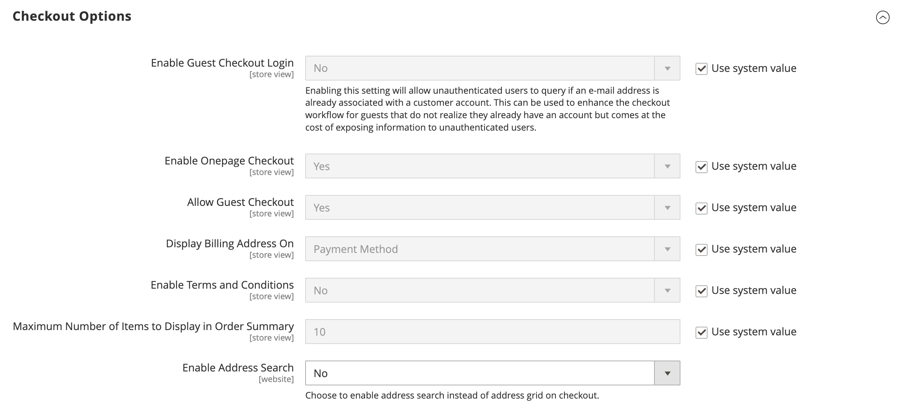
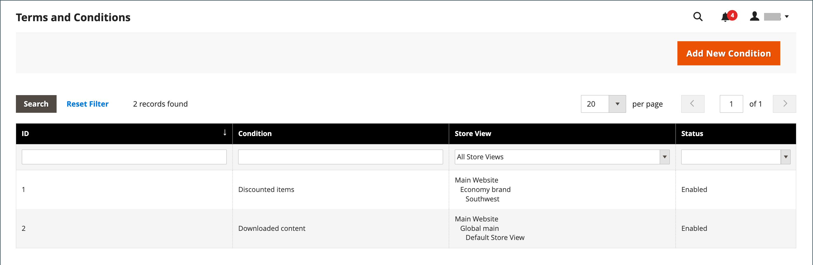
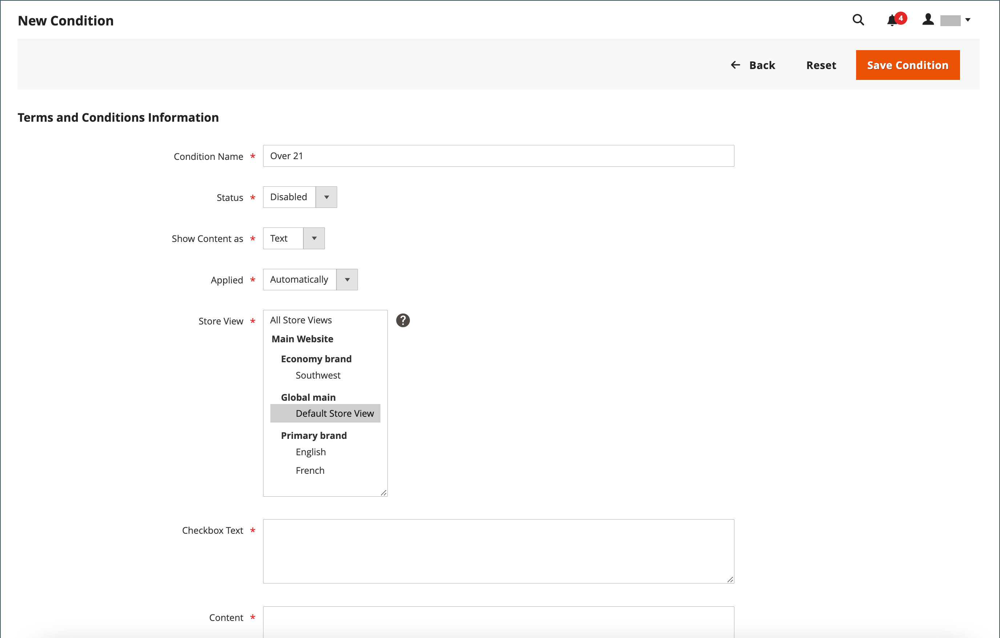

# Terms and conditions for checkout

When manual _Terms and Conditions_ functionality is enabled, customers are required to agree to the terms and conditions of the sale before the purchase is finalized. The Terms and Conditions of the sale typically includes disclosure information that might be required by law for B2C or B2B sites, and outlines the rights of the buyer and seller. The Terms and Conditions message appears after the payment information, just before the _Place Order_ button.

{width="700" zoomable="yes"}

## Step 1: Enable terms and conditions for checkout

1. On the _Admin_ sidebar, go to **[!UICONTROL Stores]** > _[!UICONTROL Settings]_ > **[!UICONTROL Configuration]**.

1. In the left panel, expand **[!UICONTROL Sales]** and choose **[!UICONTROL Checkout]**.

1. Expand  the **[!UICONTROL Checkout Options]** section.

   {width="600" zoomable="yes"}

1. Verify that **[!UICONTROL Enable Onepage Checkout]** is set to `Yes`.

1. Set **[!UICONTROL Enable Terms and Conditions]** to `Yes`.

1. Click **[!UICONTROL Save Config]**.

## Step 2: Add your own terms and conditions information

1. On the _Admin_ sidebar, go to **[!UICONTROL Stores]** > _[!UICONTROL Settings]_ > **[!UICONTROL Terms and Conditions]**.

   {width="600" zoomable="yes"}

1. In the upper-right corner, click **[!UICONTROL Add New Condition]**.

1. Enter the **[!UICONTROL Condition Name]** for internal reference.

   {width="600" zoomable="yes"}

1. Set **[!UICONTROL Status]** to `Enabled`.

1. Set **[!UICONTROL Applied]** to one of the following:

   - `Automatically` - Conditions are automatically accepted upon checkout.
   - `Manually` - Customers are required to manually accept the conditions to place an order.

1. Set **[!UICONTROL Show Content as]** to one of the following:

   - `Text` - Displays the terms and conditions content as unformatted text.
   - `HTML` - Displays the content as HTML which can be formatted.

1. Select each **[!UICONTROL Store View]** where you want these Terms and Conditions to be used.

1. Scroll down and complete the information to be displayed:

   - Enter the **[!UICONTROL Checkbox Text]** to be used as the text for the Terms and Conditions link. For example, `I understand and accept the terms and conditions of the sale`.

   - In the **[!UICONTROL Content]** box, enter the full text of the terms and conditions of the sale.

1. (Optional) Enter the **[!UICONTROL Content Height (css)]** in pixels to determine the height of the text box where the terms and conditions statement appears during checkout.

   For example, to make the text box 1 inch high on a 96-dpi display, enter `96`. A scroll bar appears if the content extends beyond the height of the box.

1. Click **[!UICONTROL Save Condition]**.
