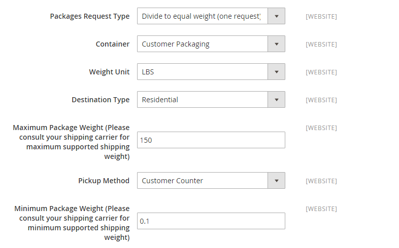
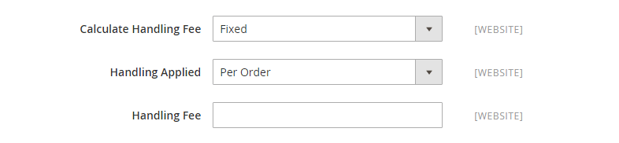
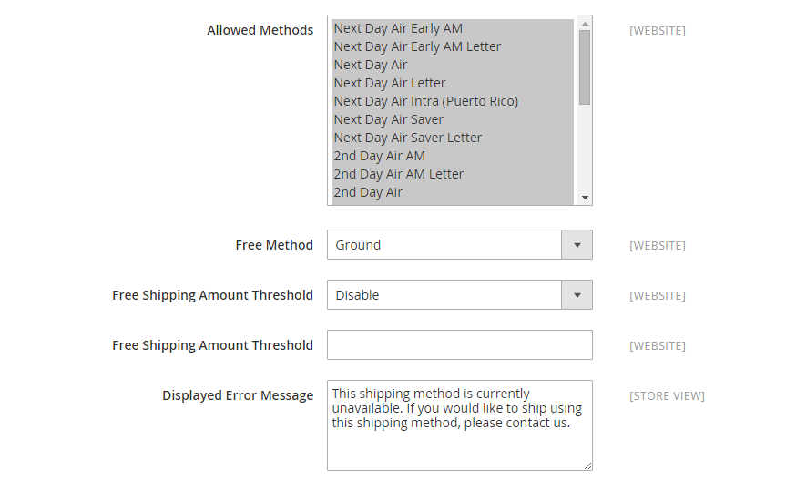
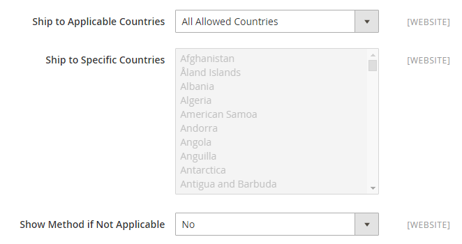
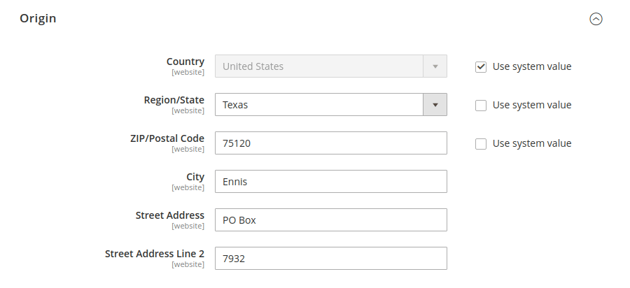

# United Parcel Service (UPS)

United Parcel Service (UPS) offers domestic and international shipping services by land and air to more than 220 countries.

{{ups-api}}

>[!NOTE]
>
>UPS can use [dimensional weight](carriers.md#dimensional-weight) to determine some shipping rates. However, Adobe Commerce supports only weight-based shipping cost calculation.

## Step 1: Open a UPS Shipping Account

To offer this shipping method to your customers, you must first open an account with UPS.

## Step 2: Enable UPS for your store

1. On the _Admin sidebar_, go to **[!UICONTROL Stores]** > _[!UICONTROL Settings]_ > **[!UICONTROL Configuration]**.

1. In the panel on the left, under **[!UICONTROL Sales]**, choose **[!UICONTROL Delivery Methods]**.

1. Expand  the **[!UICONTROL UPS]** section.

1. Set **[!UICONTROL Enabled for Checkout]** to `Yes`.

1. For a UPS XML account (default), set **[!UICONTROL UPS Type]** to `United Parcel Service XML` and do the following:

   - Enter your UPS credentials: **[!UICONTROL User ID]**, **[!UICONTROL Access License Number]** (the 16-digit UPS account `Access Key`), and **[!UICONTROL Password]**

   - Set **[!UICONTROL Mode]** to `Live` to send data to the UPS shipping system over a secure connection. (Development mode does not send data over a secure connection.)

   - Verify the **[!UICONTROL Gateway XML URL]** that is required to send requests by XML file.

   - Set **[!UICONTROL Origin of the Shipment]** to the region where the shipment originates.

   - If you have special rates with UPS, set **[!UICONTROL Enable Negotiated Rates]** to `Yes` and enter the six-digit **[!UICONTROL Shipper Number]** assigned to you by UPS.

1. For a standard UPS account, set **[!UICONTROL UPS Type]** to `United Parcel Service` and do the following:

   >[!NOTE]
   >
   >The standard United Parcel Service type is scheduled for deprecation. For new configurations, you should use the default  `United Parcel Service XML` type. The XML type is also required to generate [shipping labels](shipping-labels.md).

   - Set **[!UICONTROL Live Account]** to one of the following:

      - `Yes` - Runs UPS in production mode, and offers UPS as a shipping method to your customers.
      - `No` - Runs UPS in a test mode.

   - In the **[!UICONTROL Gateway URL]** field, enter the URL that is used to calculate UPS shipping rates.

      >[!IMPORTANT]
      >
      >UPS is discontinuing support of HTTP, which is used in the current default (system value). Clear the **[!UICONTROL Use system value]** checkbox and modify the URL to use HTTPS. Example: `https://www.ups.com/using/services/rave/qcostcgi.cgi`

1. For **[!UICONTROL Title]**, enter the name of this shipping option as you want it to appear during checkout.

   By default, this field is set to `United Parcel Service`.

   {width="600" zoomable="yes"}

## Step 3: Complete the container description

1. Set **[!UICONTROL Packages Request Type]** to one of the following:

   - `Use origin weight (few requests)`
   - `Divide to equal weight (one request)`

1. For **[!UICONTROL Container]**, specify the typical packaging type that is used for shipment:

   - `Customer Packaging`
   - `UPS Letter Envelope`
   - `Customer Supplied Package`
   - `UPS Tube`
   - `PAK`
   - `UPS Express Box`
   - `UPS Worldwide 25 kilo`
   - `UPS Worldwide 10 kilo`
   - `Pallet`
   - `Small Express Box`
   - `Medium Express Box`
   - `Large Express Box`

1. Set **[!UICONTROL Weight Unit]** to the system you use to measure product weight.

   The weight system supported by UPS varies by country. If in doubt, ask UPS which weight system you should use. Options include:

   - `LBS`
   - `KGS`

1. Set **[!UICONTROL Destination Type]** to one of the following:

   - `Residential` - Most of your shipments are business to consumer (B2C).
   - `Commercial` - Most of your shipments are business to business (B2B).

1. Enter the **[!UICONTROL Maximum Package Weight]** allowed by the carrier.

1. Set **[!UICONTROL Pickup Method]** to one of the following:

   - `Regular Daily Pickup`
   - `On Call Air`
   - `One Time Pickup`
   - `Letter Center`
   - `Customer Counter`

1. Enter the **[!UICONTROL Minimum Package Weight]** allowed by the carrier.

   {width="600" zoomable="yes"}

## Step 4: Set up handling fees

The handling fee is optional and appears as an extra charge that is added to the UPS shipping cost. If you want to include a handling fee, do the following:

1. Set **[!UICONTROL Calculate Handling Fee]** to one of the following methods:

   - `Fixed`
   - `Percent`

1. To determine how the handling fee is applied, set **[!UICONTROL Handling Applied]** to one of the following:

   - `Per Order`
   - `Per Package`

1. Enter the amount of the **[!UICONTROL Handling Fee]** to be charged.

   To enter a percentage, use the decimal format. For example, enter `0.25` for 25%.

   {width="600" zoomable="yes"}

## Step 5: Specify allowed methods and applicable countries

1. For **[!UICONTROL Allowed Methods]**, choose each UPS shipping method to be available to your customers.

   The methods appear under UPS during checkout. To select multiple methods, hold down the Ctrl key (PC) or the Command key (Mac) and click each option.

1. If you want to provide a [Free Shipping](shipping-free.md) option through UPS, set the free shipping options:

   - Set **[!UICONTROL Free Method]** to the method you want to use for free shipping. If you don't want to offer free shipping through UPS, choose `None`.

   - To require a minimum order amount that qualifies an order for free shipping with UPS, set **[!UICONTROL Enable Free Shipping Threshold]** to `Enable`. Then, enter the minimum value in **[!UICONTROL Free Shipping Amount Threshold]**.

1. If needed, change the **[!UICONTROL Displayed Error Message]**.

   This text box is preset with a default message, but you can enter a different message that you want to appear if UPS becomes unavailable.

   {width="600" zoomable="yes"}

1. Set **[!UICONTROL Ship to Applicable Countries]** to one of the following:

   - `All Allowed Countries` - Customers from all [countries](../getting-started/store-details.md#country-options) specified in your store configuration can use this delivery method.
   - `Specific Countries` - When you choose this option, the _Ship to Specific Countries_ list appears. Select each country in the list where this delivery method can be used.

1. Set **[!UICONTROL Show Method if Not Applicable]** to one of the following:

   - `Yes` - Lists all available UPS shipping methods during checkout, including methods that do not apply to the shipment.
   - `No` - Lists only the UPS shipping methods that are applicable to the shipment.

   {width="600" zoomable="yes"}

1. To create a log file with the details of UPS shipments made from your store, set **[!UICONTROL Debug]** to `Yes`.

1. For **[!UICONTROL Sort Order]**, enter a number to determine the sequence in which UPS appears when listed with other delivery methods during checkout.

   `0` = first, `1` = second, `2` = third, and so on.

1. Click **[!UICONTROL Save Config]**.

## Step 6: Set up shipping origin address

1. Make sure that your [Store Information](../getting-started/store-details.md#store-information) is complete.

1. On the _Admin_ sidebar, go to **[!UICONTROL Stores]** > _[!UICONTROL Settings]_ > **[!UICONTROL Configuration]**.

1. In the left panel, expand **[!UICONTROL Sales]** and select **[!UICONTROL Shipping Settings]**.

1. Expand  **[!UICONTROL Origin]** on the page and configure the shipping origin address.

   {width="600" zoomable="yes"}

1. Click **[!UICONTROL Save Config]**.

>[!NOTE]
>
>Commerce does not declare the full order price to UPS when calculating shipping charges. This behavior cannot be changed.
