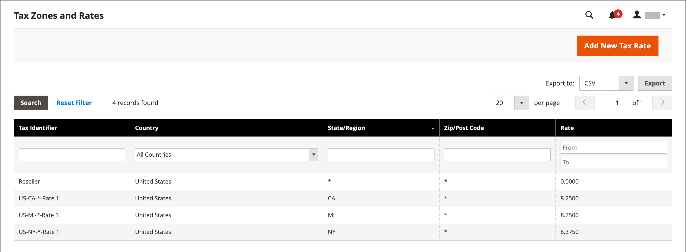
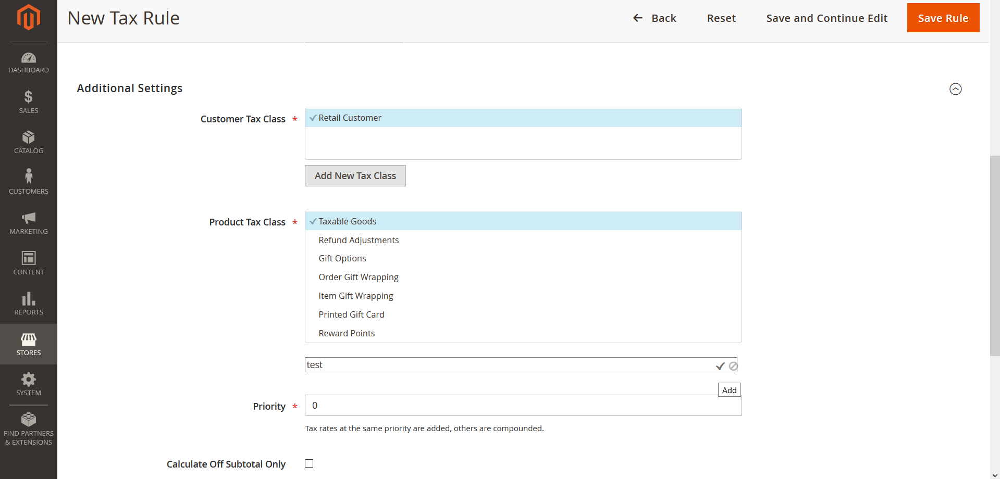
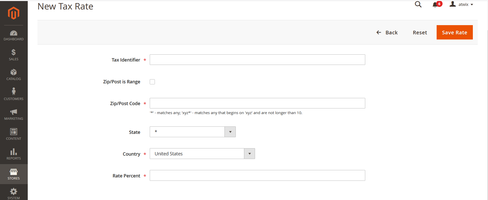
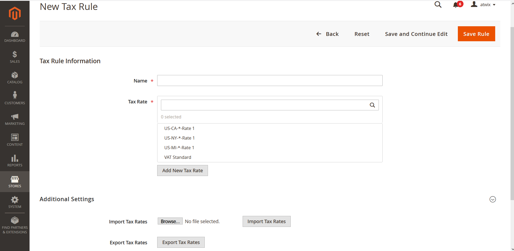
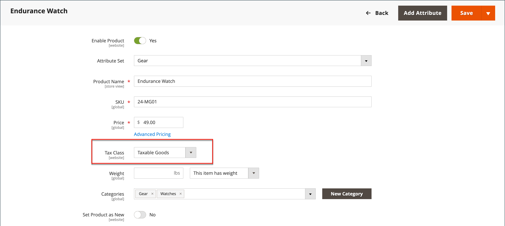

# Value Added Tax (VAT)

Some countries charge a value-added tax, or VAT, on goods and services. There can be different VAT rates depending on the stage in the manufacture or distribution process, materials, or services that you sell to your customers. In some cases, you might need to apply more than one VAT rate to correctly calculate the tax that is due.

Commerce can be configured to charge a value-added tax based on either the merchant or customer address, provided that both are located in the same country. VAT calculations are usually based on the shipment destination, rather than its point of origin. For most scenarios, a configuration setting that calculates VAT based on the customer shipping address is sufficient.

## Example scenarios

- For a VAT registered business in one EU country that supplies goods to a private individual in another EU country, VAT is calculated as a "distance sale" based on merchant location.

- A business in the Netherlands that makes a purchase from a store in the U.K. that ships to an address in the U.K. is required to pay U.K. VAT rates.

- For the sale of [downloadable products](../catalog/product-create-downloadable.md), or _digital goods_, the VAT rate is based on the shipping destination, rather than the merchant location. See [Place of supply for digital goods](taxes.md#place-of-supply-for-digital-goods-eu).

>[!TIP]
>
>Some cross-border and B2B shipments have more complex tax requirements. To expand the native capabilities of your Commerce installation, consider adding a tax management solution from the [Marketplace](https://marketplace.magento.com/extensions/accounting-finance/taxes.html).

## Configure VAT

The following instructions include a sample procedure to set up a 20% VAT in the U.K. for sales to retail customers. For other tax rates and countries, follow the general procedure but enter specific information that corresponds to your country, VAT rate, customer types, and so on.

>[!NOTE]
>
>Before proceeding, make sure to find out which rules and regulations apply to VAT in your area.

In certain business-to-business transactions, VAT is not assessed. Commerce can validate a customer's VAT ID to ensure that VAT is assessed (or not assessed) properly. See [VAT ID Validation](#vat-id-validation).

### Step 1: Set up customer tax classes

The process of creating a tax rule begins by adding a tax rate.

1. On the _Admin_ sidebar, go to **Stores** > _Taxes_ > **Tax Zones and Rates**.

1. Ensure that there is a customer tax class that is appropriate to use with the VAT.

   For this example, ensure that there is a customer tax class named "Retail Customer". If this tax class does not already exist, click **Add New Tax Rate**.

   <!-- zoom -->

1. Enter the **Tax Identifier** for the new tax class.

   All tax rates are displayed in the _Tax Rate_ field in the _Tax Rule Information_ when you create tax rules.

1. To set the zip code range (from / to) select the **Zip/Post is Range** checkbox.

1. Choose the **Country** where the tax rate applies.

1. Enter the **Rate Percent** that would be used for the tax rate calculation at purchase.

1. When complete, click **Save Rate**.

Based on the submitted tax rate, you can create subsequent tax rules. In the absence of tax rates, the creation of tax rules becomes impossible.

### Step 2: Set up product tax classes

1. On the _Admin_ sidebar, go to **Stores** >  _Taxes_ > **Tax Rules**.

1. Click **Add New Tax Rule**.

1. Expand  the **Additional Settings** section.

1. Under _Product Tax Class_, click **Add New Tax Class**.

1. Enter the **Name** of the new tax class and click the checkmark to add the new class to the list of available product tax classes and create three new classes:

   - `VAT Standard`
   - `VAT Reduced`
   - `VAT Zero`

1. Click **Save Class** for each new class that you add.

1. Click **Save Rule**.

   <!-- zoom -->

### Step 3: Set up tax zones and rates

1. On the _Admin_ sidebar, go to **Stores** >  _Taxes_ > **Tax Zones and Rates**.

   For this example you can remove the U.S. tax rates, or leave them as they are.

1. Click **Add New Tax Rate** and add new rates as follows:

   **VAT Standard**

   - Tax Identifier: `VAT Standard`
   - Country and State: `United Kingdom`
   - Rate Percent: `20.00`

   **VAT Reduced**

   - Tax Identifier: `VAT Reduced`
   - Country and State: `United Kingdom`
   - Rate Percent: `5.00`

1. Click **Save Rate** for each rate.

   <!-- zoom -->

### Step 4: Set up tax rules

A tax rule is a combination of a customer tax class, a product tax class, and a tax rate.

1. On the _Admin_ sidebar, go to **Stores** > _Taxes_ > **Tax Rules**.

1. Add new tax rules as follows:

   **VAT Standard**

   - Name: `VAT Standard`
   - Customer Tax Class: `Retail Customer`
   - Product Tax Class: `VAT Standard`
   - Tax Rate: `VAT Standard Rate`

   **Vat Reduced**

   - Name: `VAT Reduced`
   - Customer Tax Class: `Retail Customer`
   - Product Tax Class: `VAT Reduced`
   - Tax Rate: `VAT Reduced Rate`

1. Click **Save Rule** for each rate.

   <!-- zoom -->

## Step 5: Apply tax classes to products

1. On the _Admin_ sidebar, go to **Catalog** > **Manage Products**.

1. Open a product from your catalog in edit mode.

1. On the _General_ page, find the **Tax Class** option and select the **VAT Class** that applies to the product.

1. When complete, click **Save**.

   <!-- zoom -->

## Field descriptions

### Store information

Commerce uses the following [Store Information configuration settings](https://docs.magento.com/user-guide/configuration/general/general.html#store-information) to calculate VAT based on merchant information.

**[!UICONTROL VAT Number]** - The value-added tax number that is assigned to the merchant.

**[!UICONTROL Validate VAT Number]** - [VAT validation](#vat-id-validation) confirms that the VAT Number matches the corresponding record in the [European Commission](https://ec.europa.eu/taxation_customs/vies/) database.

### Customer information

Commerce uses the following fields to calculate VAT based on [customer information](https://docs.magento.com/user-guide/customers/customer-account-update.html#customer-information).

#### Account information

**[!UICONTROL Tax/VAT Number]** - If applicable, the tax number or value-added tax number that is assigned to the customer.

#### Addresses

**[!UICONTROL VAT Number]** - If applicable, the value-added tax number that is associated with a specific billing or shipping address of the customer. For the sale of [digital goods](taxes.md#place-of-supply-for-digital-goods-eu)) within the EU, the amount of the VAT is based on shipping destination.

### Customer account

Commerce uses the following [customer configuration settings](https://docs.magento.com/user-guide/customers/account-options-new.html) to calculate VAT.

**[!UICONTROL Show VAT Number on Storefront]** - Determines if the customer VAT Number field is included in the Address Book that is available in the customer account.

**[!UICONTROL Default Value for Disable Automatic Group Changes Based on VAT ID]** - VAT ID is an internal identifier for the VAT Number of the customer when used in VAT Validation. During VAT validation, Commerce confirms that the number matches the [European Commission](https://ec.europa.eu/taxation_customs/vies/) database. Customers can be automatically assigned to one of the four default customer groups based on the validation results.

## VAT ID validation

_VAT ID Validation_ automatically calculates the required tax for B2B transactions that take place within the European Union (EU), based on the merchant and customer locale. Commerce performs VAT ID validation using the web services of the [European Commission][1] server.

>[!NOTE]
>
>VAT-related tax rules do not influence other tax rules, and do not prevent the application of other tax rules. Only one tax rule can be applied at a given time.

- VAT is charged if the merchant and customer are located in the same EU country.
- VAT is not charged if the merchant and customer are located in different EU countries, and both parties are EU-registered business entities.

The store administrator creates more than one default customer group that can be automatically assigned to the customer during account creation, address creation or update, and checkout. The result is that different tax rules are used for intra-country (domestic) and intra-EU sales.

>[!IMPORTANT]
>
>If you sell virtual or downloadable products, which by their nature do not require shipping, the VAT rate of a customer's location country should be used for both intra-union and domestic sales. You must create additional individual tax rules for product tax classes that correspond to the virtual products.

### Customer registration workflow

If VAT ID Validation is enabled, after registration each customer is proposed to enter the VAT ID number. However only those who are registered VAT customers are expected to fill this field.

After a customer specifies the VAT number and other address fields, and chooses to save, the system saves the address and sends the VAT ID validation request to the European Commission server. According to the results of the validation, one of the default groups is assigned to a customer. This group can be changed if a customer or an administrator changes the VAT ID of the default address or changes the whole default address. The group can be temporarily changed (group change will be emulated) in some cases during one-page checkout.

If enabled, you can override VAT ID Validation for individual customers by selecting the checkbox on the Customer Information page.

### Checkout workflow

If a customer's VAT validation is performed during checkout, the VAT request identifier and VAT request date are saved in the Comments History section of the order.

The system behavior concerned with the VAT ID validation and the customer group change during the checkout depends on how the Validate on Each Transaction and the Disable Automatic Group Change settings are configured. This section describes the implementation of the VAT ID Validation functionality for the checkout on the frontend.

In case a customer uses Google Express Checkout, PayPal Express Checkout or another external checkout method, when the checkout is performed completely on the side of the external payment gateway, the Validate on Each Transaction setting cannot be applied. Thus the customer group cannot change during checkout.

<!-- {:width="550px"} -->

### Configure VAT ID validation

To configure VAT ID validation, you must first set up the customer groups that are needed, and create the related tax classes, rates, and rules. Then, enable VAT ID validation for the store, and complete the configuration.

The following examples show how tax classes and rates are used for VAT ID Validation. Take a look at the examples, and then follow the instructions to set up the tax classes and rules that are needed for your store.

#### Example: Minimal tax rules required for VAT ID validation

|Tax Rule #1|  |
|--- |--- |
|Customer Tax Class|Customer tax classes must include:  A class for domestic customers.  A class for customers with incorrectly formatted VAT IDs. A class for customers whose VAT ID validation failed.|
|Product Tax Class|Product tax classes must include a class for products of all types, except bundle and virtual.|
|Tax Rate|The tax rate must include the VAT rate of the merchant's country.|

{style="table-layout:auto"}

| Tax Rule #2 |   |
|--- |--- |
| Customer Tax Class | A class for intra-union customers. |
| Product Tax Class | A class for products of all types, except virtual. |
| Tax Rate | VAT rates for all EU countries, except merchant's country. Currently this rate is 0%. |

{style="table-layout:auto"}

|Tax Rule #3 |(Required for virtual and downloadable products)|
|--- |--- |
|Customer Tax Class|Customer tax classes must include:  A class for domestic customers  A class for customers with invalid VAT ID A class for customers, for whom VAT ID validation failed|
|Product Tax Class|A class for virtual products.|
|Tax Rate|VAT rate of the merchant's country.|

{style="table-layout:auto"}

|Tax Rule #4 |(Required for virtual and downloadable products)|
|--- |--- |
|Customer Tax Class|A class for intra-union customers.|
|Product Tax Class|A class for virtual products.|
|Tax Rate|VAT rates for all EU countries, except merchant's country. Currently this rate is 0%.|

{style="table-layout:auto"}

#### Step 1: Create VAT-related customer groups

VAT ID Validation automatically assigns one of the four default customer groups to customers according to VAT ID validation results:

- Domestic
- Intra-EU
- Invalid VAT ID
- Validation error

You can create new customer groups for VAT ID Validation or use existing groups, if they comply with your business logic. When configuring VAT ID Validation, you must assign each of the created customer groups as a default for customers with appropriate VAT ID validation results.

#### Step 2: Create VAT-related classes, rates, and rules

Each tax rule is defined be three entities:

- Customer Tax Classes
- Product Tax Classes
- Tax Rates

Create the [tax rules](tax-rules.md) that you need to use VAT ID Validation effectively.

- Tax rules include tax rates and [tax classes](tax-class.md).
- Tax classes are assigned to [customer groups](https://docs.magento.com/user-guide/customers/customer-groups.html).

#### Step 3: Enable and configure VAT ID validation

1. On the _Admin_ sidebar, go to **Stores** > _Settings_ > **Configuration**.

1. If necessary, set the **Store View** for the configuration.

1. In the left panel, expand **Customers** and choose **Customer Configuration**.

1. Expand  the **Create New Account Options** section.

   In the following example, the general customer settings that are not related to VAT Validation are dimmed.

   <!-- zoom -->

1. Set **Enable Automatic Assignment to Customer Group** to `Yes` and complete the following fields as needed.

   - **Default Group**
   - **Default Value for Disable Automatic Group Changes Based on VAT ID**
   - **Show VAT Number on Storefront**

1. When complete, click **Save Config**.

#### Step 4: Set your VAT ID and location country

1. In the left panel, expand **General** and choose **General** underneath.

1. Expand  the **Store Information** section.

   <!-- zoom -->

1. Select your **Country**.

1. Enter your **VAT Number** and click **Validate VAT Number**.

   The result appears immediately.

1. When complete, click **Save Config**.

#### Step 5: Verify the list of EU member countries

1. Continuing in the _General_ configuration page, Expand  the **Countries Options** section.

1. In the **European Union Countries** list, verify that each member country of the EU is selected.

   To change the default setting, clear the **Use system values** checkbox. Hold down the Ctrl key (PC) or the Command key (Mac) and click each country that you want to add or remove.

1. When complete, click **Save Config**.

   <!-- zoom -->

[1]: https://ec.europa.eu/taxation_customs/vies/
