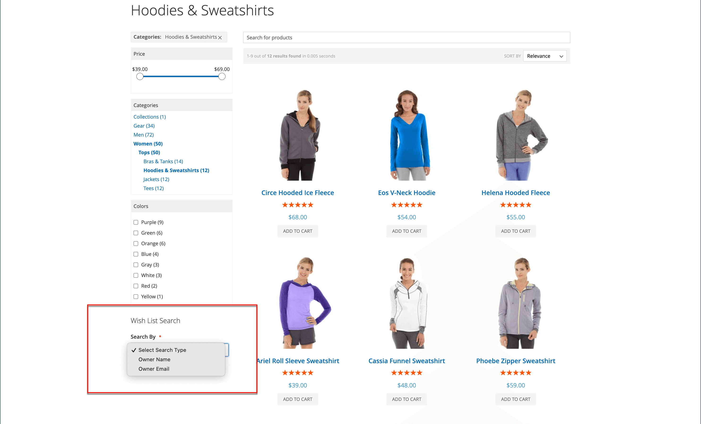
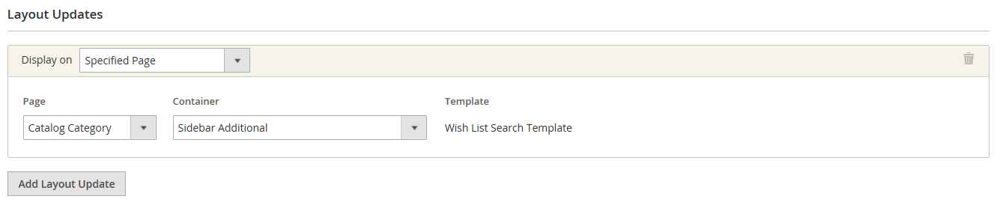

# Configure wish lists

The wish list configuration enables wish lists and determines the email template and sender of email messages that are used when a wish list is shared.

## Enable wish list functionality

1. On the _Admin_ sidebar, go to **[!UICONTROL Stores]** > _[!UICONTROL Settings]_ > **[!UICONTROL Configuration]**.

1. In the left panel, expand **[!UICONTROL Customers]** and choose **[!UICONTROL Wish List]**.

1. Expand  the **[!UICONTROL General Options]** section and do the following:

    <!-- zoom -->

    - Set the **[!UICONTROL Enabled]** field to `Yes`. This activates the wish list module for the store.

    -  (Adobe Commerce only) Set the **[!UICONTROL Enable Multiple Wish Lists]** field to `Yes`. This allows customers to create and maintain multiple wish lists.

    -  (Adobe Commerce only) sTo limit the number of wish lists customers can have associated with their account, enter value for **[!UICONTROL Number of Multiple Wish Lists]**.

    - Set the **[!UICONTROL Show in Sidebar]** field to `Yes`. This displays the wish lists in the sidebar.

1. Expand  the **[!UICONTROL Share Options]** section and do the following:

    <!-- zoom -->

    - Set the **[!UICONTROL Email Sender]** to the store contact that should appear as the sender of the message. Options: General Contact, Sales Representative, Customer Support, Custom Email.

    - Set the **[!UICONTROL Email Template]** to be used when a customer shares a wish list.

    - To limit the total number of emails a customer can send, enter a **[!UICONTROL Max Emails Allowed to be Sent]** value. The default is 10 and the maximum allowed is 10,000.

    - To limit the size of the message, enter value for **[!UICONTROL Email Text Length Limit]**. The default is 255.

1. Expand  the **[!UICONTROL My Wish List Link]** section and set **[!UICONTROL Display Wish List Summary]** to one of the following:

    - `Display number of items in wish list`
    - `Display item quantities`

    <!-- zoom -->

1. When complete, click **[!UICONTROL Save Config]**.

## Add wish list search

 (Adobe Commerce only)

Any public wish list can be found using the Wish List Search [widget](../content-design/widgets.md). The widget enables a customer to search by the name or email address of the wish list owner. Store customers can find wish lists that belong to other customers, view them and order products from them, or add the products to their own wish lists. If an item is purchased from a public wish list by another customer, it is not removed from the original wish list. The Wish List Search widget can be added to any page of your store to make it easy for customers to find the wish lists of friends and family members.

<!-- zoom -->

1. On the _Admin_ sidebar, go to **[!UICONTROL Content]** > _[!UICONTROL Elements]_ > **[!UICONTROL Widgets]**.

1. In the upper-right corner, click **[!UICONTROL Add Widget]**.

1. In the _[!UICONTROL Settings]_ tab, do the following:

   - Set **[!UICONTROL Type]** to `Wish List Search`.

   - Set **[!UICONTROL Design Theme]** to the theme of the store where the wish list is added.

   - Click Continue.

1. Complete the _[!UICONTROL Storefront Properties]_:

   - Enter the **[!UICONTROL Widget Title]**.

   - Set **[!UICONTROL Assign to Store Views]** to the view or website where the widget is to be used.

   - For **[!UICONTROL Sort Order]**, enter a number to determine the placement of the widget within its container.

     `0` = first (default), `1` = second, `2` = third, and so on.

1. In the _[!UICONTROL Layout Updates]_ section, click **[!UICONTROL Add Layout Update]** and set **[!UICONTROL Display on]** to one of the following:

   - _[!UICONTROL Categories]_

      - `Anchor Categories`
      - `Non-Anchor Categories`

   - _[!UICONTROL Products]_

      - `All Product Type`
      - `Simple Product`
      - `Virtual Product`
      - `Bundle Product`
      - `Configurable Product`
      - `Downloadable Product`
      - `Gift Card`
      - `Grouped Product`

   - _[!UICONTROL Generic Page]_

      - `All Pages`
      - `Specified Page`
      - `Page Layouts`

1. In the **[!UICONTROL Container]** list, choose the area of the page layout where it is to be placed.

   <!-- zoom -->

1. In the left panel, choose **[!UICONTROL Widget Options]**.

1. Set **[!UICONTROL Quick Search Form Types]** to one of the following:

   - `All Forms` - Customers can search by all available parameters.
   - `Owner Name` - Customers can search for wish lists by owner name.
   - `Owner Email` - Customers can search for wish lists by owner email address.

   >[!NOTE]
   >
   >Shipping addresses are not included in wish lists.

1. Configure any remaining widget properties as needed, following the standard [instructions](../content-design/widget-create.md).

1. When complete, click **[!UICONTROL Save]**.

1. When prompted, refresh all invalid caches.
