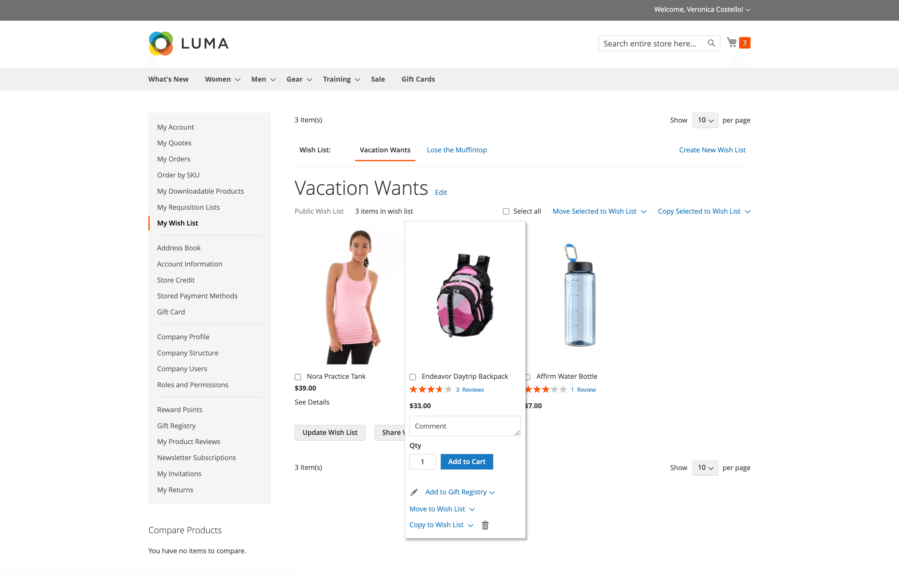
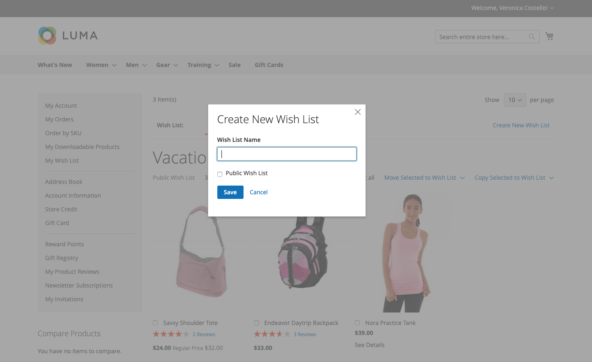
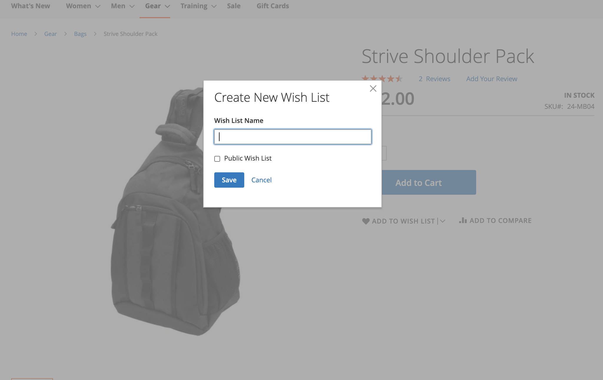
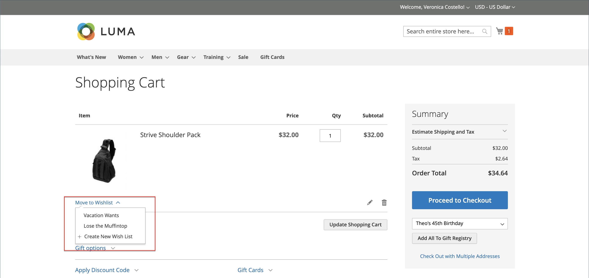
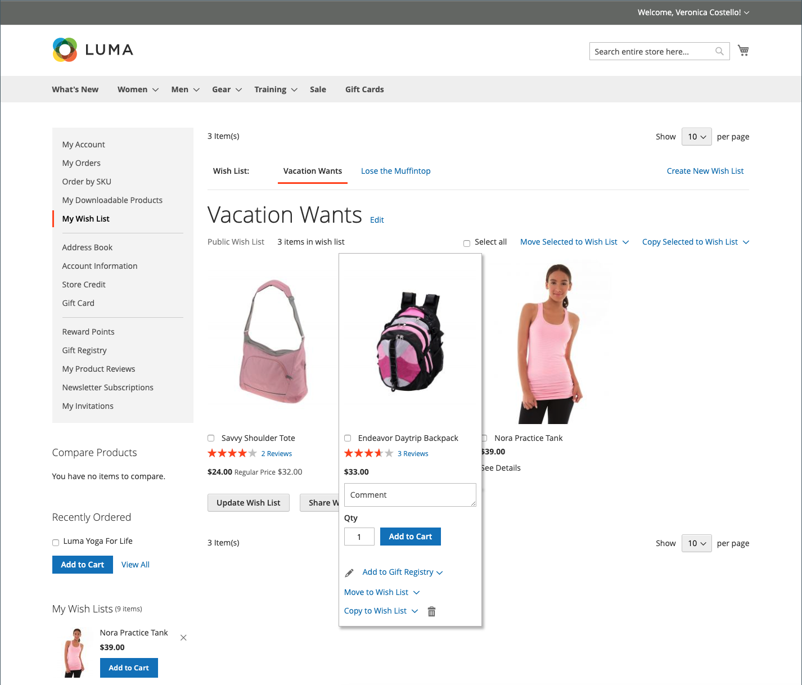
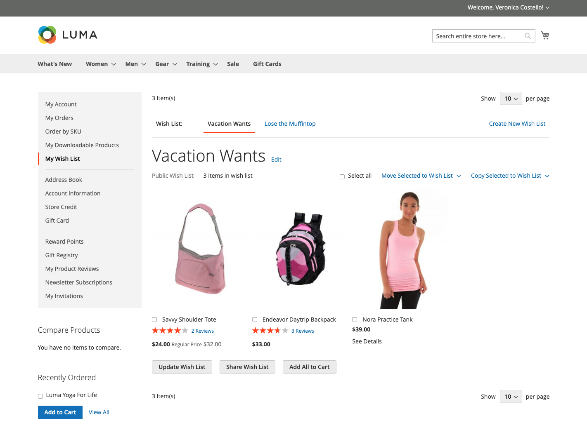
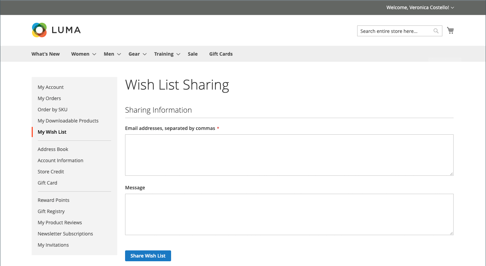
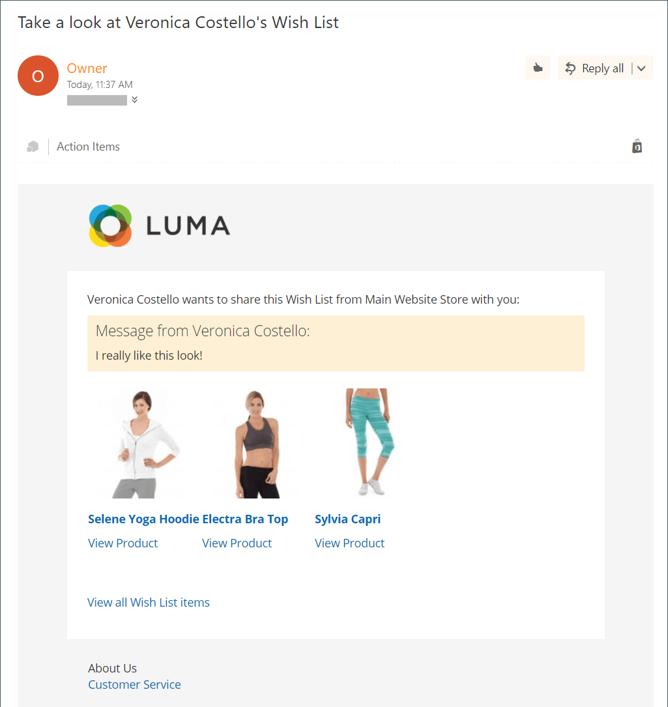
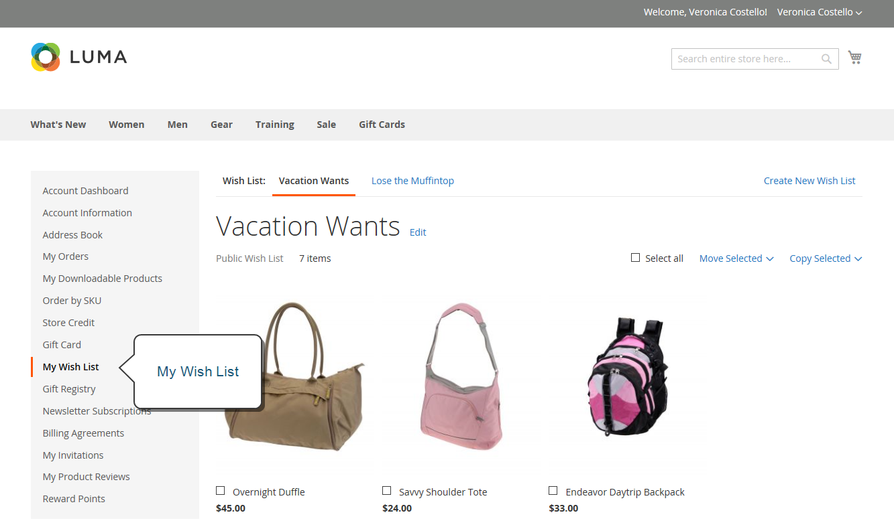
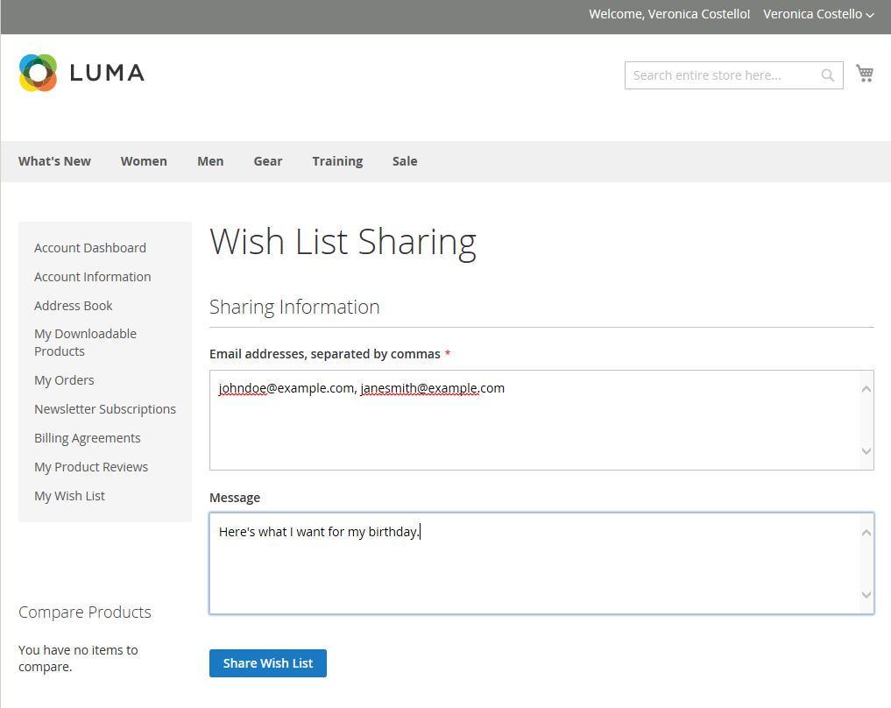

# Wish list storefront experience

A wish list is a convenient way for customers to recall products that they like, but are not ready to buy. Items from a wish list can be shared with others or added to the shopping cart. If the customer has multiple wish lists, the name of the current wish list appears at the top of the page. Customers can manage their wish lists from their account dashboard. Store administrators can also help customers manage their wish lists from the Admin.

<!-- zoom -->

 Adobe Commerce supports the use of multiple wish lists per customer account.

 Magento Open Source supports the use of a single wish list per customer account.

## Create a wish list

 (Adobe Commerce only)

In the storefront, a customer can create a wish list from their account dashboard, a product page, a catalog page, and the shopping cart.

### Method 1: From a customer account

1. In the sidebar of their account dashboard, the customer chooses **[!UICONTROL My Wish List]**.

1. In the upper-right corner, clicks **[!UICONTROL Create New Wish List]**.

1. Enter the Wish List Name.

1. To allow others to see their wish list, selects the **[!UICONTROL Public Wish List]** checkbox.

   >[!NOTE]
   >
   >The main difference between `Public` and `Private` wish lists is that private wish lists are not [searchable](wishlist-configuration.md#add-wish-list-search) through wish lists.

1. When complete, click **[!UICONTROL Save]**.

   <!-- zoom -->

### Method 2: From the catalog page

1. From the storefront, the customer goes to the catalog page that contains the product they want to add to a wish list.

1. Hovers over the product.

1. Clicks the arrow next to the _Add to Wish List_ icon and selects the **[!UICONTROL Create New Wish List]**.

1. Enters the wish list name.

1. To allow others to see their wish list, selects the **[!UICONTROL Public Wish List]** checkbox.

1. When complete, clicks **[!UICONTROL Save]**.

### Method 3: From the product detail page

1. From the storefront, the customer goes to the detail page of the product they want to add to a wish list.

1. Clicks the arrow next to **[!UICONTROL Add to Wish List]** and chooses **[!UICONTROL Create New Wish List]**.

1. Enters the **[!UICONTROL Wish List Name]**.

1. To allow others to see their wish list, selects the **[!UICONTROL Public Wish List]** checkbox.

1. When complete, clicks **[!UICONTROL Save]**.

   <!-- zoom -->

### Method 4: From the shopping cart

1. Customer opens the **[!UICONTROL Shopping Cart]** page.

1. Under the item, click the arrow next to **[!UICONTROL Move to Wishlist]** and chooses **[!UICONTROL Create New Wish List]**.

1. Enters the **[!UICONTROL Wish List Name]**.

1. To allow others to see their wish list, selects the **[!UICONTROL Public Wish List]** checkbox.

1. When complete, clicks **[!UICONTROL Save]**.

<!-- zoom -->

## Update the product listing

1. From the wish list, the customer points to the product to display the options.

1. To add a **[!UICONTROL Comment]** about the product, enters the text in the box below the price.

    <!-- zoom -->

1. To change the selection of product options, clicks **[!UICONTROL Edit]** and does the following:

    - Updates the options on the product detail page.
    - Clicks **[!UICONTROL Update Wish List]**.

## Add a wish list product to the cart

1. In the wish list, the customer points to the product that you want to add.

1. Updates the **[!UICONTROL Qty]** and edit the other options as necessary.

1. Clicks **[!UICONTROL Add to Cart]**.

## Share the wish list

<!-- zoom -->

1. The customer clicks **[!UICONTROL Share Wishlist]**.

1. Enters the email address of each person who is to receive the wish list, separated by a comma.

1. Adds a **[!UICONTROL Message]** to be included in the email.

1. Clicks **[!UICONTROL Share Wish List]**.

   <!-- zoom -->

   The message is sent from your primary [store contact](https://docs.magento.com/user-guide/stores/store-email-addresses.html) and includes a thumbnail image of each product, with links to your store.

   <!-- zoom -->

## Edit wish lists

<!-- zoom -->

### Move items to a different list

 (Adobe Commerce only)

1. The customer selects the checkbox of each item to be moved.

1. Clicks **[!UICONTROL Move Selected to Wish List]** and does one of the following:

    - Chooses an existing wish list.
    - Clicks **[!UICONTROL Create New Wish List]**.

### Copy items to a different list

 (Adobe Commerce only)

1. Selects the checkbox of each item to be moved.

1. Clicks **[!UICONTROL Copy Selected to Wish List]** and does one of the following:

    - Chooses an existing wish list.
    - Clicks **[!UICONTROL Create New Wish List]**.

## Delete a wish list

 (Adobe Commerce only)

1. Customer opens the wish list to be deleted.

1. Clicks **[!UICONTROL Delete Wish List]**.

1. When prompted to confirm, clicks **[!UICONTROL OK]**.

>[!IMPORTANT]
>
>This action cannot be undone.

## Share a wish list

1. In the left panel of the customer account dashboard, the customer chooses **[!UICONTROL My Wish List]**.

1. To add a comment to an item, hovers over the image and enter your **[!UICONTROL Comment]** in the box.

1. To share the wish list, does the following:

   - Clicks **[!UICONTROL Share My Wish List]**.

   - Enters the email address of each recipient, separated by a comma.

   - Enters a **[!UICONTROL Message]** for the body of the email.

1. When they are ready to send the message, clicks **[!UICONTROL Share Wish List]**.

   <!-- zoom -->

## Transfer wish list items to the cart

To transfer all wish list items to the cart, the customer clicks **[!UICONTROL Add All to Cart]**.

To add a single item, the customer does the following:

1. Hovers over the item and enters the **[!UICONTROL Qty]** that they want to add to the cart.

1. Clicks **[!UICONTROL Add to Cart]**.

## Find a customer wish list

If the [Wish List Search widget](wishlist-configuration.md#add-wish-list-search) in included in your store pages, customers can search by the name or email address of the wish list owner. 

1. From the wish list search widget, the customer selects a search option.

1. Enters the wish list owner's name or email address and clicks **[!UICONTROL Search]**.

   The _Wish List Search_ page opens and any matching wishlists are displayed in the search results section.

   >[!NOTE]
   >
   >Only public wishlists are displayed in search results---customers' private wishlists are not publicly viewable.

1. To view the list of wish list items, clicks **[!UICONTROL View]**.

   The owner name and the date of the last update is displayed for each wish list.

1. To add a product to their cart, the customer selects the checkbox below the product and clicks **[!UICONTROL Add to Cart]**.

   You can also add items you like from another customer's wishlist to your own.
