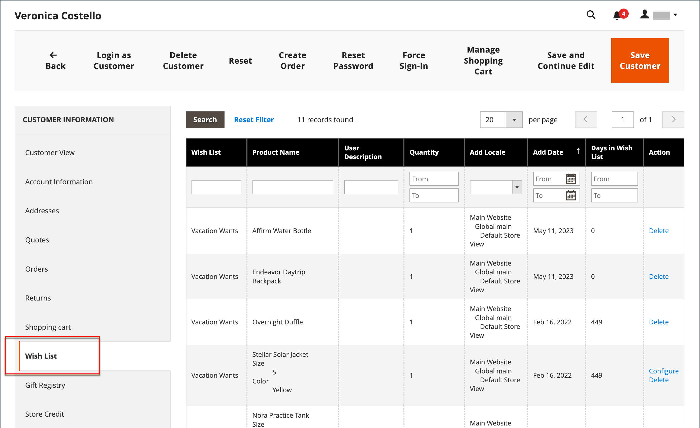

# Wish lists

A wish list is a list of products that a registered customer can share with friends, or save to transfer to the cart later. When wish lists are enabled, the Add to Wishlist link appears on the category and product pages of each product in the store. Depending on the theme, it might be a text link or a graphic image.

 Adobe Commerce supports the use of multiple wish lists per customer account.

 Magento Open Source supports the use of a single wish list per customer account.

Shared wish lists are sent from a store email address, but the body of the message contains a personalized note from the customer. You can customize the email template that is used when wish lists are shared and choose the store contact that appears as the sender.

Wish lists can be updated from the dashboard of the [customer account](../customers/account-dashboard.md). Items can be added or transferred between the wish list and cart by the customer or by the store administrator.

{width="700" zoomable="yes"}

When a product with multiple options is added to a wish list, any options that have been selected by the customer are included in the wish list item description. For example, if the customer adds the same pair of shoes in three different colors, each pair appears as a separate wish list item. However, if the customer adds the same product to the wish list multiple times, the product appears only once, but with an updated quantity that reflects the number of times the product was added.

## Wish list assistance in the Admin

Customers can [manage their wish lists](wishlist-storefront.md) by logging in to their accounts on the storefront. As a store administrator, you can also manage customer wish lists from the Admin.

**_To update wish list items from the Admin:_**

1. On the _Admin_ sidebar, go to **[!UICONTROL Customers]** > **[!UICONTROL All Customers]**.

1. Find the customer in the list and click **[!UICONTROL Edit]** in the _[!UICONTROL Action]_ column.

1. In the left panel, choose **[!UICONTROL Wish List]** and find the item to be edited in the list.

   Any options selected for the product appear below the product name.

   {width="600" zoomable="yes"}

1. To edit the product options, do the following:

   - In the **[!UICONTROL Action]** column, click **[!UICONTROL Configure]**.

   - On the product page, update the options and **[!UICONTROL Quantity]** as needed.

   - Click **[!UICONTROL OK]**.

1. When complete, click **[!UICONTROL Save Customer]** or **[!UICONTROL Save and Continue Edit]**.
