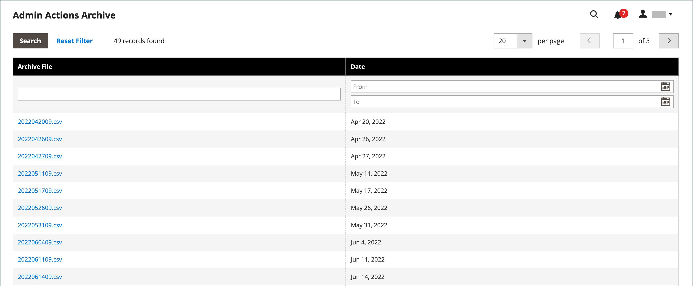

# Action log archive

{{ee-feature}}

The Admin [actions](action-log.md) archive lists the CSV log files that are stored on the server. In the configuration, you can specify how long the log entries are stored, and how often they are archived. By default, the file name includes the current date in ISO format:  `yyyyMMddHH`

>[!NOTE]
>
>Log archiving requires a [cron job](cron.md) to be set up.

## Configure the log archive

1. On the _Admin_ sidebar, go to **[!UICONTROL Stores]** > _[!UICONTROL Settings]_ > **[!UICONTROL Configuration]**.

1. In the left panel, expand **[!UICONTROL Advanced]** and choose **[!UICONTROL System]**.

1. Expand  the **[!UICONTROL Admin Actions Log Archiving]** section and set these options:

   - **[!UICONTROL Log Entry Lifetime, Days]** — Enter the number of days that you want to keep the log entries in the database before they are removed.
   - **[!UICONTROL Log Archiving Frequency]** — Set to `Daily`, `Weekly`, or `Monthly`.

   <!-- zoom -->

   For a detailed list of the configuration settings, see [Admin Actions Log Archiving](../configuration-reference/advanced/system.md) in the _Configuration Reference_.

1. When complete, click **[!UICONTROL Save Config]**.

## View the archive

On the _Admin_ sidebar, go to **[!UICONTROL System]** > _[!UICONTROL Actions Logs]_ > **[!UICONTROL Archive]**.

<!-- zoom -->
