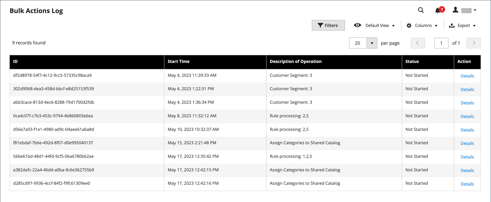

# Bulk actions

{{ee-feature}}

The bulk actions log records the details of asynchronous mass operations that run in the background, such as import/export or assigning [custom prices](../b2b/catalog-shared-manage.md#update-custom-pricing) to multiple products in a [shared catalog](../b2b/catalog-shared.md).

{width="600" zoomable="yes"}

## Configure bulk actions

1. On the _Admin_ sidebar, go to **[!UICONTROL Stores]** > _[!UICONTROL Settings]_ > **[!UICONTROL Configuration]**.

1. In the left panel, expand **[!UICONTROL Advanced]** and choose **[!UICONTROL System]**.

1. Expand  the **[!UICONTROL Bulk Actions]** section and set the log save option:

   **[!UICONTROL Days Saved in Log]** — Enter the number of days that bulk actions are saved in a log.

   {width="600" zoomable="yes"}

   For a detailed list of the configuration settings, see [_Bulk Actions_](../configuration-reference/advanced/system.md) in the _Configuration Reference_.

1. When complete, click **[!UICONTROL Save Config]**.

## View bulk actions

1. On the _Admin_ sidebar, go to **[!UICONTROL System]** > _[!UICONTROL Actions Logs]_ > **[!UICONTROL Bulk Actions]**.

1. Find the desired action in the log.

1. In the _[!UICONTROL Action]_ column, click **[!UICONTROL Details]**.
