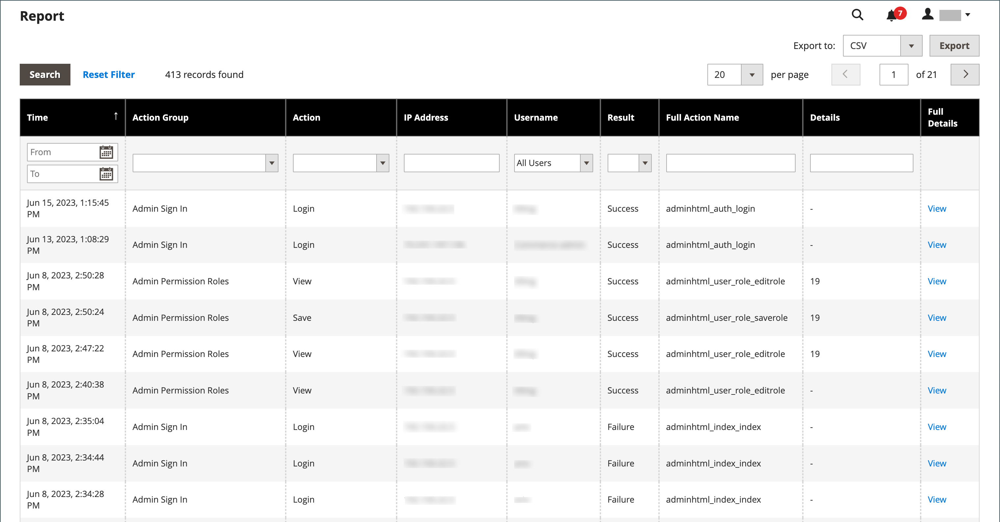
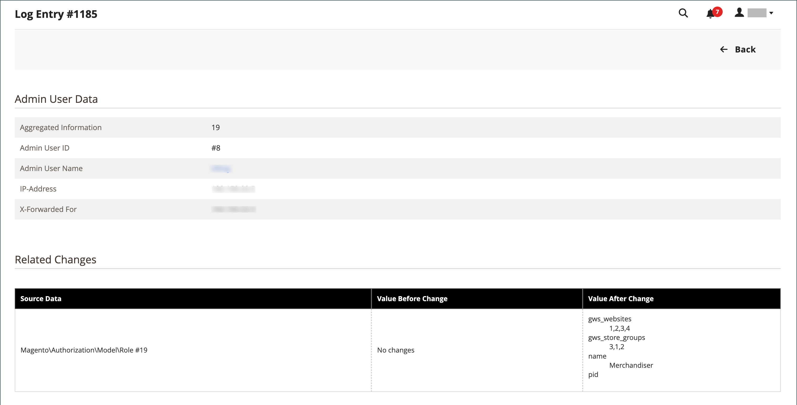
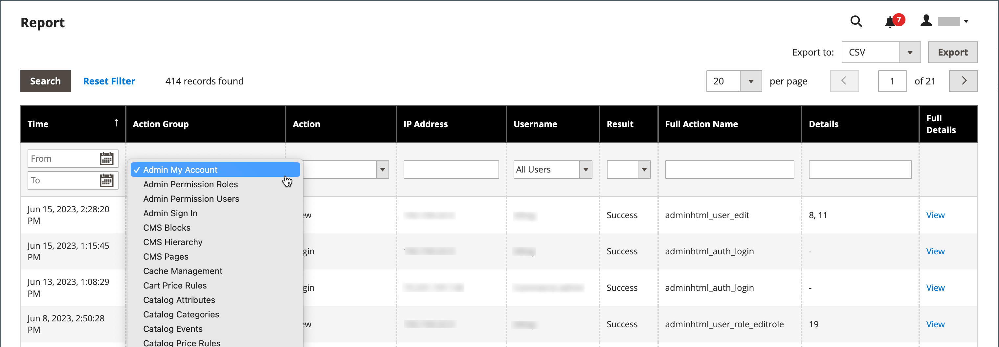

# Action Logs report

{{ee-feature}}

The _Action Logs_ report displays a detailed record of all Admin actions that are enabled for logging. Each record is time stamped, and records the IP address and name of the user. The log detail includes admin user data and related changes that were made during the action.

Actions that you want to display in the report must be enabled in the [Admin Actions Logging](action-log.md) screen in the store settings. If the action type is checked (enabled), those types of Admin actions are displayed in the Action Logs report.

The report can be filtered using the options in each column. You may set a single filter option or set filter options for multiple columns to narrow the report to list specific actions. You can also export report data in either CSV or Excel XML format.

The Action Logs Report includes the following information:

- **[!UICONTROL Time]** - The date and time the action occurred
- **[!UICONTROL Action Group]** - Displays the action type, correlates to the actions enabled on _Admin Actions Logging_ screen in your store settings
- **[!UICONTROL Action]** - Displays the action that was logged
- **[!UICONTROL IP Address]** - Displays the IP address for the machine on which the action was performed
- **[!UICONTROL Username]** - Displays the login ID for the user who performed the action
- **[!UICONTROL Result]** - Displays the success or failure of the user's action
- **[!UICONTROL Full Action Name]** - Displays the backend action name
- **[!UICONTROL Details]** - Displays the backend action category
- **[!UICONTROL Full Details]** - Displays all logged details of the admin action

## View the Action Logs report

1. On the _Admin_ sidebar, go to **[!UICONTROL System]** > _[!UICONTROL Actions Logs]_ > **[!UICONTROL Report]**.

   <!-- zoom -->

1. To view the full details of a listed admin action, click **[!UICONTROL View]**.

   <!-- zoom -->

## Filter the Action Logs report

You can define the filter options fields and then click **[!UICONTROL Search]** to narrow the actions displayed.

To clear the filter options and return to the full report, click **[!UICONTROL Reset Filter]**.

<!-- zoom -->

|Field|description|
|--- |--- |
|[!UICONTROL Time]|In **[!UICONTROL From]**, click to select a date from the dynamic calendar to define the beginning date for the filter. In **[!UICONTROL To]**, click to select a date to define the ending date for the filter.|
|[!UICONTROL Action Group]|Choose an action group.|
|[!UICONTROL Action]|Choose an action.|
|[!UICONTROL IP Address]|Enter the IP address of the machine used for an action.|
|[!UICONTROL Username]|Choose a user name. Default is `All Users`.|
|[!UICONTROL Result]|Choose Success or Failure.|
|[!UICONTROL Full Action Name]|Enter text for the search to match in the field.|
|[!UICONTROL Details]|Enter text for the search to match in the field.|

{style="table-layout:auto"}

## Export the Action Logs report

1. For **[!UICONTROL Export to]**, choose an export format:

   - `CSV` - A comma-separated value file containing plain text data
   - `Excel XML` - An XML-based, spreadsheet data format

1. Click **[!UICONTROL Export]**.

   The generated file is automatically saved to your designated folder for downloads.

   <!-- zoom -->
