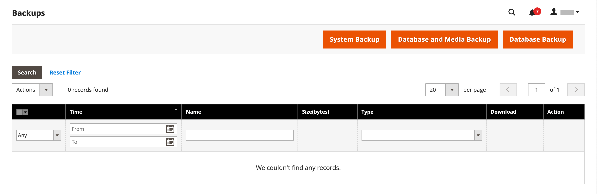

# System backups

Adobe Commerce and Magento Open Source give you the ability to back up different parts of the system—such as the file system, database, and media files—and to roll back automatically. A record for each backup appears in the grid on the _Backups_ page. Deleting a record from the list deletes the archived file as well. Database backup files are compressed using the GZ format. For the system backups and the database and media backups, the TGZ format is used. As a best practice, you should restrict access to backup tools, and back up before installing extensions and updates.

- **Restrict access to backup tools.** Access to the backups and roll back management tool can be restricted by configuring [user roles](permissions-user-roles.md) for backup and roll back resources. To restrict access, leave the corresponding checkbox unselected. To give access to roll back resources, you must grant access to backup resources as well.

- **Back up before installing extensions and updates.** Always perform a backup before you install an extension or update.

{{$include /help/_includes/backups-note.md}}

## Enable and schedule backups

1. On the _Admin_ sidebar, go to **[!UICONTROL Stores]** > _[!UICONTROL Settings]_ > **[!UICONTROL Configuration]**.

1. In the left panel, expand **[!UICONTROL Advanced]** and choose **[!UICONTROL System]**.

1. Expand  the **[!UICONTROL Backup Settings]**.

1. Set **[!UICONTROL Enabled Schedule Backup]** to `Yes`.

1. To schedule automatic beckups, set the scheduling options:

   - Set **[!UICONTROL Enabled Schedule Backup]** to `Yes`.
   - Set **[!UICONTROL Scheduled Backup Type]** to the type of backup to run at the scheduled interval.
   - Set **[!UICONTROL Start Time]** to the time of day to run the backup operation.
   - Set **[!UICONTROL Frequency]** to `Daily`, `Weekly`, or `Monthly`.
   - Set **[!UICONTROL Maintenance Mode]** to `Yes`.

   {width="600" zoomable="yes"}

1. When complete, click **[!UICONTROL Save Config]**.

## Create a backup

1. On the _Admin_ sidebar, go to **[!UICONTROL System]** > _[!UICONTROL Tools]_ > **[!UICONTROL Backups]**.

1. In the upper-right corner, click the type of backup you want to create:

   - **[!UICONTROL System Backup]** - Creates a complete backup of the database and the file system. During the process, you can choose to include the media folder in the backup.

   - **[!UICONTROL Database and Media Backup]** - Creates a backup of the database and the media folder.

   - **[!UICONTROL Database Backup]** - Creates a backup of the database.

   {width="600" zoomable="yes"}

1. To put the store into maintenance mode during the backup, select the checkbox.

   When the backup is complete, maintenance mode is turned off automatically.

1. For a system backup, select the **[!UICONTROL Include Media folder to System Backup]** checkbox to include the media folder.

1. When prompted, confirm the action.

