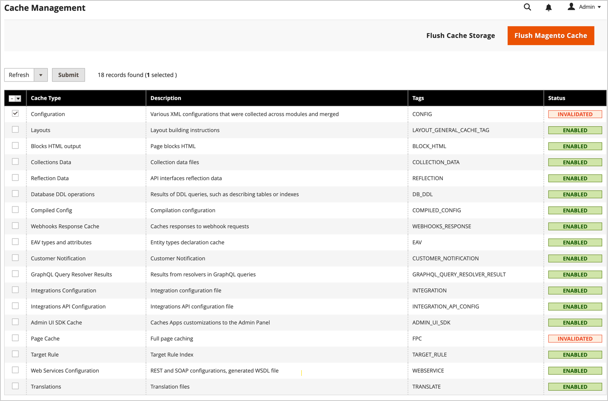
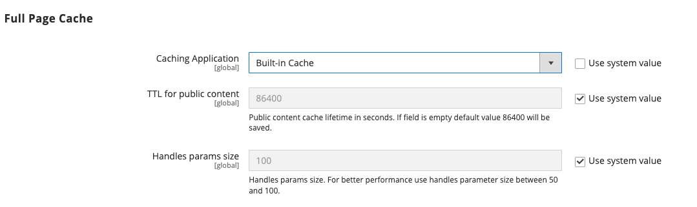

# Cache management

The Adobe Commerce and Magento Open Source cache management system provides an easy way to improve the performance of your site. Whenever a cache requires a refresh, a notification displays with a link to the [!UICONTROL Cache Management] page to complete the refresh.

{width="500"}

The _[!UICONTROL Cache Management]_ page shows the status of each primary cache and its associated tag. The large buttons in the upper-right corner can be used to flush the cache, or the all-inclusive Cache Storage. At the bottom of the page, additional buttons allow you to flush the catalog product images cache and JavaScript/CSS cache.

>[!IMPORTANT]
>
>When catalog entities are changed, it can affect other pages and invalidate multiple caches simultaneously. When you review the cache management page, you could see invalid items that require refresh when they were _**not edited directly**_. For example, this invalidation occurs when you edit any product in the catalog that is assigned to any category, or when you change any related product rule.

After clearing a cache, always refresh your browser to make sure that you can see the most recent files. Clearing the Commerce cache does not clear your web browser cache. You might need to clear the browser cache to see updated content.

Additional technical information about Adobe Commerce caching is available from the [Cache overview](https://developer.adobe.com/commerce/frontend-core/guide/caching/){:target="_blank"} in the _Commerce Frontend Development Guide_.

Access the _[!UICONTROL Cache Management]_ page by doing one of the following:

- Click the **[!UICONTROL Cache Management]** link in the message above the workspace.
- On the _Admin_ sidebar, go to **[!UICONTROL System]** > _[!UICONTROL Tools]_ > **[!UICONTROL Cache Management]**.

{width="700" zoomable="yes"}

## Best Practices for caching

Reindexing and caching have different purposes in Commerce. [Indexes](index-management.md) track database information for increased search performance, faster data retrieval for storefronts, and more. Caches save loaded data, images, formats, and the like for increased performance loading and accessing the storefront.

- Always flush the cache after installing extensions/modules. You can install one or more extensions, then flush the cache.
- Flush the cache after installing Commerce. For fresh installs, you should also reindex.
- Flush the cache after upgrading from one version of Open Source or Commerce to another.
- When flushing caches, consider the type of cache and scheduling the flushing during non-peak times. For example, pick a time when few customers use the site such as late night or early morning. Clearing cache types during peak demand can increase load on the Admin and cause the site to go down until the operation completes.
- When [reindexing](index-management.md), you do not need to flush the cache.

## Cache management role resources

You can assign access to specific cache maintenance actions to users by role, including options to view, toggle, and flush caches. Adobe recommends enabling flush actions only for administrator level users. Providing access to all Cache Management features can impact your storefront's performance.

{width="600" zoomable="yes"}

For information about assigning resources to grant access for Admin user accounts, see [Role resources](permissions-user-roles.md#role-resources). The following resources control access to the cache management tools:

- [!UICONTROL Clean Cache Actions]

   - [!UICONTROL Flush Cache Storage]
   - [!UICONTROL Flush Magento Cache]

- [!UICONTROL Cache Type Management]

   - [!UICONTROL Toggle Cache Type]
   - [!UICONTROL Refresh Cache Type]

- [!UICONTROL Additional Cache Management]

   - [!UICONTROL Catalog Images Cache]
   - [!UICONTROL Flush Js/Css]
   - [!UICONTROL Flush Static Files]

## Refresh specific caches

1. For each cache to be refreshed, select the checkbox at the beginning of the row.

1. Set **[!UICONTROL Actions]** to `Refresh` and click **[!UICONTROL Submit]**.

## Perform mass action refresh

1. To select a group of caches, set **[!UICONTROL Mass Actions]** to one of the following:

   - `Select All`
   - `Select Visible`

1. Select the checkbox for each cache to refresh.

1. Set **[!UICONTROL Actions]** to `Refresh` and click **[!UICONTROL Submit]**.

## Flush the product image cache

1. Under _[!UICONTROL Additional Cache Management]_, click **[!UICONTROL Flush Catalog Images Cache]** to clear pre-generated product image files.

   The `Image cache was cleaned` message appears at the top of the workspace.

1. Clear the cache of your browser.

## Flush the JavaScript/CSS cache

1. Under _[!UICONTROL Additional Cache Management]_, clear Javascript and CSS files that have been merged into a single file by clicking **[!UICONTROL Flush JavaScript/CSS Cache]**.

   The `The JavaScript/CSS cache has been cleaned` message appears at the top of the workspace.

1. Clear the cache of your browser.

## Flush using the command line

System Administrators and developers with access to the Commerce application server can also manage the cache and cache configuration from the command line using the Commerce CLI. See [Manage the cache](https://experienceleague.adobe.com/en/docs/commerce-operations/configuration-guide/cli/manage-cache#clean-and-flush-cache-types){:target="_blank"} in the _Configuration Guide_.

## Controls

| Control                   | Description                                                                                                                                                                                                                                                                                                                                                |
|---------------------------|------------------------------------------------------------------------------------------------------------------------------------------------------------------------------------------------------------------------------------------------------------------------------------------------------------------------------------------------------------|
| [!UICONTROL Mass Actions] | Selects the checkbox of multiple caches. Options:  **[!UICONTROL Select All]** — Selects the checkbox of all caches.  **Unselect All** — Clears the checkbox of all caches.  **[!UICONTROL Select Visible]** — Selects the checkbox of all visible caches.  **[!UICONTROL Unselect Visible]** — Clears the checkbox of all visible caches. |
| [!UICONTROL Actions]      | Determines the action to be applied to all selected caches. Options:  **[!UICONTROL Enable]** — Enables all selected caches.  **[!UICONTROL Disable]** — Disables all selected caches.  **[!UICONTROL Refresh]** — Refreshes all selected caches.                                                                                              |
| [!UICONTROL Submit]       | Applies the action to all selected caches.                                                                                                                                                                                                                                                                                                                 |

{style="table-layout:auto"}

### Buttons

| Button                                  | Description                                                                                                                                                                                                                            |
|-----------------------------------------|----------------------------------------------------------------------------------------------------------------------------------------------------------------------------------------------------------------------------------------|
| [!UICONTROL Flush Magento Cache]        | Removes all items in the default Commerce cache (`var/cache`), according to their associated Commerce tags.                                                                                                                            |
| [!UICONTROL Flush Cache Storage]        | Removes all items from the cache, regardless of Commerce tag. If your system uses an alternate cache location, any cached files used by other applications are removed in the process.                                                 |
| [!UICONTROL Flush Catalog Images Cache] | Removes all automatically resized and watermarked catalog images that are stored in `media/catalog/product/cache`. If recently uploaded images are not reflected in the catalog, try flushing the catalog and refreshing your browser. |
| [!UICONTROL Flush JavaScript/CSS Cache] | Removes the merged copy of JavaScript and CSS files from the cache. If recent changes to the style sheet or JavaScript are not reflected in the store, try flushing the JavaScript/CSS cache and refreshing your browser.              |
| [!UICONTROL Flush Static Files Cache]   | Removes preprocessed view files and static files.                                                                                                                                                                                      |

{style="table-layout:auto"}

### Caches

The [!UICONTROL Cache Management] page lists the cache types that you can manage from the Admin with their current status. This section describes the default cache types supported by Adobe Commerce. The _Cache Tag_ and _Cache id_ columns describe values used in the Commerce application code:

- `cache_type_id` defines the unique identifier for a cache type.

- `%CACHE_TYPE_TAG%` defines the unique tag to be used in cache type scoping.

Developers and system integrators use these values to configure and manage caching when customizing or integrating with Adobe Commerce, for example developing integrations using GraphQL APIs. The `cache type id` is also used for cache management from the application server command line using the Commerce CLI. For example, ` bin/magento cache:status config` displays the current status of the Configuration cache.

>[!NOTE]
>
>Developers and system integrators can customize and extend the Commerce cache management system to support custom modules and integrations. For details, see [Configure Caching](https://experienceleague.adobe.com/en/docs/commerce-operations/configuration-guide/cache/caching-overview) in the _Adobe Commerce Configuration Guide_.

 <!-- prettier-ignore -->
 
#### Cache list detail

| Cache | Description| Cache Tag| Cache id |
|-------|------------|----------|----------|
| [!UICONTROL Configuration] | Commerce collects XML configuration from all modules, merges it, and saves the merged result to the cache. **[!UICONTROL System]** -  `config.xml`, `local.xml` **[!UICONTROL Module]** - `config.xml`  This cache also contains store-specific settings stored in the file system and database. Clean or flush this cache type after modifying configuration files. | `CONFIG` | `config` |
| [!UICONTROL Layouts] | Compiled page layouts, that is, the layout components from all components. Clean or flush this cache type after modifying layout files. | `LAYOUT_GENERAL_CACHE_TAG`| `layout` |
| [!UICONTROL Blocks HTML output] | HTML page fragments per block. Clean or flush this cache type after modifying the view layer. | `BLOCK_HTML`         | `block_html`|
| [!UICONTROL Collections Data] | Collection data files that store the results of database queries. If necessary, Commerce cleans up this cache automatically, but third-party developers can put any data in any segment of the cache. Clean or flush this cache type if your custom module uses logic that results in cache entries that Commerce cannot clean. | `COLLECTION_DATA` | `collections`|
| [!UICONTROL Reflections]| Clears API interface reflection data, that typically is generated during runtime. |`REFLECTION`| `reflection` |
| `Database DDL operations` | Database schema. If necessary, Commerce cleans up this cache automatically, but third-party developers can put any data in any segment of the cache. Clean or flush this cache type after you make custom changes to the database schema. (In other words, these are updates that Commerce does not make itself.) One way to update the database schema automatically is using the magento setup:db-schema:upgrade command. | `DB_DDL`               | `db_ddl`|
| [!UICONTROL Compiled Config] | Results of code compilation. | `COMPILED_CONFIG` | `compiled_config`|
| [!UICONTROL Webhooks Response Cache]| Caches responses to webhook requests. For more information, see the [Webhooks Guide](https://developer.adobe.com/commerce/extensibility/webhooks/release-notes/#enhancements-2) in the Commerce developer documentation.                                | `WEBHOOKS_RESPONSE` | `webhooks_response`|
| [!UICONTROL EAV types and attributes] | Caches entity types declaration for metadata related to Entity Attribute Value (EAV) attributes. Attributes include store labels, links to related PHP code, attribute rendering, search settings, and so on. You typically do not need to clean or flush this cache type. | `EAV`| `eav`|
| [!UICONTROL Customer Notification] | Temporary notifications that appear in the user interface. |`CUSTOMER_NOTIFICATION` | `customer_notification`|
| [!UICONTROL GraphQL Query Resolver Results] | Caches the results from GraphQL query resolvers for customer, CMS page, CMS block, and product media gallery entities. Keep this cache enabled to improve GraphQL performance. | `GRAPHQL_QUERY_RESOLVER_RESULT` | `graphql_query_resolver_result` |
| [!UICONTROL Integrations Configuration] | Integration configuration file. Clean or flush this cache after changing or adding integrations. | `INTEGRATION` | `config_integration` |
| [!UICONTROL Integrations API Configuration] | Compiled integration APIs configuration for store integrations. | `INTEGRATION_API_CONFIG` | `config_integration_api` |
| [!UICONTROL Admin UI SDK Cache] | Caches customizations to the Admin. See [Admin configuration and testing](https://developer.adobe.com/commerce/extensibility/admin-ui-sdk/configuration/) in the _Admin UI SDK Guide_. | `ADMIN_UI_SDK` | `admin_ui_sdk` |
| [!UICONTROL Page Cache] | Full page caching. | `FPC` | `full_page` |
| [!UICONTROL Target Rule] | Target Rule Index | `TARGET_RULE` | `target_rule`|
| [!UICONTROL Web Services Configuration] | Caching the Web API structure. | `WEBSERVICE`| `config_webservice`|
| [!UICONTROL Translations] | Translation files. | `TRANSLATE`| `translate` |

{style="table-layout:auto"}

## Full-page caching

Adobe Commerce and Magento Open Source use full-page caching on the server to display category, product, and CMS pages quickly. Full-page caching improves response time and reduces the load on the server. Without caching, each page might need to run blocks of code and retrieve information from the database. However, with full-page caching enabled, a fully generated page can be read directly from the cache.

>[!NOTE]
>
>It is recommended that [Varnish Cache](https://varnish-cache.org/){:target="_blank"} be used only in a production environment.

Cached content can be used to process the requests from similar types of visits. As a result, pages shown to a casual visitor might differ from pages shown to a customer. For the purposes of caching, each visit is one of three types:

- `Non-sessioned` - During a non-sessioned visit, the shopper views pages, but does not interact with the store. The system caches the content of each page viewed and serves them to other non-sessioned shoppers.
- `Sessioned` - During a sessioned visit, shoppers who interact with the store are assigned a session ID. Interactions include activities such as comparing products or adding products to the shopping cart. Cached pages that are generated during the session are used only by that shopper during the session.
- `Customer` - Customer sessions are created for customers that log in and shop using their registered account. During the session, customers can be presented with special offers, promotions, and prices based on their assigned customer group.

For technical information, see [Configure and Use Varnish](https://experienceleague.adobe.com/docs/commerce-operations/configuration-guide/cache/varnish/config-varnish.html){:target="_blank"} and [Use Redis for the Commerce page and default cache](https://experienceleague.adobe.com/docs/commerce-operations/configuration-guide/cache/redis/redis-pg-cache.html){:target="_blank"} in the _Configuration Guide_.

**_To configure the full-page cache:_**

1. On the _Admin_ sidebar, go to **[!UICONTROL Stores]** > _[!UICONTROL Settings]_ > **[!UICONTROL Configuration]**.

1. In the left panel, expand **[!UICONTROL Advanced]** and choose **[!UICONTROL System]**.

1. Expand  the **[!UICONTROL Full Page Cache]** section.

   {width="600" zoomable="yes"}

1. Set **[!UICONTROL Caching Application]** to one of the following:

   - `Built-in Application`
   - `Varnish Caching`

1. To set the timeout for the page cache, enter the **[!UICONTROL TTL for public content]**. (The default value is `86400`)

1. To specify the maximum number of [layout handles](https://developer.adobe.com/commerce/frontend-core/guide/layouts/#layout-handles) to process on the [`{BASE-URL}/page_cache/block/esi`](https://experienceleague.adobe.com/docs/commerce-operations/configuration-guide/cache/use-varnish-esi.html) HTTP endpoint, enter the **[!UICONTROL Handles param size]**. Restricting the size can improve security and performance. (The default value is `100`)

1. If using Varnish, complete the **[!UICONTROL Varnish Configuration]** section as follows:

   - **[!UICONTROL Access list]** - Enter the IP addresses that can purge the Varnish configuration to generate a config file. Separate multiple entries with a comma. The default value is `localhost`.

   - **[!UICONTROL Backend host]** - Enter the IP address of the backend host that generates config files. The default value is `localhost`.

   - **[!UICONTROL Backend port]** - Identify the backend port that is used to generate config files. The default value is: `8080`.

   - **[!UICONTROL Grace period]** - Specify the number of seconds to use as a grace period to generate config files. See [Advanced Varnish configuration](https://experienceleague.adobe.com/docs/commerce-operations/configuration-guide/cache/config-varnish-advanced.html) in the _Configuration Guide_.

   - To export the configuration as a `varnish.vcl` file, click the button for the version of Varnish that you use.

   {width="600" zoomable="yes"}

1. When complete, click **[!UICONTROL Save Config]**.
