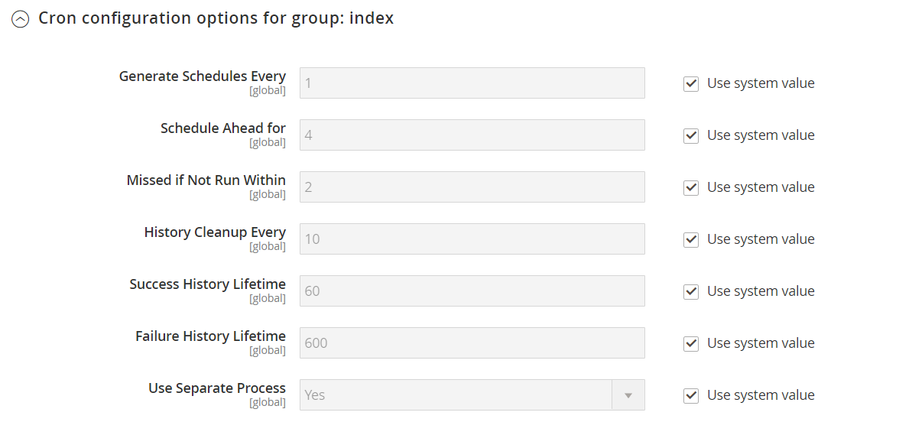

# Cron (scheduled tasks)

Adobe Commerce and Magento Open Source perform some operations on schedule by periodically running a script. You can control the execution and scheduling of Commerce cron jobs from the Admin. Store operations that run according to a cron schedule include, but are not limited to:

- [Email](email-communications.md)
- [Catalog Price Rules](../merchandising-promotions/price-rules-catalog.md)
- [Newsletters](../merchandising-promotions/newsletters.md)
- [XML Sitemap Generation](../merchandising-promotions/sitemap-xml.md)
- [Currency Rate Updates](../stores-purchase/currency-update.md)
- [Inventory Management](../inventory-management/introduction.md)

>[!IMPORTANT]
>
>Commerce services must be installed in crontab to ensure that core components, and some third-party extensions, to function as expected. See the [instructions in the _Installation Guide_](https://experienceleague.adobe.com/docs/commerce-operations/installation-guide/next-steps/configuration.html) for detailed information about installing services to crontab.

In addition, you can configure the following to run according to a cron schedule:

- Order System Grid Updates and Reindexing
- Pending Payment Lifetime

Make sure that the [base URLs](../stores-purchase/store-urls.md) for the store are set correctly so that the URLs that are generated during cron operations are correct. For Adobe Commerce on cloud infrastructure, see [Set up cron jobs](https://experienceleague.adobe.com/docs/commerce-cloud-service/user-guide/configure/app/properties/crons-property.html) in the _Commerce on Cloud Infrastructure Guide_. For on-premise, see [Configure and run con](https://experienceleague.adobe.com/docs/commerce-operations/configuration-guide/cli/configure-cron-jobs.html) in the _Configuration Guide_.

## Configure cron

1. On the _Admin_ sidebar, go to **[!UICONTROL Stores]** > _[!UICONTROL Settings]_ > **[!UICONTROL Configuration]**.

1. In the left panel, expand **[!UICONTROL Advanced]** and choose **[!UICONTROL System]**.

1. Expand  the **[!UICONTROL Cron]** section.

   {width="600" zoomable="yes"}

1. Complete the following settings for the **[!UICONTROL Index]** and **[!UICONTROL Default]** groups.

   The settings are the same in each section.

   - **[!UICONTROL Generate Schedules Every]** - Defines how often the schedule is generated (in minutes). Schedules are stored in the database.
   - **[!UICONTROL Schedule Ahead for]** - Defines how far in advance cron jobs are scheduled (in minutes). For example, if this setting is set to `10` and the cron runs, cron jobs are scheduled for the next 10 minutes.
   - **[!UICONTROL Missed if not Run Within]** - Defines the time (in minutes) used to determine a missed job. If the cron job is not run at its scheduled time and the specified time elapses, it cannot be run and its status is set to `Missed`.
   - **[!UICONTROL History Cleanup Every]** - Defines the time (in minutes) that the history of ended tasks is cleared from the database.
   - **[!UICONTROL Success History Lifetime]** - Defines the length of time (in minutes) that the history of cron jobs with a `Successful` status remains in the database.
   - **[!UICONTROL Failure History Lifetime]** - Defines the length of time (in minutes) that the history of cron jobs with an `Error` status remains in the database.
   - **[!UICONTROL Use Separate Process]** - Defines whether all cron jobs from the group are run in a separate system process. Options: `Yes` / `No`

   {width="600" zoomable="yes"}

1. When complete, click **[!UICONTROL Save Config]**.
