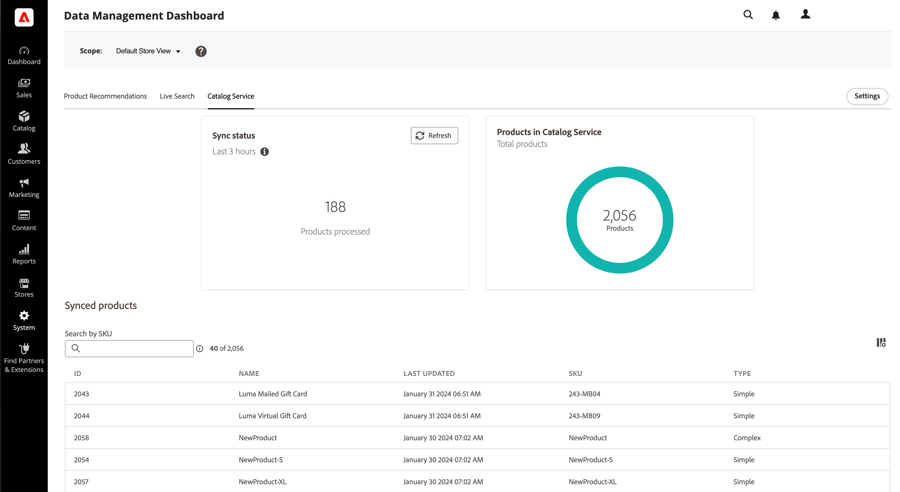
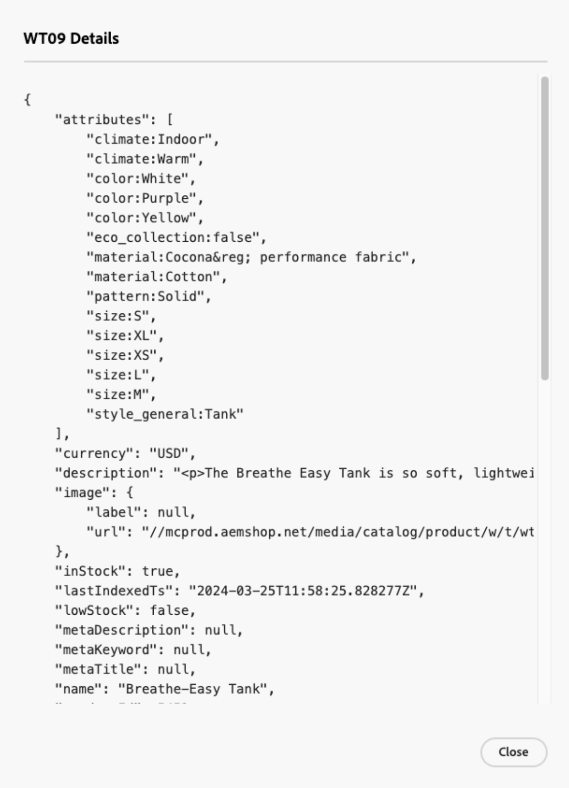
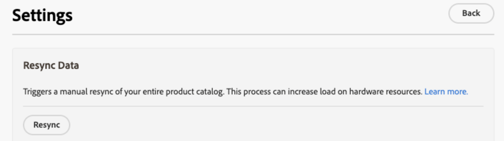

# Data Management Dashboard

The Data Management Dashboard offers an overview of the synchronization status for product data transferred from the Commerce database to Commerce SaaS services. Users can conveniently monitor product sync statuses and initiate data resynchronization from a unified dashboard. This feature provides valuable insights into the availability of product data for your storefront, ensuring it can be promptly displayed to your shoppers.

## Audience

The Data Management Dashboard is available at no additional cost to all Commerce merchants using [[!DNL Product Recommendations]](https://experienceleague.adobe.com/docs/commerce-merchant-services/product-recommendations/guide-overview), [[!DNL Live Search]](https://experienceleague.adobe.com/docs/commerce-merchant-services/live-search/guide-overview), or [[!DNL Catalog Service]](https://experienceleague.adobe.com/docs/commerce-merchant-services/catalog-service/guide-overview) with an active license.

The Data Management Dashboard is located at *System* > Data Transfer > *Data Management Dashboard*.

The dashboard contains the following fields:

|Field|Description|
|--- |--- |
| Scope | Specific website for the synced data.|
|[!DNL Product Recommendations]|Displays sync status, number of products synced, and a table of the [displayable](https://experienceleague.adobe.com/docs/commerce-admin/config/catalog/inventory#stock-options) synced products for [!DNL Product Recommendations].|
|[!DNL Live Search]|Displays sync status, number of products synced, and a table of the [displayable](https://experienceleague.adobe.com/docs/commerce-admin/config/catalog/inventory#stock-options) synced products for [!DNL Live Search].|
|[!DNL Catalog Service]|Displays sync status, number of products synced, and a table of the synced products for [!DNL Catalog Service].|
|Settings| Opens a dialog where you can [manually resync the catalog data](#resync-catalog-data).|
|Sync status|Displays the number of products that have been transferred from the Commerce database to any of the SaaS services within the last three hours. If you make infrequent updates to your catalog, this value is frequently zero. If a sync is in progress, click **[!UICONTROL Refresh]** to get an updated count.|
|Product count|Reflects the total number of catalog products available to the service. The [!DNL Product Recommendations] and [!DNL Live Search] dashboards display the total number of _displayable_ products. [!DNL Catalog Service] does not filter products by displayable, so if you have both [!DNL Catalog Service] and [!DNL Live Search] or [!DNL Product Recommendations] installed, it is possible for the two dashboards to show two different values for the product count.|
|Synced products|Provides details about the products in the core Commerce index. By default, this table is sorted by 'Last Updated'. To find a specific product, use the **[!UICONTROL Search by SKU]** field. To control what columns are displayed, click **[!UICONTROL Customize Table]** on the right of the table.|

## Using the Data Management dashboard

When you update products in the Commerce database, product data transfers to SaaS services according to your system configuration. When the sync process initiates, **Product Count** indicates the number of products sent to SaaS services.

>[!IMPORTANT]
>
>The time it takes to complete the sync varies based on your catalog size and the volume of updated data.

When the number of products processed matches the number of updated products, it indicates that the sync is complete.

### List of synced products

To see the details of a synced product, click on the product from the table.

### Resync catalog data

To ensure that your Commerce SaaS services are always up-to-date with the latest product information, you should [implement a schedule](https://experienceleague.adobe.com/docs/commerce-operations/configuration-guide/cli/manage-indexers#reindex) for syncing catalog data.

While you can [manually initiate](#manually-resync-catalog) a catalog data resync from the Commerce database to SaaS services, it is not recommended as it can increase the load on hardware resources. However, manually resyncing the catalog might be necessary in the following scenarios:

- Whenever significant changes are made to your product catalog, such as adding new products, updating product details, or modifying categories

- If you notice any discrepancies or performance issues in displaying product data on your storefronts

- Following any updates or changes to integrations between the Commerce database and SaaS services

- When deploying customizations or configurations that impact product data management or synchronization processes

By adhering to these guidelines and proactively resyncing catalog data as needed, you can maintain data consistency, accuracy, and reliability across your Adobe Commerce ecosystem.

#### Manually resync catalog

If you need to resync catalog data, click **[!UICONTROL Settings]** on the right side of the page to display a dialog where you can initiate a resync. Resynching catalog data forces the service to refetch data from the Commerce database to SaaS services.

