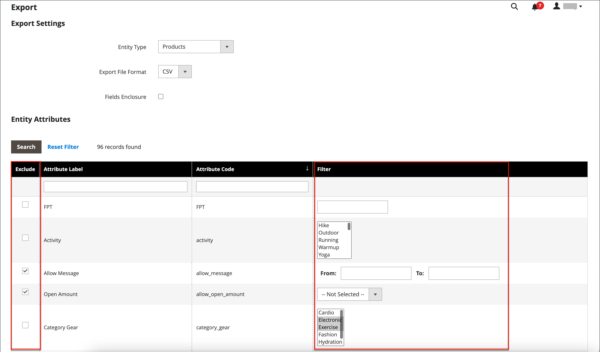
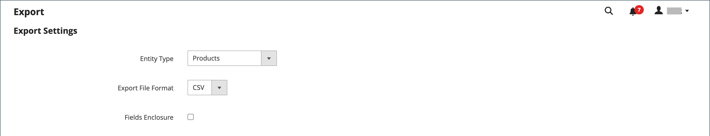
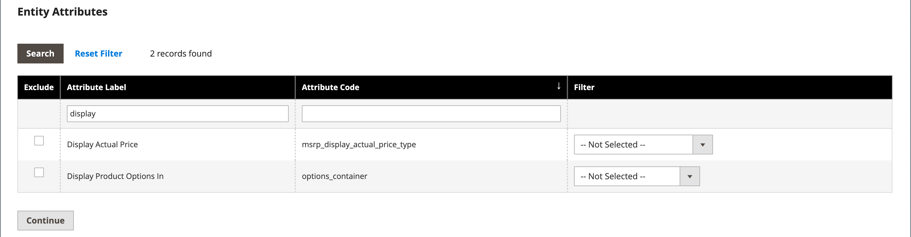
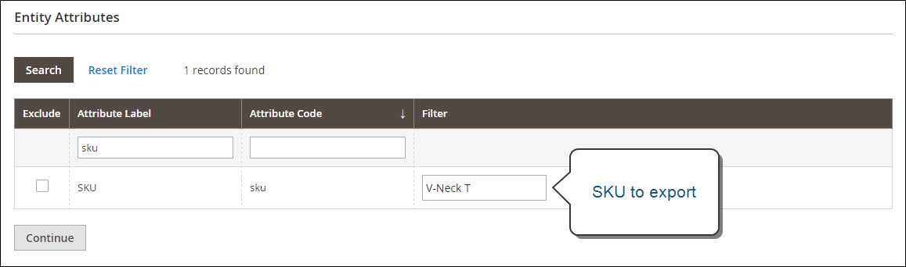
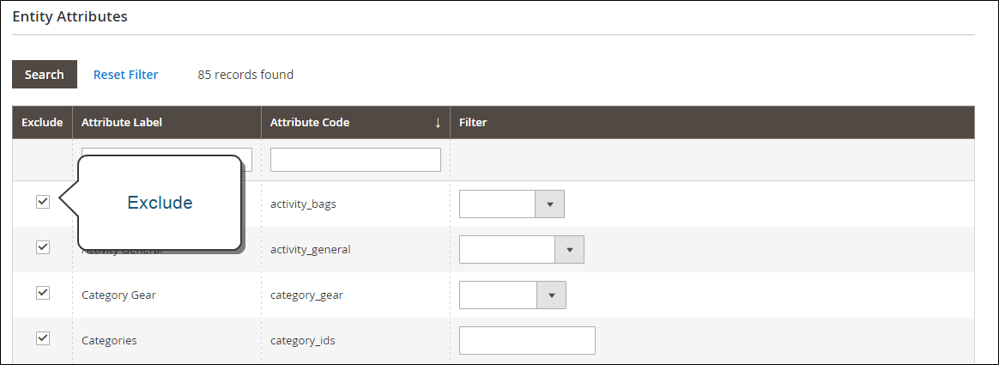

# Export

The best way to become familiar with the structure of your database is to export the data and open it in a spreadsheet. After you become familiar with the process, you can use it as an efficient way to manage large amounts of information.

Special characters—such as the equal sign, greater and less than symbols, single and double quotes, backslash, pipe, and ampersand symbols—can cause problems during data transfer. To ensure that such special characters are correctly interpreted, they can be marked as an _escape sequence_. For example, if the data includes a string of text such as `code="str"`, `code="str2"`, enclosing the text in double quotes ensures that the original double quotes are understood to be part of the data: `"code="str""`. When the system encounters a double set of double quotes, it understands that the outer set of double quotes is enclosing the actual data.

Data export is an asynchronous operation, which executes in the background so that you can continue working in the Admin without waiting for the operation to finish. The system displays a message when the task is complete.

## Export criteria

Export filters are used to specify the data that you want to in the export file, based on attribute value. In addition, you can specify which attribute data you want to include or exclude from the export.

<!-- zoom -->

### Export filters

You can use filters to determine which SKUs are included in the export file. For example, if you enter a value in the Country of Manufacture filter, the exported CSV file includes only products manufactured in that country.

The type of filter corresponds to the data type. For date fields, you can choose the date from the Calendar . See [Attribute Input Types](../catalog/attributes-input-types.md) for more information.

The format of the date is determined by the [locale](../getting-started/store-details.md#locale-options).

To include only records with a specific value, such as a SKU, enter the value into the Filter field. Some fields such as Price, Weight, and Set Product as New have a from/to range of values.

### Exclude attributes

The checkbox in the first column is used to exclude attributes from the export file. If an attribute is excluded, the associated column in the export data is included, but empty.

|Exclude|Filter|Result|
|--- |--- |--- |
||No|The exported file contains each attribute for all existing records.|
||Yes|The export file contains each attribute with only the records allowed by the filter.|
||No|The export file does not include the column for the excluded attribute, but does include all existing records.|
||Yes|The export file does not include the column for the excluded attribute, and contains only the records allowed by the filter.|

{style="table-layout:auto"}

## Export data

1. On the _Admin_ sidebar, go to **[!UICONTROL System]** > _[!UICONTROL Data Transfer]_ > **[!UICONTROL Export]**.

1. In the _Export Settings_ section, set **[!UICONTROL Entity Type]** to one of the following:

    - `Advanced Pricing`
    - `Products`
    - `Customer Finances`
    - `Customers Main File`
    - `Customer Addresses`
    - `Stock Sources`

1. Accept the default **[!UICONTROL Export File Format]** of CSV.

1. If you want to enclose any special characters that might be found in the data as an _escape sequence_, select the **[!UICONTROL Fields Enclosure]** checkbox.

   <!-- zoom -->

1. If needed, change the display of the entity attributes.

   By default, the Entity Attributes section lists all the available attributes in alphabetical order. You can use the standard [list controls](../getting-started/admin-grid-controls.md) to search for specific attributes and to sort the list. The Search and Reset Filter controls control the display of the list, but have no effect on the selection of attributes to be included in the export file.

   <!-- zoom -->

1. To filter the exported data based on attribute value, do the following:

    - To export only records with specific attribute values, enter the required value in the **Filter** column. The following example exports only a specific SKU.

      <!-- zoom -->

    - To omit an attribute from the export, select the **[!UICONTROL Exclude]** checkbox at the beginning of the row. For example, to export only the `sku` and `image` columns, select the checkbox of every other attribute. The column appears in the export file, but without any values.

      <!-- zoom -->

1. Scroll down and click **[!UICONTROL Continue]** in the lower-right corner of the page.

   Upon completion of the task, the file is processed through a message queue (make sure that your cron job is running). The exported file is saved in the `var/export/ folder`. For more information about the message queue, see [Manage message queues](https://experienceleague.adobe.com/docs/commerce-operations/configuration-guide/message-queues/manage-message-queues.html) in the _Configuration Guide_.

   You can save or open the exported CSV file as a spreadsheet, then edit the data and import it back into your store.

   >[!NOTE]
   >
   >By default, all exported files are in the `<Magento-root-directory>/var/export` folder. If the Remote storage module is enabled, all exported files are in the `<remote-storage-root-directory>/import_export/export` folder.

## Troubleshooting resources

For help with troubleshooting data export issues, see the following Commerce Support Knowledge Base articles:

- [Exported products .csv file does not appear](https://experienceleague.adobe.com/docs/commerce-knowledge-base/kb/troubleshooting/miscellaneous/exported-products-.csv-file-does-not-appear.html)
- [Product export file does not show in Admin](https://experienceleague.adobe.com/docs/commerce-knowledge-base/kb/support-tools/patches/v1-0-9/mdva-31168-magento-patch-product-export-file-does-not-show-in-admin.html)
- [Issue in exporting orders in CSV format](https://experienceleague.adobe.com/docs/commerce-knowledge-base/kb/support-tools/patches/v1-0-8/mdva-31242-magento-patch-issue-in-exporting-orders-in-csv-format.html)
