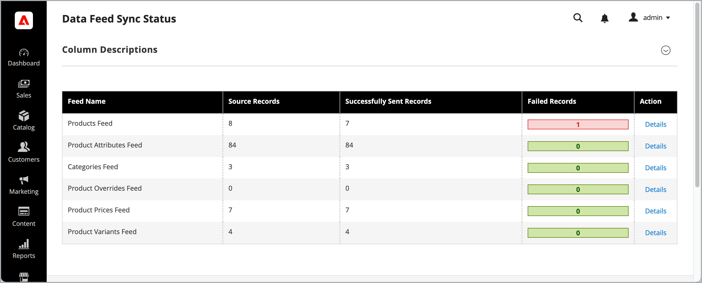

# Data Feed Status Monitoring

Adobe Commerce administrators can monitor the synchronization status of data export feeds from the Data Feed Sync Status page in the Commerce Admin.



This page provides real-time insights into the health and performance of data export feeds that transfer product and category data from Commerce to external services such as [[!DNL Product Recommendations]], [[!DNL Live Search]], and [[!DNL Catalog Service]].

Monitoring feed status helps ensure data consistency and enables prompt resolution of any issues that arise during the export process. Administrators can:

* **View the synchronization status** for all data feeds
* **Identify and troubleshoot errors** in feed processing
* **Access detailed status information** for individual feed items

Status is tracked for the following feeds:

* Products Feed
* Product Attributes Feed
* Categories Feed
* Product Overrides Feed
* Product Prices Feed
* Product Variants Feed

## Install the extension

The Data Feed Status page is available to all Commerce merchants with active licenses for the following Commerce services:

* [[!DNL Product Recommendations v6.0.0+]](https://experienceleague.adobe.com/en/docs/commerce/product-recommendations/guide-overview)
* [[!DNL Live Search v4.1.0+]](https://experienceleague.adobe.com/en/docs/commerce/live-search/guide-overview)
* [[!DNL Catalog Service v1.17+]](https://experienceleague.adobe.com/en/docs/commerce/catalog-service/guide-overview) with an active license.

**Requirements**

* PHP 8.1, 8.2, 8.3, or 8.4
* Adobe Commerce 2.4.4+
* [Adobe Commerce Data Export Extension](https://experienceleague.adobe.com/en/docs/commerce/saas-data-export/manage-extension), version 103.4.11 or later
* Access to [repo.magento.com](https://repo.magento.com)

  To generate keys and obtain the necessary rights, see [Get your authentication keys](https://experienceleague.adobe.com/en/docs/commerce-operations/installation-guide/prerequisites/authentication-keys). For cloud installations, see the [Commerce on Cloud Infrastructure Guide](https://experienceleague.adobe.com/en/docs/commerce-on-cloud/user-guide/develop/authentication-keys).
* Access to the command line of the Adobe Commerce application server.

### Installation steps

Add the `adobe-commerce/module-extra-product-attributes` module using Composer:

```shell
composer require adobe-commerce/module-extra-product-attributes
```

For detailed installation steps, see the following guides:

* [Install extension on Adobe Commerce on Cloud Infrastructure](https://experienceleague.adobe.com/en/docs/commerce-on-cloud/user-guide/configure-store/extensions)

* [Install extension Adobe Commerce on-premises](https://experienceleague.adobe.com/en/docs/commerce-operations/installation-guide/tutorials/extensions)

## Access the Data Feed Status page

From the Commerce Admin, Access the Data Feed Status page from the Commerce Admin at **[!DNL System]** > Data Transfer > **[!DNL Data Feed SyncStatus]**.


Data Feed Status monitoring provides two interfaces, the [Data Feed Sync Status summary page](#feed-status-summary-page) that lists the available feeds and current state, and a [detail page](#feed-sync-status-details) that shows detailed information about a selected feed.

## Data Feed Sync Status summary

The Feed Sync Status summary page provides information about data feed export activity including the following information:

| Field | Description |
|-------|-------------|
| **Feed Name** | The name of the feed indexer responsible for synchronizing a specific entity or its part, for example product or product price.|
| **Source Records** | Number of records available for export from the Commerce database. This number can be larger than the number of records displayed in the Commerce Admin as each feed item belongs to a specific scope, such as Store View code.|
| **Successfully Sent Records** | Number of records successfully transmitted to Commerce SaaS for further processing. If errors occurred during transmission, the number of records successfully transmitted to external services. |
| **Failed Records** | Number of records that failed to export and require attention. |
| **Action** | Available actions for each feed (View Details, Resync). |

## Data Feed Sync Status details

From the Data Feed Status summary page, click a feed name or use the [!DNL View Details] action to access detailed information about individual records within a feed.

<!--TO DO: Insert updated screen capture-->

![[!UICONTROL Data Feed Sync Status - Details] page with feed item status reporting](assets/data-feed-sync-status-details.png)

The detail view provides the following information for each feed item:

<!--To Do: Verify files names in the detail view-->

| Field | Description |
|-------|-------------|
| **Feed Item ID** | Internal identifier for the feed record |
| **Feed Identifiers** | The unique identifier of the entity, such as Product ID or Category ID.|
| **Entity ID** | The source entity ID (product ID, category ID, and so on) |
| **Export Status** | The [synchronization status](#export-status-types) of the feed item. Current status of the export attempt with color-coded indicators |
| **Last Sync Date** | Timestamp when the record was last sent to Commerce Services |
| **Is entity deleted?** | Indicates whether the entity or its part (product or product price for example) has been deleted in Adobe Commerce. Items are displayed only if an error occurred during synchronization. |
| **Error** | Detailed error information if the feed item failed to synchronize. |
| **Request ID** | A unique identifier for the synchronization request. Provide this ID to Support when troubleshooting specific entity updates. |

<!--Validate the content below. Not sure it is implemented or applicable for initial release of the Data Feed Status extension-->

### Feed health indicators

At the top of each feed detail page, critical health indicators provide system status:

#### Indexer status

* **Valid**: Indexer is up-to-date and functioning normally
* **Invalid**: Indexer needs to be rerun to capture recent changes.
* **Processing**: Indexer is currently running

#### Changelog backlog

* **All synced**: No pending changes to process
* **Items in backlog**: Number of pending changes waiting to be processed
* **High backlog warning**: More than 1,000 items indicates potential performance issues

#### Indexer mode

* **Schedule mode** (Recommended): Indexer runs on schedule, reducing risk of data loss
* **Relative mode** (Warning): Immediate processing but higher risk of data loss under load

### Export status types

The system uses color-coded status indicators to help you quickly identify issues:

#### Status categories

| **Status** | **Description** | **Action required** |
|--------|-----------|-------------|
| **Submitted to service** | Feed item successfully exported to Commerce service. | None |
| **Failed, will retry** | Temporary failure. The system will automatically retry. | Monitor for resolution |
| **Failed, requires attention** | Failed due to application or data error. | Investigate and resolve the issue in the [!DNL Error] column|
| **Awaiting submission** | Queued for export but not yet processed. | Normal processing state |

## Monitor data feed status

When you update product and category related entities in the Commerce database, the data transfers to Commerce services according to your feed configuration. You can monitor this process in real time from the Data Feed Sync Status summary page.

>[!IMPORTANT]
>
>The time it takes to complete data synchronization varies based on your catalog size, the volume of updated data, and external service performance.

When the number of successfully sent records matches the number of source records, it indicates that the sync is complete and all data has been transmitted successfully.

>[!NOTE]
>
>Adobe also provides command-line interface tools and system logs that developers and system integrators can use to manage and track sync operations. For details, see the [SaaS Data Export Guide](https://experienceleague.adobe.com/en/docs/commerce-merchant-services/saas-data-export/overview).

### Managing failed exports

To see the details of failed exports and take corrective action:

1. From the Feed Sync Status page, find the feed with failed records.
1. Click **[!DNL Details]**.

1. Review error messages for specific failure reasons.

1. Use mass actions to schedule resync operations for failed items.


### Resync failed data

To ensure that your external services receive the most current information, you can manually resync failed or problematic data feeds.

While the system automatically retries certain types of failures, manual intervention may be necessary in the following scenarios:

* You notice authentication or permission errors (401, 403 status codes).
* After resolving data format issues that caused payload errors.
* Following updates to external service configurations or endpoints.
* You are deploying customizations that impact data export processes.

By proactively monitoring feed status and addressing failures promptly, you can maintain data consistency and reliability across your Commerce ecosystem.

#### Manually resync feed items

If you need to resync specific feed items:

1. **Select Records**: Use checkboxes to select failed records that need attention.
2. **Choose Action**: Select **[!DNL Schedule Resync]** from the mass action dropdown.
3. **Confirm**: Click **[!DNL Submit]** and confirm the resync operation.
4. **Monitor Results**: Check the success message and monitor status changes.

**Resync options:**

* **Selected Items**: Reschedule only the items that you have selected
* **Full Feed Resync**: When no items are selected, this option triggers a complete feed resync

## Best practices

### Regular monitoring

1. **Daily Checks**: Review the overview page daily for any feeds showing high failure rates
1. **Weekly Deep Dive**: Examine the detailed status for critical feeds (products, prices)
1. **Monthly Analysis**: Track trends in export success rates and performance

### Troubleshooting workflow

1. **Identify Issues**: Look for errors and high failure counts
1. **Check Indexer Health**: Ensure that indexers are valid and backlog is manageable
1. **Review Error Details**: Click on failed records to see specific error messages
1. **Schedule Resync**: Use mass actions to retry failed exports
1. **Monitor Resolution**: Verify that resynchronized items show successful status

### Fix common issues

#### High failure rates

**Symptoms**: Large number of records showing "Failed, require attention" status

**Potential causes**:

* External service configuration changes
* Data format incompatibilities
* Authentication or permission issues

**Resolution steps**:

1. Check external service status and configuration
1. Review error messages for patterns
1. Verify authentication credentials
1. Contact external service support if needed

#### Slow export performance

**Symptoms**: High changelog backlog, slow status updates

**Potential Causes**:

* Indexer performance issues
* High data volume
* External service rate limiting

**Resolution Steps**:

1. Check indexer status and rerun if invalid
2. Monitor external service response times
3. Consider scheduling exports during off-peak hours
4. Review system resources and performance

#### Authentication Failures

**Symptoms**: 401 or 403 status codes

**Resolution Steps**:

1. Verify API credentials and tokens
1. Check external service account permissions
1. Renew expired authentication tokens
1. Contact your service provider for access issues

### Performance optimization

* **Maintain Schedule Mode**: Keep indexers in schedule mode for optimal performance
* **Monitor Backlog**: Address high changelog backlogs promptly
* **Batch Operations**: Use mass actions for efficient bulk resync operations

>[!MORELIKETHIS]
>
>* [Data Management Dashboard](https://experienceleague.adobe.com/en/docs/commerce-admin/systems/data-transfer/data-dashboard)
>* [SaaS Data Export Guide](https://experienceleague.adobe.com/en/docs/commerce-merchant-services/saas-data-export/overview)
