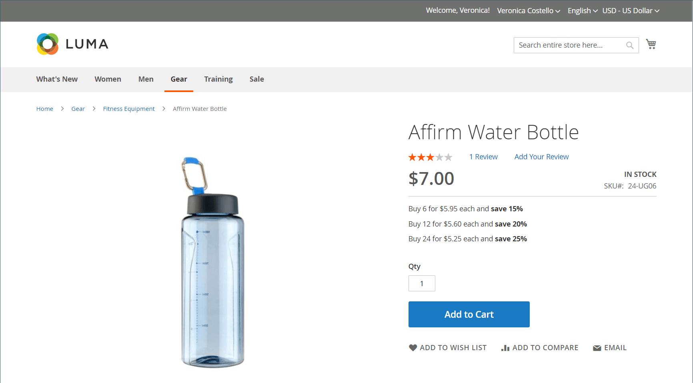
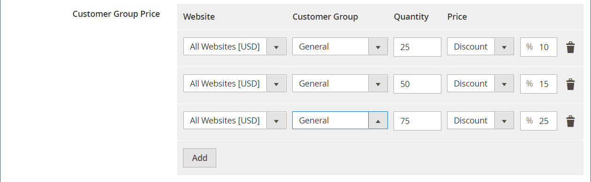
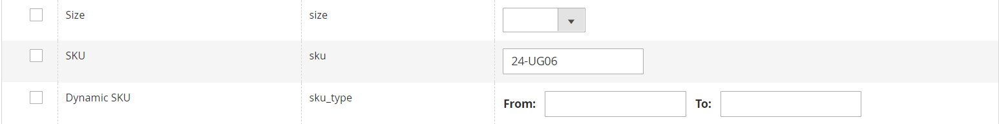

# Import tier prices

Rather than entering [tier prices](../catalog/product-price-tier.md) manually for each product, it can be more efficient to [import](data-import.md) the pricing data. Before you begin, create a sample file of exported tier price data that you can use as a template.

{width="700" zoomable="yes"}

## Step 1: Export the tier price data

The following example exports tier pricing data for a single product. Then, you can use the exported data as a template for bulk imports of tier price data. To learn more about exporting advanced pricing data, see [Advanced pricing data](data-attributes-product.md#advanced-pricing-attributes).

{width="600" zoomable="yes"}

1. On _Admin_ sidebar, go to  **[!UICONTROL System]** > _[!UICONTROL Data Transfer]_ > **[!UICONTROL Export]**.

1. Under _[!UICONTROL Export Settings]_, set **[!UICONTROL Entity Type]** to `Advanced Pricing`.

1. In the **[!UICONTROL Entity Attributes]** grid, scroll down to the SKU attributes and do the following:

    - For tier prices that are based on a discount percentage, enter the SKU of each product to be exported, separated by a comma.

      {width="600" zoomable="yes"}

    - For tier prices that are based on a fixed amount, enter the SKU of each product.

    - Scroll down and click **[!UICONTROL Continue]**.

1. Locate the export file at the downloads location for your web browser and open the file.

   {width="600" zoomable="yes"}

**_Exported tier price data_**

The following columns are included in the exported data:

- `sku`
- `tier_price_website`
- `tier_price_customer_group`
- `tier_price_qty`
- `tier_price`
- `tier_price_value_type`

You use the exported data as a template for importing tier price data.

## Step 2: Update the data

1. Update the tier price data for each product, as needed.

   Any products without tier price updates can be deleted from the CSV file. There is no need to reimport products that have not changed.

1. **[!UICONTROL Save]** the updated CSV file.

>[!NOTE]
>
>The size of an import file cannot be larger than 2 MB.

## Step 3: Import the updated data

1. On _Admin_ sidebar, go to **[!UICONTROL System]** > _[!UICONTROL Data Transfer]_ > **[!UICONTROL Import]**.

1. Under _Import Settings_, set **[!UICONTROL Entity Type]** to `Advanced Pricing`.

1. Set **[!UICONTROL Import Behavior]** to `Add/Update`.

1. Under **[!UICONTROL File to Import]**, click **[!UICONTROL Choose File]** and select the file that you prepared to import from your directory.

1. In the upper-right corner, click **[!UICONTROL Check Data]**.

1. If the file is valid, click **[!UICONTROL Import]**.

   Otherwise, correct each problem with the data that is listed in the message, and try to import the file again.
