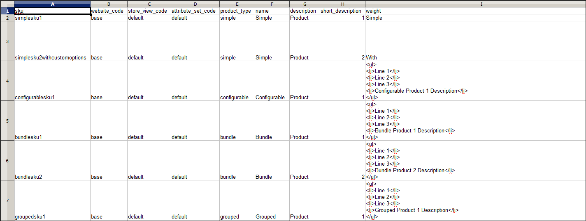

# Import

Data for all product types can be imported into the store. In addition, you can import products, advanced pricing data, customer data, customer address data, and product images. Import supports the following operations:

- Add/Update
- Replace
- Delete

## Import guidelines

### New entities

- Entities are added with the attribute values specified in the CSV file.
- For a required attribute with no default value set, the entity (the corresponding row or rows) cannot be imported if there is no value or a non-valid value.
- For a required attribute with a default value set, the entity (the corresponding row or rows) is imported and the default value is set for the attribute if there is no value or a non-valid value.
- If the complex data is not valid, the entity (the corresponding row or rows) cannot be imported.

### Existing entities

- For attributes that are not complex data, the values from the import file, including the empty values for the non-required attributes, replace the existing values.
- If there is no value, or there is a non-valid value, for a required attribute, then the existing value is not replaced.
- If the complex data for the entity is invalid, the entity (the corresponding row or rows) cannot be imported, except the case, when Delete Entities was selected in the Import Behavior drop-down menu.

### Complex data

If an attribute that is specified in the import file exists and its value is derived from a defined set of values, the following applies:

- If the value is not already included in the defined set of values, the row can be imported and a default value, if defined, is set for the attribute.
- If the value is already included in the defined set, the corresponding row cannot be imported.
- If the import file specifies an attribute name that is not yet defined in the system, it is not created and its values are not imported.

### Invalid files

- A file cannot be imported if all rows are invalid.
- A non-existing service data or complex data name is specified in the import file, such as a column with a `_<non-existing name>` heading.

## Import operations

| Operation | Description |
| --------- | ----------- |
| Add/Update| New product data is added to the existing product data for the existing entries in the database. All fields except `sku` can be updated.  New tax classes that are specified in the import data are created automatically.  New product categories that are specified in the import file are created automatically.  New SKUs that are specified in the import file are created automatically  **_Note:_** For products, you can update all fields except SKU through import.  **_Important:_** Multiple field values, such as websites or categories, cannot be removed using the _Add/Update_ import behavior. These fields remain in the database after the import if they are not listed in the CSV file. |
| Replace| The existing product data is replaced with new data.  **_Important:_** Exercise caution when replacing data because the existing product data is cleared and all references in the system are lost.  If a SKU in the import data matches the SKU of an existing entity, all fields, including the SKU, are deleted and a new record is created using the CSV data. An error occurs if the CSV file references a SKU that does not exist in the database. You can Check Data to display error. |
| Delete| Any entities in the import data that exist in the database are deleted from the database.  Delete ignores all columns in the import data, except for SKU. You can disregard all other attributes in the data.  An error occurs if the CSV file references a SKU that does not exist in the database. You can Check Data to display error. |

{style="table-layout:auto"}

## Import process

The size of the import file is determined by the settings in the `php.ini` file on the server. The system message on the _Import_ page indicates the current size limit. The default size is 2 MB.

Special characters (such as the equal sign, greater and less than symbols, single and double quotes, backslash, pipe, and ampersand symbols) can cause problems during data transfer. To ensure that such special characters are correctly interpreted, they can be marked as an _escape sequence_. For example, if the data includes a string of text such as `code="str"`, `code="str2"`, choosing to enclose the text in double quotes ensures that the original double quotes are understood to be part of the data. When the system encounters a double set of double quotes, it understands that the outer set of double quotes is enclosing the actual data.

When importing product data, new product data is added to existing product data entries in the database. All fields except SKU can be updated through import. All existing product data is replaced with the imported new data. Exercise caution when replacing data. All existing product data is cleared and all references in the system is lost.

<!-- zoom -->

### Step 1: Prepare the data

1. On the _Admin_ sidebar, go to **[!UICONTROL System]** > _[!UICONTROL Data Transfer]_ > **[!UICONTROL Import]**.

1. Under _Import Settings_, set **[!UICONTROL Entity Type]** to one of the following:

   - `Advanced Pricing`
   - `Products`
   - `Customer Finances`
   - `Customers and Addresses`
   - `Customers Main File`
   - `Customer Addresses`
   - `Stock Sources`

1. Click **[!UICONTROL Download Sample File]**.

1. Locate the export file at the downloads location for your web browser and open the file.

   <!-- zoom -->

   The sample file includes column headings with placeholder data for the product types.

   <!-- zoom -->

1. Examine the structure of the sample file and use it to prepare your CSV import file, making sure that the column headings are spelled correctly.

1. Verify that the size of your import file does not exceed the limit shown in the message.

   <!-- zoom -->

1. If the import data includes paths to product images, make sure that the image files have been uploaded to the appropriate location.

   The default location on the Commerce server is: `pub/media/import`.

   If the images reside on an external server, make sure that you have the full URL to the directory that contains the images.

### Step 2: Choose the import behavior

1. Set **[!UICONTROL Import Behavior]** to one of the following:

   - `Add/Update` (For products, you can update all fields except SKU through import.)
   - `Replace`
   - `Delete`

1. To determine what happens when an error is encountered when importing data, choose one of the following:

   - `Stop on Error`
   - `Skip error entries`

1. For **[!UICONTROL Allowed Errors Count]**, enter the number of errors that can occur before the import is canceled.

   The default value is 10.

1. Accept the default value of a comma (`,`) for **[!UICONTROL Field separator]**.

1. Accept the default value of a comma (`,`) for **[!UICONTROL Multiple value separator]**.

   In a CSV file, a comma is the default separator. To use a different character, make sure that the data in the CSV file matches the character that you specify.

1. Accept the default value `_EMPTY_VALUE_` for **[!UICONTROL Empty attribute value constant]**. 

1. If you want to enclose any special characters that might be found in the data as an _escape sequence_, select the **[!UICONTROL Fields Enclosure]** checkbox.

   <!-- zoom -->

### Step 3: Identify the import file

1. Click **[!UICONTROL Choose File]** to select the file to import.

1. Find the CSV file that you prepared to import and click **[!UICONTROL Open]**.

1. For **[!UICONTROL Images File Directory]**, enter the relative path to the location on the Commerce server where uploaded images are stored.

   For example: `product_images`.

   >[!NOTE]
   >
   >Starting with the Adobe Commerce and Magento Open Source `2.3.2` release, the path specified in _[!UICONTROL Images File Directory]_ concatenates for import to the images base directory: `<Magento-root-folder>/var/import/images`. For example, place the `product_images` files in the `<Magento-root-directory>/var/import/images/product_images` folder. The import images base directory can be configured in the `\Magento\ImportExport\etc\config.xml` file. If the Remote storage module is enabled, import files to the `<remote-storage-root-directory>/var/import/images/product_images` folder.

   To learn more about importing product images, see [Importing Product Images](data-import-product-images.md).

   <!-- zoom -->

### Step 4: Check the import data

1. In the upper-right corner, click **[!UICONTROL Check Data]**.

1. Wait a few moments for the validation process to complete.

   If the import data is valid, the following message appears:

   <!-- zoom -->

1. If the file is valid, click **[!UICONTROL Import]**.

   Otherwise, correct each problem with the data that is listed in the message, and try to import the file again.

1. The import process continues to the end of the data, unless an error is encountered.

   If an error message appears in the Validation Results, correct the problem in the data and import the file again.

   <!-- zoom -->

   A message appears when the import is complete.

## Import history

Commerce maintains a record of data that has been imported into your store, including the start date and time, user, execution time, and a link to the imported file. The _Execution Time_ is the duration of the import process.

**_To view the import history:_**

On the _Admin_ sidebar, go to **[!UICONTROL System]** > _[!UICONTROL Data Transfer]_ > **[!UICONTROL Import History]**.

<!-- zoom -->

>[!NOTE]
>
>By default, import history files are in the `<Magento-root-directory>/var/import_history` folder. If the Remote storage module is enabled, import history files are in the `<remote-storage-root-directory>/import_export/import_history` folder.

|Field|Description|
|--- |--- |
|[!UICONTROL ID]| An internal number used to designate a transfer.|
|[!UICONTROL Start Date & Time]| A specific date and time when the transfer took place.|
|[!UICONTROL User]| The customer who made the transfer.|
|[!UICONTROL Imported file]| Link for downloading the imported file.|
|[!UICONTROL Error file]| The corresponding error file.|
|[!UICONTROL Execution Time]| Time interval of the import process.|
|[!UICONTROL Summary]| The number of items created, updated, and deleted, or the error message.|

{style="table-layout:auto"}

To download the _Imported/Error_ file, click **[!UICONTROL Download]**.
