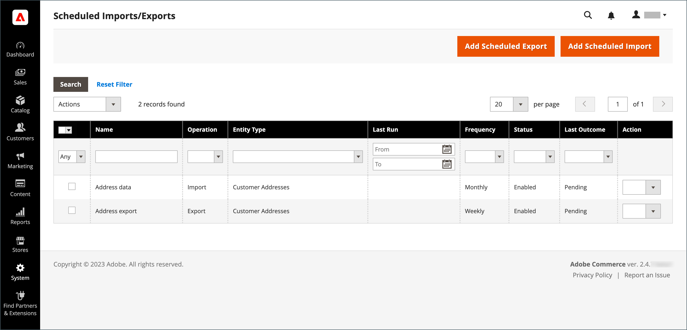
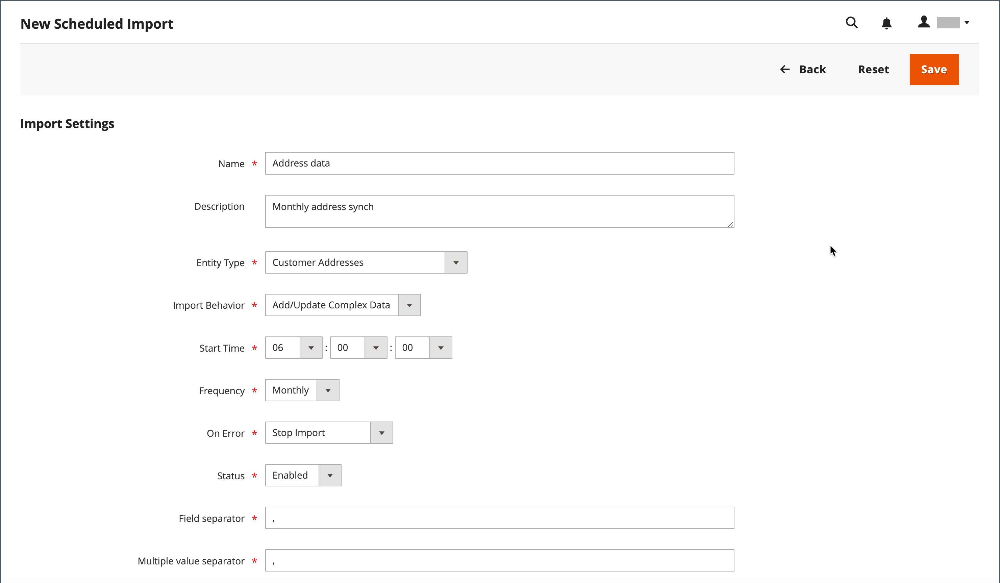
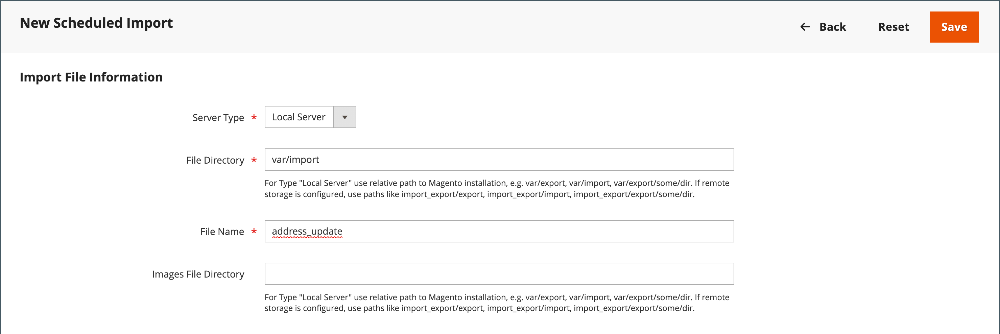
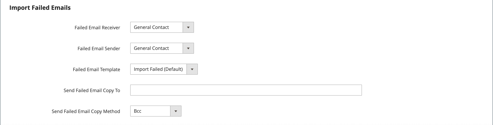
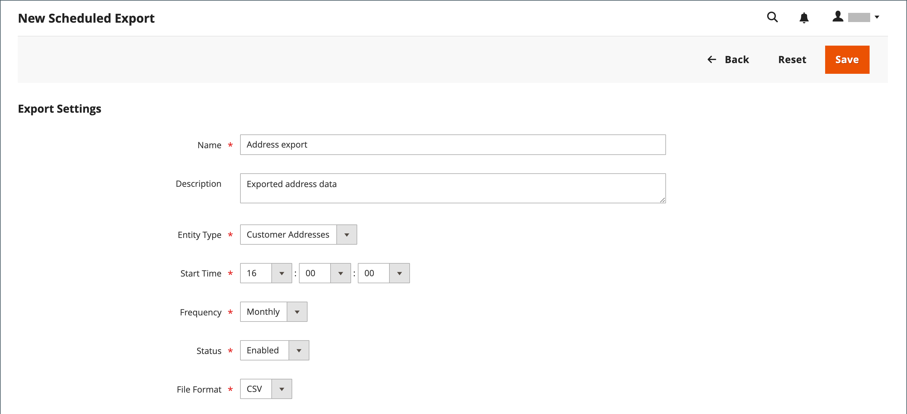
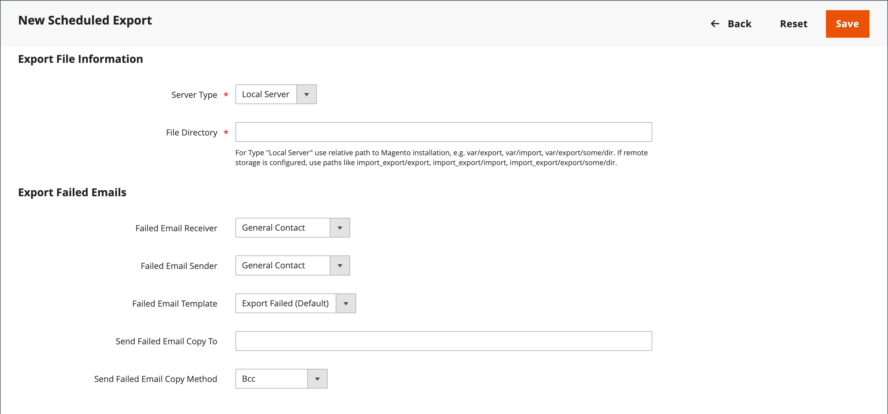

# Scheduled import and export

{{ee-feature}}

Scheduled imports and exports can be run on a daily, weekly, or monthly basis. The files to be imported or exported can reside on local Adobe Commerce servers, or on remote FTP servers. Scheduled Import/Export is implemented by default, and does not require additional configuration. All scheduled imports and exports are managed by the Cron job scheduler.

## Access scheduled import/export

1. On the _Admin_ sidebar, go to **[!UICONTROL System]** > _[!UICONTROL Data Transfer]_ > **[!UICONTROL Scheduled Imports/Exports]**.

   {width="700" zoomable="yes"}

1. To create a new scheduled import or export job, click the appropriate button and follow the instructions for the type of scheduled job.

    - [Add Scheduled Export](#schedule-an-export)
    - [Add Scheduled Import](#schedule-an-import)

1. When the record is saved, the job appears in the _[!UICONTROL Scheduled Import/Export]_ grid.

   >[!NOTE]
   >
   >When you create or update a scheduled import/export, it results in a change to the system configuration. After saving, make sure that you address the cache invalidation notice that appears at the top of the Admin page and flush the cache in order to apply the new or updated schedule.

1. After each scheduled job, a copy of the file is placed in the `var/log/import_export` directory on the Adobe Commerce local server.

   The details of each operation are not written to the log. If an error occurs, notification is sent of the failed import/export job, with a description of the error.

## Schedule an import

For the available import file format and types of import entities, the scheduled import process is similar to the manual import process:

- The import file should be in .CSV format
- You can import product and customer data

The advantage of using scheduled import is that you can automatically import a data file multiple times after specifying the import parameters and schedule only once.

The details of each import operation are not written to a log, but when there is a failure you receive an _Import Failed_ email with a description of the error. The result of the last scheduled import job is shown in the Last Outcome column on the Scheduled Import/Export page.

After each import operation, a copy of the import file is placed in the `var/log/import_export` directory on the server where Adobe Commerce or Magento Open Source is deployed. The timestamp, the marker of the imported entity (products or customers), and the type of the operation (in this case, import) are added to the import file name.

After each scheduled import job, a reindex operation is performed automatically. On the frontend, changes in the descriptions and other text information are reflected after the updated data goes to the database, and the changes in prices are reflected only after the reindex operation.

### Step 1: Complete the import settings

1. On the _Admin_ sidebar, go to **[!UICONTROL System]** > _[!UICONTROL Data Transfer]_ > **[!UICONTROL Scheduled Import/Export]**.

1. In the upper-right corner, click **[!UICONTROL Add Scheduled Import]**.

1. Set the scheduling and import options:

   - **[!UICONTROL Name]** — Enter a name for the scheduled import.

   - **[!UICONTROL Description]** — Enter a brief description that explains the purpose of the import and how it is to be used.

   - **[!UICONTROL Entity Type]** — Set to one of the following: 

      - `Products`
      - `Advanced Pricing`
      - `Customers and Addresses (single file)`
      - `Customer Addresses`
      - `Customer Finances`
      - `Customers Main File`
      - `Stock Sources`

   - **[!UICONTROL Import Behavior]** — Set to one of the following:

      - `Add/Update Complex Data` — Adds or updates new complex data to the existing complex data for existing entries in the database. This is the default value.
      - `Replace` — Writes over existing complex for existing entities in the database.
      - `Delete Entities` — Deletes existing entries in the database.
      - `Custom Action` - Customizes existing entities in the database.

      >[!NOTE]
      >
      >For the _[!UICONTROL Advanced Pricing]_, _[!UICONTROL Products]_, _[!UICONTROL Customers and Addresses (single file)]_, and _[!UICONTROL Stock Sources]_ entity types, these import behaviors are displayed: `Add/Update`, `Replace`, and `Delete`. For the _Customer Finances_, _Customers Main File_, and _Customers and Addresses_ entity types, these import behaviors are displayed: `Add/Update Complex Data`, `Delete Entities`, and `Custom Action`.

   - **[!UICONTROL Start Time]** — Set to the hour, minute, and second that the import is scheduled to begin.

   - **[!UICONTROL Frequency]** — Set to one of the following: `Daily`, `Weekly`, or `Monthly`

   - **[!UICONTROL On Error]** - Set to one of the following: `Stop Import` or `Continue Processing`

   - **[!UICONTROL Status]** — To activate the scheduled import, set to `Enabled`.

   - **[!UICONTROL Field Separator]** — Enter the character that is used to separate fields in the import file. The default character is a comma.

   - **[!UICONTROL Multiple Value Separator]** — Enter the character that is used to separate multiple values within a field.

   {width="600" zoomable="yes"}

### Step 2: Complete the import file information

1. Set **[!UICONTROL Server Type]** to one of the following:

   - `Local Server` - Imports the data from the same server where Adobe Commerce is installed.
   - `Remote FTP` - Imports the data from a remote server.

   {width="600" zoomable="yes"}

   >[!NOTE]
   >
   >When the remote storage module is enabled, `Local Server` automatically switches to `Remote Storage`.

1. Enter the **[!UICONTROL File Directory]** where the import file originates.

   - `Local Server` - Enter a relative path in the Commerce installation. For example, `var/import`. If the Remote storage module is configured, use `import_export/import`.
   - `Remote FTP server` - Enter the full URL and path to the import folder on the remote server.

1. Enter the **[!UICONTROL File Name]** to be imported.

1. For **[!UICONTROL Images File Directory]**, enter the path to the directory where product images are stored. 

   On a local server, enter a relative path such as: `var/import`. On a remote storage, enter a relative path such as: `import_export/import` or `import_export/import/some/dir`.

### Step 3: Configure the import failed emails

{width="600" zoomable="yes"}

1. Set **[!UICONTROL Failed Email Receiver]** to the store contact who is to receive notification if an error occurs during the import.

1. Set **[!UICONTROL Failed Email Sender]** to the store contact that appears as the sender of the notification.

1. Set **[!UICONTROL Failed Email Template]** to the template that is used for the notification.

1. For **[!UICONTROL Send Failed Email Copy To]**, enter the email address of anyone who is to receive a copy of the notification.

   Separate multiple email addresses with a comma.

1. Set **[!UICONTROL Failed Email Copy Method]** to one of the following:

   - `Bcc` - Sends a blind courtesy copy of the failed import notification. The name and address of the recipient is included in the original email distribution, but hidden from view.
   - `Separate Email` - Sends a copy of the failed import notification as a separate email.

1. When complete, click **[!UICONTROL Save]**.

   The new scheduled import job is added to the list on the _[!UICONTROL Scheduled Import/Export]_ page. From this page, it can be run immediately for testing and edited. The import file is validated before the execution of each import job.

>[!NOTE]
>
>When you create or update a scheduled import/export, it results in a change to the system configuration. After saving, make sure that you address the cache invalidation notice that appears at the top of the Admin page and flush the cache in order to apply the new or updated schedule.

### Field descriptions

#### [!UICONTROL Import Settings]

| Field | Description | 
| ----- | ----------- | 
| [!UICONTROL Name] | The name of the import. Helps you to distinguish it if many different scheduled imports are created.| 
| [!UICONTROL Description] | (Optional) You can enter a description.| 
| [!UICONTROL Entity Type] | Defines the data to be imported.| 
| [!UICONTROL Import Behavior] | Defines how complex data is handled if the entities being imported exist in the database. Complex data for products include categories, websites, custom options, tier prices, related products, up-sells, cross-sells, and associated products data. Complex data for customers include addresses. Options: **[!UICONTROL Add/Update Complex Data]** - The new complex data are added or updated to the existing complex data for existing entries in the database. This is the default value. **[!UICONTROL Add/Update]** - New data is added to the existing entries in the database. All fields except `sku` can be updated for products. Any multiple field values that are not listed in the CSV file, such as categories or websites, remain in the database after the import. **[!UICONTROL Replace]** - The existing complex data for the existing entities are replaced. **[!UICONTROL Delete Entities]** - If imported entities exist in the database, they are deleted from the database. **[!UICONTROL Custom Action]** - The existing complex entities are customized during the import process. |
| [!UICONTROL Start Time] | Set the start hour, minutes, and seconds of the import. |
| [!UICONTROL Frequency] | Define how often the import is run. Options: `Daily` / `Weekly` / `Monthly` |
| [!UICONTROL On Error] | Define the system behavior in case errors are found during file validation. Options: **Stop Import** — The file is not imported if any errors are found during validation. This is the default value. **Continue Processing** - In case errors are found during validation, but importing is possible, the file is imported.| 
| [!UICONTROL Status] | The import is enabled by default. You can suspend it by setting the Status to `Disabled`.| 
| [!UICONTROL Field Separator] | Determines the character that is used to separate fields. Default value: `,` (comma)| 
| [!UICONTROL Multiple Value Separator]| Determines the character that is used to separate multiple values within a field. Default value: `,` (comma)| 

{style="table-layout:auto"}

#### [!UICONTROL Import File Information]

| Field | Description | 
| ----- | ----------- | 
| [!UICONTROL Server Type] | You can import from a file on the same server where Commerce is deployed (select `Local Server`) or from the remote FTP server (select `Remote FTP`). If you select _[!UICONTROL Remote FTP]_, additional options for credentials and file transfer settings appear. If the remote storage module is enabled, `Local Server` type is automatically switched to `Remote Storage`. |
| [!UICONTROL File Directory] | Specify the directory where the import file is located. If Server Type is set to _[!UICONTROL Local Server]_, specify the path relative to the Commerce installation directory. For example: `var/import` or `import_export/import` for remote storage. |
| [!UICONTROL File Name] | Specify the name of the import file. |
| [!UICONTROL Images File Directory] | Enter the path to the directory where product images are stored. For a local server, enter a relative path. For example: `var/import` or `import_export/import` for remote storage. |

{style="table-layout:auto"}

#### [!UICONTROL Import Failed Emails]

| Field | Description | 
| ----- | ----------- | 
| [!UICONTROL Failed Email Receiver] | Specify the email address to which an email notification (failed import email) is sent if the import fails. |
| [!UICONTROL Failed Email Sender] | Specify the email address that is used as the sender for the import failed email. |
| [!UICONTROL Failed Email Template] | Select a template for the import failed email. By default, only the Import Failed (Default Template from Locale option is available. Custom templates can be created under _[!UICONTROL System]_ > _[!UICONTROL Transactional Emails]_. |
| [!UICONTROL Send Failed Email Copy To] | The email address to which a copy of import failed email is sent. |
| [!UICONTROL Send Failed Email Copy Method] | Select the copy sending method for the import failed email. |

{style="table-layout:auto"}

## Schedule an export

Scheduled Export is similar to a manual [Export](data-export.md) in the available export file format and types of entities that can be exported:

- You can export to CSV format
- You can export product and customer data

The advantage of using Scheduled Export is that you can export data multiple times automatically, after specifying the export parameters, and schedule only once.

The details of each export are not written to a log, but if there is failure you receive an Export Failed email, which contains the error description. The result of the last export job appears in the Last Outcome column on the Scheduled Import/Export page.

After each export, the export file is placed in the user-defined location, and a copy in the `var/log/import_export` directory on the server where Adobe Commerce or Magento Open Source is deployed. The timestamp and the marker of the exported entity (products or customers) and type of the operation (in this case, export) are added to the export file name.

### Step 1: Complete the export settings

1. On the _Admin_ sidebar, go to **[!UICONTROL System]** > _[!UICONTROL Data Transfer]_ > **[!UICONTROL Scheduled Import/Export]**.

1. In the upper-right corner, click **[!UICONTROL Add Scheduled Export]** and do the following:

   - Enter a **[!UICONTROL Name]** for the scheduled export.

   - Enter a brief **[!UICONTROL Description]** that explains the purpose of the export, and how it is to be used.

   - Set **[!UICONTROL Entity Type]** to one of the following:

      - `Advanced Pricing`
      - `Products`
      - `Customer Financing`
      - `Customers Main File`
      - `Customer Addresses`
      - `Stock Sources`

      The _[!UICONTROL Entity Attributes]_ section at the bottom of the page is updated to reflect the selected Entity Type.

   - Set **[!UICONTROL Start Time]** to the hour, minute, and second that the export is scheduled to begin.

   - Set **[!UICONTROL Frequency]** to one of the following:

      - `Daily`
      - `Weekly`
      - `Monthly`

1. To activate the scheduled export, set **[!UICONTROL Status]** to `Enabled`.

1. Accept `CSV` as the default **[!UICONTROL File Format]**.

   {width="600" zoomable="yes"}

### Step 2: Complete the export file information

1. Set **[!UICONTROL Server Type]** to one of the following:

   - `Local Server` - To save the export file on the same server where Commerce is installed.
   - `Remote FTP` — To save the export file on a remote server.

   {width="600" zoomable="yes"}

   >[!NOTE]
   >
   >When the remote storage module is enabled, the `Local Server` automatically switches to `Remote Storage`.

1. For **[!UICONTROL File Directory]**, enter the directory where the export file is to be saved as follows:

   - For **[!UICONTROL Local Server]**, enter a relative path within the Commerce installation, such as `var/export`. If the remote storage module is configured, use `import_export/export`.
   - For **[!UICONTROL Remote FTP server]**, enter the full URL and path to the target folder on the destination server.

1. If the _[!UICONTROL Remote FTP]_ server is selected, enter connection credentials to the server and select additional settings:

   - For **[!UICONTROL FTP Host[:Port]]**, enter remote FTP host address.
   - For **[!UICONTROL User Name]**, enter the username used to access the remote server.
   - For **[!UICONTROL Password]**, enter the password of the provided username account.
   - For **[!UICONTROL File Mode]**, choose `Binary` or `ASCII`.
   - For **[!UICONTROL Passive Mode]**, choose `No` or `Yes`.

### Step 3: Configure the export failure emails

1. Set **[!UICONTROL Failed Email Receiver]** to the store contact who is to receive notification if an error occurs during the export.

1. Set **[!UICONTROL Failed Email Sender]** to the store contact that appears as the sender of the notification.

1. Set **[!UICONTROL Failed Email Template]** to the template that is used for the notification.

1. For **[!UICONTROL Send Failed Email Copy To]**, enter the email address of anyone who is to receive a copy of the notification.

   For multiple email addresses, separate with a comma.

1. Set **[!UICONTROL Failed Email Copy Method]** to one of the following:

   - `Bcc` - Sends a blind courtesy copy. The name and address of the recipient is included in the original email distribution, but is hidden from view.
   - `Separate Email` — Sends the copy as a separate email.

### Step 4: Choose the entity attributes

1. In the _[!UICONTROL Entity Attributes]_ section, choose the attributes that you want to include in the export data.

   - To filter export data by attributes value, enter the attribute value in the _[!UICONTROL Filter]_ column.
   - To exclude products or customers with certain attribute values, enter the values of the attributes that you want to exclude, and select the checkbox in the Skip column.

1. When complete, click **[!UICONTROL Save]**.

   The new scheduled export job is added to the list on the _[!UICONTROL Scheduled Import/Export]_ page. From this page it can be run immediately, for testing, and edited.

>[!NOTE]
>
>When you create or update a scheduled import/export, it results in a change to the system configuration. After saving, make sure that you address the cache invalidation notice that appears at the top of the Admin page and flush the cache in order to apply the new or updated schedule.

### Field descriptions

#### [!UICONTROL Export Settings]

| Field | Description | 
| ----- | ----------- | 
| [!UICONTROL Name] | The name of the export. Helps you to distinguish it if many different scheduled exports are created. |
| [!UICONTROL Description] | (Optional) A description of the scheduled export. |
| [!UICONTROL Entity Type] | Identifies the data to be exported. After the selection is made, the Entity Attributes appear below. Options: `Advanced Pricing` / `Products` / `Customer Finances` / `Customers Main File` / `Customer Addresses` / `Stock Sources` |
| [!UICONTROL Start Time] | Set the start hour, minutes, and seconds of the export. |
| [!UICONTROL Frequency] | Define how often the export job is executed. Options: `Daily` / `Weekly` / `Monthly` |
| [!UICONTROL Status] | A new scheduled export is enabled by default. You can suspend it by setting Status to Disabled. Options: `Enabled` / `Disabled` |
| [!UICONTROL File Format] | Select the format of the export file. Currently only the `.CSV` option is available. |

{style="table-layout:auto"}

#### [!UICONTROL Export Settings Information]

| Field | Description | 
| ----- | ----------- | 
| [!UICONTROL Server Type] | Determines the location of the export file. Options: **Local Server** — Places the export file on the same server where Commerce is deployed. If the Remote storage module is enabled, `Local Server` is switched to `Remote Storage`. **Remote FTP** — Places the export file on a remote server. Additional options for credentials and file transfer settings appear. |
| [!UICONTROL File Directory] | Specify the directory where the export file is placed. In case _[!UICONTROL Server Type]_ is set to `Local Server`, specify the path relative to the Commerce installation path. For example, `var/export`, or `import_export/export` for remote storage. |

{style="table-layout:auto"}

#### [!UICONTROL Export Failed Emails]

| Field | Description | 
| ----- | ----------- | 
| [!UICONTROL Failed Email Receiver] | Specify the email address to which an email notification (export failed email) is sent if the export fails. |
| [!UICONTROL Failed Email Sender] | Specify the email address that is used as export failed email sender. |
| [!UICONTROL Failed Email Template] | Select a template for the failed export email. By default, only the `Export Failed (Default Template from Locale)` option is available. |
| [!UICONTROL Send Failed Email Copy To] | The email address to which a copy of the failed export email is sent. |
| [!UICONTROL Send Failed Email Copy Method] | Specify the copy sending method for the export failed email. |

{style="table-layout:auto"}
