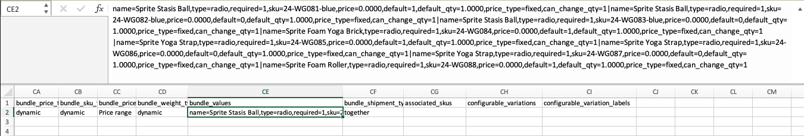
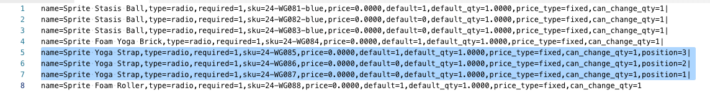

# Import bundle products

A bundle product presents a selection of items and allows customers to choose the ones they want to purchase. All the items that make up a bundle exist in the catalog as either [Simple Products](../catalog/product-create-simple.md) or [Virtual Products](../catalog/product-create-virtual.md). Typically, bundle products are created and updated from the Admin. However, you can also import data to create a bundle product or you can export existing bundle products, edit the data, and import them back into the catalog. The Sprite Yoga Companion Kit is a bundle product in the sample data that is used in the following examples.

<!-- zoom -->

## Change the order of bundle items

There are two ways to change the order of items in a bundle product.

### Method 1: Drag and drop

When working with a [Bundle](../catalog/product-create-bundle.md) product from the Admin, you can drag and drop items and sections into position.

<!-- zoom -->

### Method 2: Edit the product data

The best way to understand the structure of a bundle product is to export the product and examine the data in a spreadsheet. You can change the order of bundle items by exporting the product and adding a position parameter to the data for each item. The item data are in the `bundle_values` column of the exported product. When opened in a spreadsheet, all the items associated with the product are in a single cell as a long string of text. The `bundle_values` column contains the following elements for each item:

- Name of the item section
- Input control
- Required item indicator
- SKU
- Color
- Price
- Default option indicator
- Default quantity
- Price type
- Editable quantity indicator

#### Step 1: Export the bundle product

In this step, the Sprite Yoga Companion Kit is exported as a ([CSV](data-csv.md) file. You can use any other bundle product that you have in your catalog.

1. On the _Admin_ sidebar, go to **[!UICONTROL System]** > _[!UICONTROL Data Transfer]_ > **[!UICONTROL Export]**.

1. Under _Export Settings_, set **[!UICONTROL Entity Type]** to `Products`.

1. In the list of product attributes, scroll down to **[!UICONTROL SKU]** and enter the SKU of the bundle product that you want to export.

   The SKU is `24-WG080` for the product in this example.

1. Scroll down to the bottom of the section and click **[!UICONTROL Continue]**.

1. In the _[!UICONTROL Action]_ column of the _[!UICONTROL File name]_ grid, click **[!UICONTROL Select]** and choose `Download`.

   The file appears in the download location used by your browser.

#### Step 2: Edit the data

1. Open the downloaded CSV file in a spreadsheet.

1. Scroll to the far right, until you can see the `bundle_values` column.

   In the `bundle_values` data, each element is separated by comma, and each bundle item is separated from the next with a vertical bar. (The last item does not end with a vertical bar.) Your exported bundle data should look similar to the following example:

   <!-- zoom -->

1. To make it easier to edit, you can copy the `bundle_values` data, and paste it into a text editor, Then, add a line break after each item, so each item is on a separate line.

1. After editing the data, carefully remove the line breaks and paste the edited data back into the `bundle_values` column.

   In the following illustration, a `position=[number]` parameter is added to each yoga strap to change the order of the items in the store listing.

   <!-- zoom -->

1. After editing the data, **[!UICONTROL Save]** the CSV file.

#### Step 3: Import the updated product

1. On the _Admin_ sidebar, go to **[!UICONTROL System]** > _[!UICONTROL Data Transfer]_ > **[!UICONTROL Import]**.

1. Under _[!UICONTROL Import Settings]_, set **[!UICONTROL Entity Type]** to `Products`.

1. Set **[!UICONTROL Import Behavior]** to `Replace`.

   This option overwrites the previous data for your bundle product, rather than adding your changes as additional items.

1. Scroll down to the _File to Import_ section and click **[!UICONTROL Choose File]**.

1. Select the CSV file that you edited.

1. Click **[!UICONTROL Check Data]** and wait a few moments for the data to be checked.

1. If the file is valid, click **[!UICONTROL Import]**.

1. When the process is complete, go to **[!UICONTROL System]** > _[!UICONTROL Tools]_ > **[!UICONTROL Cache Management]** and click **[!UICONTROL Flush Cache Storage]**.

   This ensures that the updated product is immediately available in the storefront.
