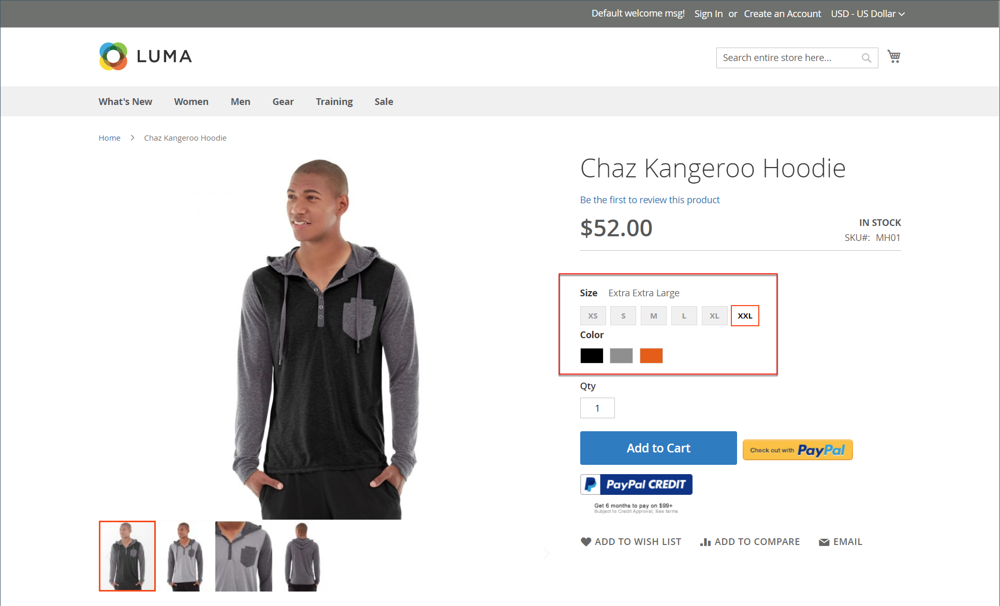
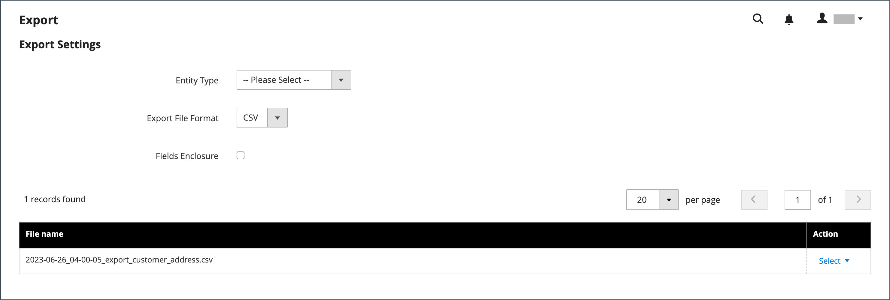
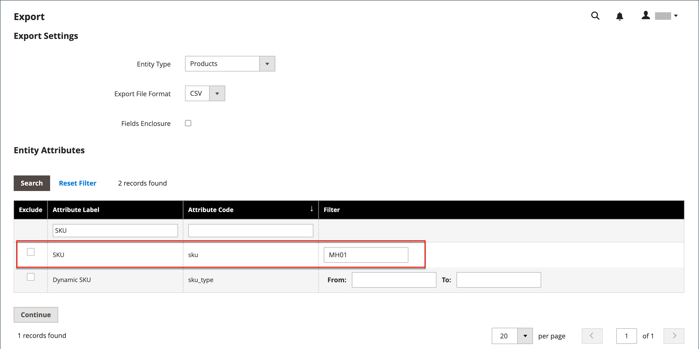
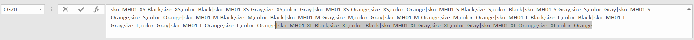
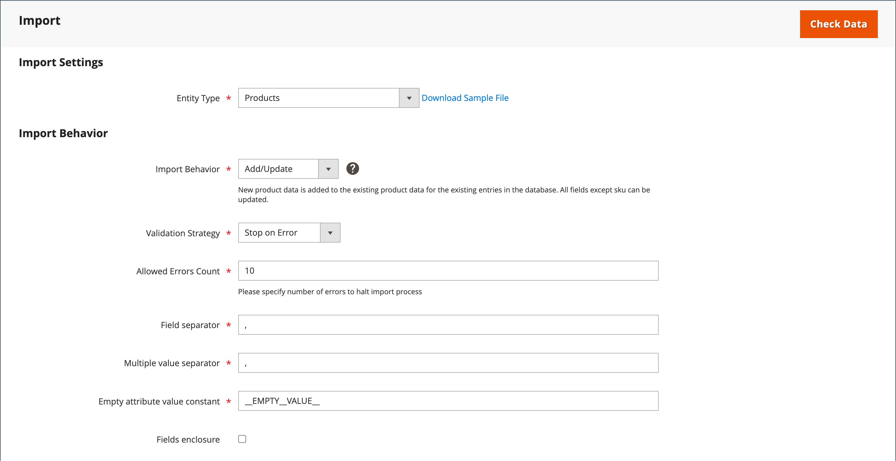
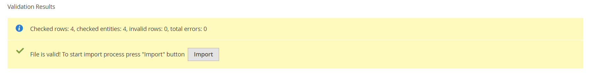

# Import configurable products

The best way to understand how configurable product data is structured, is to export a configurable product and its variations, and examine the data in a spreadsheet.

In the following example, you add a set of product variations for a new size in each color. First, you export the configurable product, and examine the data structure. Then, you update the data and import it back into the catalog. If you do not want to go through the exercise of exporting the data, you can download the CSV file that is used in the example.

{width="700" zoomable="yes"}

## Step 1: Verify attribute settings and values

1. Before you begin, make sure that the attributes that are used for product variations have the required property settings.

   - [**[!UICONTROL Scope]**](../getting-started/websites-stores-views.md#scope-settings) - `Global`
   - [**[!UICONTROL Catalog Input Type for Store Owner]**](data-attributes-product.md) - The input type of any attribute that is used for a product variation must be one of the following:

      - `Dropdown`
      - `Visual Swatch`
      - `Text Swatch`
      - `Multi-Select`

   - **[!UICONTROL Values Required]** - `Yes`

1. If you are adding a size or color, or making any other change to an existing attribute, make sure to update the attribute with the new value.

1. On the _Admin_ sidebar, go to **[!UICONTROL Stores]** > _[!UICONTROL Attributes]_ > **[!UICONTROL Product]**.

1. Find the attribute in the list and open in edit mode.

1. Add the new value to the attribute.

   In the following example, a new size is added to a Text Swatch.

   {width="500" zoomable="yes"}

1. When complete, click **[!UICONTROL Save Attribute]**.

1. If you are adding an attribute, follow the instructions to [create the attribute](../catalog/attribute-product-create.md) before you begin.

## Step 2: Export the configurable product

1. On the _Admin_ sidebar, go to **[!UICONTROL Catalog]** > **[!UICONTROL Products]**.

1. Find the configurable product to export:

   - Click **[!UICONTROL Filters]**.
   - Set **[!UICONTROL Type]** to `Configurable Product` and click **[!UICONTROL Apply Filters]**.
   - Choose the configurable product that you want to use for your test export and take note of the **[!UICONTROL SKU]**.

1. On the _Admin_ sidebar, go to **[!UICONTROL System]** > _[!UICONTROL Data Transfer]_ > **[!UICONTROL Export]**.

   {width="600" zoomable="yes"}

1. Under _[!UICONTROL Export Setting]s_, do the following:

   - Set **[!UICONTROL Entity Type]** to `Products`.

   - Set **[!UICONTROL Export File Format]** to `CSV`.

1. Under _[!UICONTROL Entity Attributes]_, scroll down or use the attribute label filter to locate the **[!UICONTROL SKU]** attrubute and do the following:

   - Enter the SKU of the configurable product that you have chosen to export and click **[!UICONTROL Continue]**.

      {width="600" zoomable="yes"}

   - Look for the file in the download location for your web browser and open it as a spreadsheet.

      The CSV file has a separate row for each simple product variation, and one row for the configurable product. The `product_type column` shows multiple simple product variations that are associated with one configurable product.

      {width="600" zoomable="yes"}

   - Scroll to the far right of the worksheet to find the following columns.

      - `configurable_variations` - Defines the one-to-many relationship between the configurable product record and each variation.
      - `configurable_variation_labels` - Defines the label that identifies each variation.

      In this example, the data can be found in columns CG and CH. Depending on the number of variations, the string of data in the `configurable_variations` column can be long. The data is used as an index to the associated product variations, and has the following structure:

      ```text
      sku={{SKU_VALUE}},attribute1={{VALUE}},attribute2={{VALUE}}| sku={{SKU_VALUE}},attribute1={{VALUE}},attribute2={{VALUE}}
      ```

      Each SKU is separated by a pipe symbol (&#124;), and attributes are separated by a comma. The value of each attribute is represented by the attribute code, rather than the attribute label. This is how the actual data appears:

      ```text
      sku=MH01-XS-Black,size=XS,color=Black|sku=MH01-XS-Gray,size=XS,color=Gray|sku=MH01-XS-Orange,size=XS,color=Orange</pre>
      ```

1. When you understand the structure of configurable product data, you can edit the data or add new variations directly to the CSV file.

   To learn more, see [Complex Data](data-attributes-product.md#complex-product-data-attributes).

## Step 3: Edit the data

In the following example, the set of XL sizes is copied and pasted into the worksheet to create a set of product variations for a new size in each color.

1. Copy the set of product variations that you want to use as a template for the new products.

   {width="600" zoomable="yes"}

1. Insert the copied rows records into the worksheet.

   You now have two identical sets of the simple product variations.

   {width="600" zoomable="yes"}

1. Update the data in the following columns of the new variations, as needed.

   - `sku`
   - `name`
   - `url_key`
   - `additional_attributes`

   For this example, all the `XL` references are changed to `XXL`.

1. Update the information in the `product_variations` column of the configurable product record, so that the new variations are included as part of the configurable product.

   On the row with the configurable product record, click the cell that contains the `product_variations` data. Then in the formula bar, copy the last set of parameters, beginning with the pipe symbol.

   {width="600" zoomable="yes"}

1. Paste the parameters to the end of the data and edit as needed for the new variations.

   In this example, the `sku` and `size` parameters are updated for the new XXL size.

1. Before the data is imported back into the catalog, delete any rows that have not changed.

   In this example, only the three new variations for the new size and the row with the updated configurable product are imported back into the catalog. The other rows can be deleted from the CSV file. However, make sure not to delete the header row with column labels.

   {width="600" zoomable="yes"}

1. **[!UICONTROL Save]** the CSV file.

   The data is ready to import into the catalog.

   >[!NOTE]
   >
   >The size of an import file cannot be larger than 2 MB.

## Step 4: Import the updated data

1. On the _Admin_ sidebar, go to **[!UICONTROL System]** > _[!UICONTROL Data Transfer]_ > **[!UICONTROL Import]**.

1. Under _[!UICONTROL Import Settings]_, set **[!UICONTROL Entity Type]** to `Products`.

1. Under _[!UICONTROL Import Behavior]_, set **[!UICONTROL Import Behavior]** to `Add/Update`.

   {width="600" zoomable="yes"}

1. Under _[!UICONTROL File to Import]_, click **[!UICONTROL Choose File]** and navigate to the CSV file that you prepared for import and choose the file.

   {width="600" zoomable="yes"}

1. In the upper-right corner, click **[!UICONTROL Check Data]**.

1. If the file is valid, click **[!UICONTROL Import]**.

   Otherwise, correct any problems found in the data and try again.

   {width="600" zoomable="yes"}

1. When the import is complete, click **[!UICONTROL Cache Management]** in the message at the top of the page and refresh all invalid caches.

   The new product variations are now available in the catalog from the Admin and in the storefront. In this example, the hoodie is now available in size XXL for all colors.
